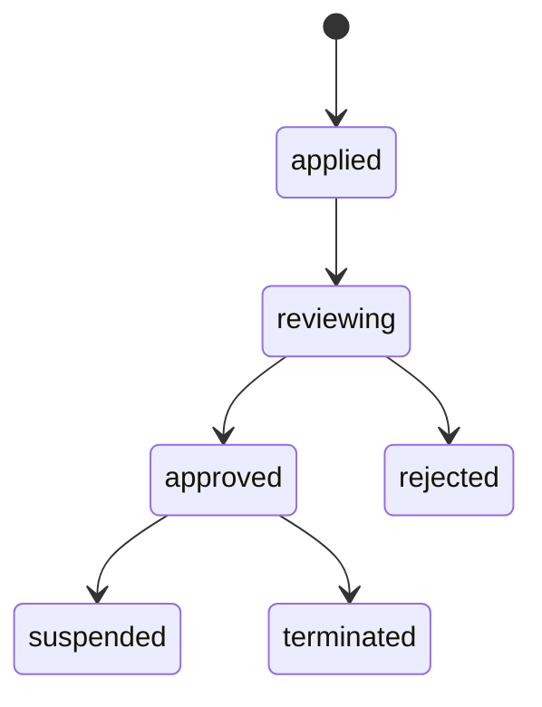

# 00 — TraceNex Partner 架构总览（Architecture Overview）

> 版本：**v1.2（Fy-api round-2 cosmetic 收口, 2026-05-11）**
> 维护人：Architect (主架构师)
> 最后更新：2026-05-11（v1.1 → v1.2：合入 Fy-api round-2 残余 4 项文字级补强）
> 上游输入：`prd/PRD-v1.0.md`（2295 行，已定稿）
> Round-1 review：`reviews/dev-round-1/{01-PM,02-Architect,03-Security,04-Compliance}-review.md`
> Round-2 review：`reviews/dev-round-2/{01-PM,02-Architect,03-Security,04-Compliance}-review.md`（4 方 PASS）
> Fy-api review：`reviews/fy-api-review/01-fy-api-side-review.md`（ACCEPT-WITH-CHANGES, 2026-05-12）+ `02-fy-api-round2-review.md`（ACCEPT, 2026-05-13）
> 关联输出：本目录 `integration-design.md` v1.2（集成层硬契约）；`backend-design.md` v1.2、`frontend-design.md` 均依赖本文与 `integration-design.md` 的契约不可改动。
> 详细修订条目见本文末尾 §14 "v0.1 → v0.2 CHANGELOG" + §15/§16 ADDENDUM + §17 "v0.2.2 → v1.0 收口" + §18 "v1.0 → v1.1 CHANGELOG（合入 Fy-api review）" + §19 "v1.1 → v1.2 CHANGELOG（Fy-api round-2 cosmetic）"。
> **架构债务清单**（22 条 + v1.1 新增 T-23 / T-24）见附录 A；**Phase 1 / Phase 2 合规 follow-up**（16 项 hard-gate + 等保 + R2-Risk-4）见附录 B；**v1.1 Fy-api 跨团队 hand-off**见附录 C（引用 `integration-design.md` §16）。

---

## 0. 阅读说明

本文是**前后端 + 集成三份开发文档共同依赖的"宪法"**。

**它定义的内容**（不可被下游文档颠覆）：

- 系统上下文（C4 L1）与容器拓扑（C4 L2）
- 12 个业务模块的 package / 路由切分边界
- 三类**跨文档契约的归属和锚点**（REST API / DB schema / 异步消息）
- 环境矩阵（dev / staging / prod）与 NFR → 设计决策 traceability
- Phase 1 / 2A / 2B / 3 的最小可交付集合（与 PRD §12 强对齐）
- 关键 ADR 索引（每条 ADR 都引用 PRD 章节）
- 文档约定（术语、状态机命名、错误码区段）

**它不定义的内容**（在下游文档展开）：

- Fy-api `/api/internal/*` 字段级 schema → `integration-design.md` §2
- partner-api 内部 service/repository 拆分 → `backend-design.md`
- React 组件树 / 状态管理 → `frontend-design.md`

> ⚠️ 本文每节末尾的 "测试钩子" 段，列出该节设计正确的契约级 invariant，供 e2e 测试团队作为基线。

---

## 0.1 目录

1. 系统上下文（C4 L1）
2. 容器拓扑（C4 L2）
3. 逻辑模块切分（12 模块 → Go package + React route）
4. 跨文档契约锚点（REST / DB / Async）
5. 术语与术语表锚点
6. 环境矩阵
7. NFR → 设计决策映射表
8. Phase 切片（与 PRD §12 对齐）
9. 关键 ADR 索引
10. 风险登记（指向 PRD §11 + 本文新增）
11. 文档约定（命名、状态机、错误码）
12. 测试钩子全集
13. 跨文档变更管理

---

## 1. 系统上下文（C4 Level 1）

```
                     ┌────────────────────────────────────────────────────┐
                     │                  外部用户角色                        │
                     │                                                    │
                     │  ┌────────────┐    ┌────────────┐    ┌──────────┐  │
                     │  │  渠道商     │    │  终端客户   │    │ 平台 staff │  │
                     │  │ (partner)  │    │ (customer) │    │ (4 子角色) │  │
                     │  └─────┬──────┘    └─────┬──────┘    └─────┬────┘  │
                     └────────┼──────────────────┼─────────────────┼──────┘
                              │ HTTPS            │ HTTPS           │ HTTPS
                              ▼                  ▼                 ▼
              ┌───────────────────────────────────────────────────────────┐
              │           TraceNex Partner（本系统，可独立部署）            │
              │  partner.tracenex.cn / admin.tracenex.cn                  │
              │                                                           │
              │   Web (React)  ←—→  partner-api (Go/Gin)                  │
              │                                                           │
              │   - 钱包 / 分润 / 结算 / 发票 / 工单 / KYC / 内容安全 …       │
              └────────┬─────────┬────────┬───────────┬────────┬──────────┘
                       │         │        │           │        │
                       │ HTTP    │ async  │ KMS       │ OSS    │ SLS
                       │ + mTLS  │ outbox │ envelope  │ (PII)  │ (logs)
                       ▼         ▼        ▼           ▼        ▼
              ┌──────────────┐  ┌─────┐  ┌────┐  ┌────────┐  ┌─────┐
              │   Fy-api     │  │MySQL│  │KMS │  │ OSS    │  │ SLS │
              │ (AI 网关)     │  │8.x  │  │    │  │ Archive│  │     │
              │ api.aitra... │  │     │  │    │  │        │  │     │
              │ + 覆盖层      │  └─────┘  └────┘  └────────┘  └─────┘
              │ /api/internal│
              └──────┬───────┘
                     │ HTTPS / SDK
                     ▼
              ┌────────────────────────────────────────┐
              │           外部托管 / 持牌服务            │
              │                                        │
              │  • 持牌分账方（连连/易宝/汇付/合利宝候选） │
              │  • 阿里云内容安全 / 腾讯天御              │
              │  • 阿里云 OCR（KYC 营业执照 / 身份证）    │
              │  • 全电发票（国税总局 SDK）              │
              │  • SMTP / SMS                          │
              │  • 12377（网信办举报）/ 公安网安          │
              └────────────────────────────────────────┘
```

> 引用：PRD §5.1（架构图）、§5.2（设计原则）、§7.6（资金流）、§15（合规）。

### 1.1 系统职责边界

| 系统 | 职责 | 不做 |
|---|---|---|
| **TraceNex Partner**（本系统） | 渠道分销代理业务：渠道商 / 客户管理、钱包 / 分润台账、KYC、结算、发票、工单、内容安全工作流、PIPL 用户权利 | AI 推理、Token 鉴权、上游渠道路由、**沉淀客户付款**（去二清，§7.6） |
| **Fy-api** | AI 网关：用户 / Token / 计费 / 上游渠道 / 模型路由 | 渠道分销业务、KYC、发票、合规审核 |
| **持牌分账方** | 央行牌照下的资金归集 + 分账下账 | — |
| **阿里云 KMS / OSS / SLS** | 信封加密 KEK、私有桶、日志归档 | — |
| **阿里云 / 腾讯内容安全** | 输入 / 输出审核 | — |

**测试钩子（§1）**：

- I-1.1 partner-api 配置只读 DSN 连接 Fy-api 库时不应能 INSERT/UPDATE（DB GRANT 验证，详见 §7.4）
- I-1.2 partner-api 进程不应直接持有客户付款（任何流入 partner-api 的资金路径都应能追踪到持牌方流水号）

---

## 2. 容器拓扑（C4 Level 2）

> 物理部署蓝图。Phase 1 单 region（CN，杭州/上海）；SG 为 Phase 3+ 扩展。

```
┌─────────────────────────────────────────────────────────────────────┐
│                         Aliyun VPC（CN region）                       │
│                                                                     │
│  ┌──────────────┐    ┌──────────────┐    ┌──────────────────────┐   │
│  │ partner-web  │    │  partner-api │    │      Fy-api          │   │
│  │ (React/Vite) │    │  (Go/Gin)    │    │  (Go/Gin + 覆盖层)    │   │
│  │ NGINX/CDN    │◀──▶│ K8s Deploy   │◀──▶│  K8s Deploy          │   │
│  │              │ JSON│ replicas≥3  │mTLS│  replicas≥3          │   │
│  └──────────────┘    └──────┬───────┘    └──────────┬───────────┘   │
│                             │                       │               │
│                             │      ┌────────────────┘               │
│                             ▼      ▼                                │
│                       ┌──────────────────┐    ┌──────────────────┐  │
│                       │  Redis 7.x       │    │   MySQL 8.x      │  │
│                       │  (Aliyun Tair)   │    │   (Aliyun RDS)   │  │
│                       │                  │    │                  │  │
│                       │ - cache          │    │ ┌──────────────┐ │  │
│                       │ - rate-limit     │    │ │partner_db    │ │  │
│                       │ - jti revocation │    │ │(本系统 RW)    │ │  │
│                       │ - nonce dedup    │    │ ├──────────────┤ │  │
│                       │ - Pub/Sub        │    │ │fy_api_db     │ │  │
│                       │   (option_update,│    │ │(本系统只读)    │ │  │
│                       │    user_update)  │    │ │  + 覆盖层 RW  │ │  │
│                       └──────────────────┘    │ │  outbox 表也  │ │  │
│                                               │ │  在此（同事务） │ │  │
│                                               │ └──────────────┘ │  │
│                                               └──────────────────┘  │
│                                                                     │
│  ┌──────────┐    ┌──────────┐    ┌──────────┐    ┌──────────────┐   │
│  │ Aliyun   │    │ Aliyun   │    │ Aliyun   │    │   Aliyun     │   │
│  │   KMS    │    │   OSS    │    │   SLS    │    │   ACK / ASK  │   │
│  │  (KEK)   │    │ (PII)    │    │ (logs)   │    │ (orchestrator)│  │
│  └──────────┘    └──────────┘    └──────────┘    └──────────────┘   │
└─────────────────────────────────────────────────────────────────────┘
                                 │
                                 │ HTTPS（外部 SaaS / 监管）
                                 ▼
                ┌─────────────────────────────────────────┐
                │ 持牌分账方 / 微信支付 / 支付宝 / Stripe    │
                │ 阿里云内容安全 / 腾讯天御                  │
                │ 全电发票 / SMTP / SMS                    │
                │ 12377 / 公安网安                          │
                └─────────────────────────────────────────┘
```

> 引用：PRD §5.1、§5.2、§10.6（SLS）、§19（KMS）、§16（信任边界）。

### 2.1 关键说明（来自 Round-2 Architect H-1）

- **outbox 表 `consume_log_outbox` 物理位置**：必须落在 Fy-api 的 `LOG_DB`（与 `logs` 表同库 / 同事务）。当 `LOG_SQL_DSN` 拆分时，outbox 表跟随 `logs` 表走，不留在 `transnext_db` 主库。详见 `integration-design.md` §3。这是 PRD §22.1 F-10 已确认的决策。
- **Redis 实例**：Phase 1 单 region 单实例；SG 启用前必须 region-isolated（PRD §15.7 / Compliance NEW-4）。`option_update` / `user_update` 频道**禁止跨 region 订阅**。
- **MySQL user 四类**：`tnbiz_app`（应用读写）、`tnbiz_migrator`（DDL）、`tnbiz_outbox_consumer`（仅 LOG_DB 上 SELECT/UPDATE(consumed_at)/DELETE on consume_log_outbox）、`tnbiz_audit_sealer`（仅 audit_log 上 INSERT + audit_log_unsealed 上 SELECT/DELETE，专用于 sealer 进程，与 `tnbiz_app` 隔离）。具体 GRANT 在 `integration-design.md` §6。（Round-1 ARCH-LOW-21 修复，Security S-7 验收）

### 2.2 流量分类

| 流量 | 协议 | 加密 | 频道 |
|---|---|---|---|
| 浏览器 → partner-web | HTTPS | TLS 1.3 | partner.tracenex.cn |
| partner-web → partner-api | HTTPS | TLS 1.3 + **httpOnly cookie `tnbiz_access`** + `X-Csrf-Token` header（double-submit `tnbiz_csrf` non-httpOnly cookie）| api.partner.tracenex.cn |
| partner-api → Fy-api `/api/internal/*` | HTTPS + **Nginx mTLS（v1.1：Podman + Nginx 反代终结 client cert，注入 `X-Client-Verified` / `X-Client-CN` header；gin 校验 CN 白名单 + loopback ingress）** | TLS + HMAC（§17 鉴权） | 内网 ECS / VPC（v1.0 写"K8s + Istio"已纠正为 v1.1 实际部署形态，详见 `integration-design.md` §6.4 v1.1）|
| partner-api → Fy-api `/api/sdk/*`（server-to-server，仅模型 API SDK）| HTTPS | TLS 1.3 + Authorization Bearer（仅此一处保留 Bearer header）| api.partner.tracenex.cn/api/sdk |
| partner-api → MySQL | TCP+TLS | RDS SSL | VPC 内 |
| partner-api → Redis | TCP+TLS+AUTH+ACL | Tair SSL | VPC 内 |
| 持牌方回调 → partner-api | HTTPS | RSA 验签 + IP 白名单 | callback.partner.tracenex.cn |

**测试钩子（§2）**：

- I-2.1 partner-api 进程禁止以明文 HTTP 调用 `/api/internal/*`（启动期 dial 测试）
- I-2.2 Redis ACL：`tnbiz_app` 角色对 `option_update` 频道**无 publish 权限**（M-r2-4）
- I-2.3 SG region 启用后，CN-region pod 的 Redis 客户端 host 列表中**不应出现** SG endpoint

---

## 3. 逻辑模块切分

> 与 PRD §7（M1-M12 模块）一一对应。本节定义 Go package 与 React route 的归属，下游 backend-design / frontend-design 必须按这个边界拆分。

### 3.1 模块 → Go package 矩阵

```
partner-api/
├── cmd/
│   ├── api/main.go              # gin 入口
│   ├── outbox-poller/main.go    # 独立进程：消费 consume_log_outbox（§9.3）
│   ├── settlement-runner/main.go# Cron leader：月结（§4.6）
│   └── audit-sealer/main.go     # 单实例 leader：审计哈希链（HIGH-r2-1 修复）
│
├── internal/
│   ├── config/                  # biz_setting + env loader
│   ├── auth/                    # JWT 验证 + scope middleware（PRD §17、§16.3）
│   ├── partner/                 # M3, M4-01..06, M3-01..14（渠道商域）
│   ├── customer/                # M2, M9（终端客户域 + 防绕过）
│   ├── wallet/                  # 钱包 + wallet_hold + saga（PRD §8.3-5, §9.4）
│   ├── pricing/                 # partner_pricing_rule + 解析器（PRD §8.6, §9.5）
│   ├── revenue/                 # revenue_log + outbox consumer（PRD §8.7, §9.3）
│   ├── settlement/              # 月结 / 周结 + 个税（PRD §7.5, §15.4）
│   ├── kyc/                     # KYC + OSS + KMS + consent_log（PRD §7.7, §19）
│   ├── invoice/                 # 全电发票（PRD §7.8）
│   ├── payment/                 # 持牌方收单 + ISV mchid（PRD §7.6）
│   ├── ticket/                  # 工单（PRD §7.10）
│   ├── notify/                  # 邮件 / 站内信 / SMS / Webhook（PRD §7.11）
│   ├── content_safety/          # 输入 / 输出审核工作流 + 上报（PRD §7.12）
│   ├── pipl_rights/             # 用户权利中心（PRD §7.13 / Compliance NEW-3）
│   ├── audit/                   # append-only audit_log + hash chain
│   ├── idempotency/             # idempotency_record（PRD §8.16, §18）
│   ├── saga/                    # saga_step + 编排器
│   ├── fyapi_client/            # Fy-api /api/internal/* SDK（HMAC + retry）
│   ├── outbox/                  # poller / SKIP LOCKED / dead letter
│   ├── kms_envelope/            # KMS 信封 + DEK 缓存（PRD §19）
│   ├── permission/              # RBAC enum + 矩阵（PRD §3.4）
│   ├── pubsub/                  # Redis Pub/Sub 订阅 / 缓存失效
│   └── platform/                # finance / operations / support / superadmin 域
│
├── pkg/                         # 跨进程公共：errors、tracing、validator…
└── migrations/                  # GORM AutoMigrate + 三方言 SQL 备选
```

### 3.2 模块 → Go package 对照表

| PRD 模块 | Package | Phase | 备注 |
|---|---|:---:|---|
| M1 公开商城 | `partner-web` only（无独立后端 package；走 `customer` + `pricing` 视图） | 1 | M1-04/06 在 Phase 1 |
| M2 客户后台 | `customer` + `wallet`（视图层）| 1 (basic) / 2A (full) | M2-13 余额预警在 1 |
| M3 渠道商后台 | `partner` + `wallet` + `pricing` + `revenue` | 1 (M3-01..04, 09, 13) / 2A (M3-05, 08, 12, 14) | |
| M4 平台后台 | `platform` + 跨 package 视图 | 1 (M4-01..07, 15) / 2A (M4-03, 08, 09, 10, 12, 16, 17) / 2B (M4-11, 13) | |
| M5 分润结算 | `settlement` | 2B | settlement_run + Cron leader |
| M6 支付 | `payment` | 2A (M6-01..08) / 2B (M6-09 下账) | |
| M7 KYC | `kyc` + `kms_envelope` + `pipl_rights` | 1 (stub) / 2A (full) | |
| M8 发票 | `invoice` | 2B / 3 | |
| M9 客户体验 / 防绕过 | `customer` (M9-01/02 in Phase 1) | 1 / 3 (M9-03/04) | |
| M10 工单 | `ticket` | 1 (basic) / 3 (full) | |
| M11 通知 | `notify` | 1 (email + inapp) / 2A (sms + webhook) | |
| M12 内容安全 | `content_safety` | 1 (M12-01/02 basic) / 2A (full) | |
| **M13 用户权利**（Compliance NEW-3） | `pipl_rights` | 2A | 新增模块 |

### 3.3 React route 切分

```
partner-web/
├── src/
│   ├── pages/
│   │   ├── public/             # 公开商城（M1）
│   │   ├── customer/           # 客户后台（M2, M9, M13）
│   │   │   ├── dashboard/
│   │   │   ├── billing/
│   │   │   ├── topup/
│   │   │   ├── api-keys/
│   │   │   ├── kyc/
│   │   │   ├── invoice/
│   │   │   ├── tickets/
│   │   │   └── pipl-rights/    # 用户权利中心
│   │   ├── partner/            # 渠道商后台（M3）
│   │   │   ├── dashboard/
│   │   │   ├── customers/
│   │   │   ├── pricing/
│   │   │   ├── wallet/
│   │   │   └── statements/
│   │   ├── admin/              # 平台后台（M4, M5, M6, M8, M10）
│   │   └── auth/               # 登录 / MFA / 重置
│   ├── components/
│   ├── api/                    # generated from OpenAPI
│   └── hooks/
└── vite.config.ts
```

### 3.4 子域路由

| 子域 | 服务 | 受众 |
|---|---|---|
| `partner.tracenex.cn` | partner-web (customer + partner) | 渠道商 + 终端客户 |
| `admin.tracenex.cn` | partner-web (admin) | 平台 staff |
| `api.partner.tracenex.cn` | partner-api | 浏览器 / partner SDK |
| `callback.partner.tracenex.cn` | partner-api（仅持牌方回调） | 持牌方 IP 白名单 |
| `api.aitracenex.com` | Fy-api | API 调用方（终端客户的 Token） |

> 跨子域 cookie 不共享。Auth 走 Fy-api JWT，**承载方式为 `tnbiz_access` httpOnly + Secure + SameSite=Lax cookie**（PRD §17.1 修订 + Compliance M-r2-8 + Security CRITICAL-1 verdict）；CSRF 防护采用双提交：non-httpOnly `tnbiz_csrf` cookie + 必要的 `X-Csrf-Token` header（详见 ADR-007 v0.2）。Bearer Authorization header 仅保留给 `/api/sdk/*` 的 server-to-server 模型 API 流量，不进入浏览器流量。

**测试钩子（§3）**：

- I-3.1 import linter：`internal/customer` 不允许直接 import `internal/wallet` 内部类型（应通过 service 接口）
- I-3.2 每个新增 router 必须引用一条 `permission.X` enum 否则 CI 失败（Security M-r2-2）
- I-3.3 `internal/fyapi_client` 是 partner-api 唯一允许调用 Fy-api `/api/internal/*` 的 package（grep gate）

---

## 4. 跨文档契约锚点（CRITICAL）

> 三类契约的"谁定义、谁消费、契约文件物理位置"在此一次性锁死。

### 4.1 REST API / OpenAPI 契约

| 契约 | 定义位置 | 消费者 | 谁负责改 |
|---|---|---|---|
| partner-api 对前端的 REST API | `openapi/partner-api.yaml`（partner-api 仓库内，CI 生成 TS client）| `partner-web` 通过生成的 TS client 调用 | Backend Architect |
| partner-api 对持牌方回调的 webhook 入口 | `openapi/payment-callback.yaml` | 持牌方系统 | Backend Architect + 财务 |
| Fy-api 对外的 `/api/*` 已存在 API | Fy-api 自己定义 | partner-api 在 customer / partner 自助场景调用 | Fy-api 上游 |
| **Fy-api `/api/internal/*` 覆盖层 API** | **`integration-design.md` §2**（本节是唯一 source of truth）| partner-api 通过 `internal/fyapi_client` 调用 | **本架构师 + Backend Architect 联合定义** |

> ⚠️ 跨文档契约的物理路径：
>
> - OpenAPI 文件检入 Fy-api 仓库或 TraceNexBiz 仓库，由 PR review 控制变更
> - 任何改动都必须先改 spec、再改实现；CI 强制 contract test（dredd / schemathesis）
> - 契约破坏性变更需要走 ADR（见 §9）

### 4.2 数据模型 / 数据库边界契约

| 库 | 表归属 | DDL 定义位置 | 谁可写 |
|---|---|---|---|
| `partner_db` | `partner / customer / wallet / wallet_hold / partner_wallet_log / partner_pricing_rule / revenue_log / settlement / settlement_item / settlement_run / settlement_config_change_log / kyc_application / invitation_code / seat / invoice_application / invoice_title / audit_log / audit_log_pii / audit_log_unsealed / staff / biz_setting / idempotency_record / saga_step / ticket / ticket_reply / notification_outbox / consent_log / customer_partner_change_log / partner_debt(F-2 决策后) / user_model_ratio_override(F-1 决策后)` | partner-api 自身 migrations | `tnbiz_app` |
| `fy_api_db` | Fy-api 原生表（users / tokens / logs / channels / abilities / options …） | Fy-api 上游 + 覆盖层 migrations | Fy-api（**partner-api 只读**） |
| `fy_api_db.consume_log_outbox` | Fy-api 覆盖层（C-5）；与 `logs` 同库 / 同事务 | Fy-api 覆盖层 migration | Fy-api 写 / partner-api 标记 consumed |
| `fy_api_db.internal_idempotency` | Fy-api 覆盖层（C-7） | Fy-api 覆盖层 migration | Fy-api 自身 |

**跨库 join 规则**（PRD §6.3 修订 + Architect H-1）：

- `partner_db ↔ fy_api_db` 之间**不允许 ORM 层 JOIN**；如同实例则 SQL JOIN 仅在报表 read-only 场景，由 `internal/platform/reporting` 独立 service 通过专用 `bizDB` 连接（`tnbiz_app` 兼有两库 SELECT）
- `LOG_SQL_DSN` 拆分场景下，跨库 JOIN 不可用 → fallback 到 `GET /api/internal/usage/*` HTTP 聚合（PRD §6.3 双路径）
- 用户身份映射依靠 `partner.fy_user_id` / `customer.fy_user_id` 在应用层做 lookup，详见 PRD §6.4

### 4.3 异步消息契约

| 异步契约 | 定义位置 | 生产者 | 消费者 | 字段 schema |
|---|---|---|---|---|
| `consume_log_outbox` 表行 | `integration-design.md` §3 | Fy-api `RecordConsumeLog`（覆盖层）| partner-api outbox poller | log_id / user_id / group_name / quota / channel_id / model_name / occurred_at / consumed_at / status / retry_count / last_error / trace_id |
| Redis Pub/Sub `option_update` | `integration-design.md` §3 | Fy-api `UpdateOption` | Fy-api 全部 pod（自订阅，刷新 groupRatioMap） | `{key: string, version: int64}` |
| Redis Pub/Sub `user_update` | `integration-design.md` §3 | Fy-api `SetGroupRatioOverride`（覆盖层）| Fy-api 全部 pod（刷新 user cache） | `{user_id: int64, kind: 'group_ratio_override'}` |
| `saga_step` 表行 | partner-api `internal/saga` | partner-api 自身 saga 编排器 | partner-api saga retry worker | saga_id / step_name / status / attempts / payload / last_error |
| `idempotency_record` 表行 | partner-api `internal/idempotency` | partner-api 入口 middleware | partner-api 同 endpoint 的后续请求 | actor_type / actor_id / idempotency_key / endpoint / request_hash / **response_cipher VARBINARY(16384)** / **response_key_id VARCHAR(128)** / status / saga_id（详见 backend §3.16；ARCH-CRIT-2 / SEC-r2 verdict：response 必须 KMS 加密，不存明文，不留"二选一"）|
| `notification_outbox` 表行 | partner-api `internal/notify` | partner-api 业务 service | partner-api notification dispatcher worker | recipient / channel / event_code / payload / status / retry_count |

**关键 invariant**：

- `consume_log_outbox` 的写入必须**与 `logs` INSERT 在同一 GORM Transaction**（PRD §22.1 F-12 修订；Architect 确认 `RecordConsumeLog` 现状非事务，需 ~25 LOC 而非 5 LOC）
- 任何 outbox 表的 poller 都必须使用 `SELECT ... FOR UPDATE SKIP LOCKED`（多 poller 并发；Security M-r2-4 + Architect §9.3）
- partner-api 与 Fy-api 在跨服务调用时**透传相同 `Idempotency-Key`**；TraceNexBiz `idempotency_record` TTL 24h，Fy-api `internal_idempotency` TTL 7d（满足 saga 1h wall-clock cap，Round-2 Security LOW-2）

### 4.4 共享 trace_id 契约

| 字段 | 来源 | 透传规则 |
|---|---|---|
| `X-Oneapi-Request-Id` | Fy-api 既有；partner-api 入口在缺失时生成 UUIDv7 | 跨进程透传：`partner-web → partner-api → Fy-api`；持久化到 `audit_log.trace_id` / `revenue_log.trace_id`（待加列）/ `saga_step.trace_id` |
| `X-Auth-KeyId` / `X-Auth-Timestamp` / `X-Auth-Nonce` / `X-Signature` | partner-api → Fy-api 内部签名 4 元组 | 见 `integration-design.md` §1 |

**测试钩子（§4）**：

- I-4.1 OpenAPI lint：`/api/internal/*` 每个 endpoint 必须声明 `Idempotency-Key` header（state-changing endpoints）+ 4 个 X-Auth header
- I-4.2 同 trace_id 在 partner-api log 和 Fy-api log 中可关联（SLS 跨索引查询返回 ≥ 2 行）
- I-4.3 任何写到 `consume_log_outbox` 的事务，回滚后 `logs` 表也无对应行（Fy-api 单元测试）

---

## 5. 术语与术语表锚点

> 术语权威来源：PRD §20 + 附录 D（实际去重指向 §20）。

本文新增的开发期术语（不进 PRD）：

| 术语 | 含义 |
|---|---|
| `bizDB` | partner-api 中指向 `partner_db` 的 GORM 连接（读写） |
| `fyDB` | partner-api 中指向 `fy_api_db` 的 GORM 连接（只读） |
| `logDB` | Fy-api 覆盖层中指向 `LOG_SQL_DSN` 的 GORM 连接（读写 outbox 与 logs） |
| outbox poller | partner-api 独立进程，消费 `consume_log_outbox` 并写 `revenue_log` |
| audit sealer | partner-api 单实例 leader 进程，给 `audit_log_unsealed` 计算哈希链 |
| settlement runner | partner-api Cron leader（Phase 1 Redis SETNX；Phase 2+ K8s Lease） |
| envelope DEK | KMS 生成的数据加密密钥（明文+密文一对），用于 PII 字段 |
| 信任边界 / trust boundary | PRD §16.1 中定义的 STRIDE 边界 |

---

## 6. 环境矩阵

| 维度 | dev | staging | prod (CN) | prod (SG, Phase 3+) |
|---|---|---|---|---|
| **域名** | `*.dev.tracenex.cn` | `*.stg.tracenex.cn` | `*.tracenex.cn` | `*.tracenex.sg` |
| **Fy-api endpoint** | local docker | `api.stg.aitracenex.com` | `api.aitracenex.com` | `api.aitracenex.sg` |
| **MySQL** | docker / sqlite | RDS staging | RDS prod (主+从) | 独立 RDS（region-isolated）|
| **Redis** | docker | Tair staging | Tair prod 集群 | 独立 Tair（region-isolated）|
| **KMS** | local fake KMS（dev only） | Aliyun KMS staging KEK | Aliyun KMS prod KEK | Aliyun KMS SG KEK |
| **OSS** | minio | OSS staging bucket | OSS prod 私有桶 + Archive | OSS SG 私有桶 |
| **SLS** | stdout | SLS staging | SLS prod project | SLS SG project |
| **持牌分账方** | mock | 持牌方 sandbox | 持牌方 prod | （需另签合规协议） |
| **mTLS CA** | self-signed | ACK 自签 | ACK CA + 内网 mesh | 同 prod |
| **HMAC keys** | hardcoded test key | KMS Secret Manager（独立 namespace） | KMS Secret Manager prod | KMS Secret Manager SG |
| **GROUP_RATIO_OVERRIDE 启用** | on | on | on | on |
| **outbox 表位置** | 同库 | 同库 | 与 `logs` 同库（受 LOG_SQL_DSN 决定）| 与 `logs` 同库 |
| **Settlement Cron 启用** | off（手动触发）| 沙箱周期 | 启用 | 启用 |
| **内容安全提供商** | mock | 阿里云内容安全（test） | 阿里云内容安全（prod） | 同 prod，但跨境数据归属须重新评估（PRD §15.7） |
| **MFA 强制** | off | partner KYC 通过即强制 | partner KYC 通过即强制（PRD §22.1 F-9） | 同 |

**配置加载约定**：

- 所有 secret 走 KMS Secret Manager 注入（PRD §19.5）
- 所有可调参数走 `biz_setting` 表（PRD §8.15），**不走** Fy-api `common/init.go`（避免上游 sync 冲突，PRD §22.1 F-13）
- 业务参数变更走 audit_log（M4-15）

**测试钩子（§6）**：

- I-6.1 任意 dev / staging / prod 构建产物**不允许**包含明文 secret（`grep -E '(sk-|akia|ghp_)'` 在镜像层失败即 CI fail）
- I-6.2 prod 启动期 self-check：连接 KMS、MySQL、Redis、OSS、SLS、Fy-api `/api/internal/health` 全部成功才暴露 readiness probe

---

## 7. NFR → 设计决策映射表

> 每条 PRD §10 的 NFR 都映射到具体设计决策与负责文档。当 NFR 改动时按本表 traceability 更新。

| NFR | PRD 章节 | 设计决策 | 实施位置 |
|---|---|---|---|
| 内部 P95 < 500ms | §10.1 | partner-api 单进程、连接池、index 评审 | backend-design |
| 端到端 P95 < 800ms | §10.1 | mTLS keepalive、HMAC 用 sync.Pool、DEK 缓存命中 | integration-design §2 |
| outbox poll 延迟 < 2s | §10.1 | 1s tick、SKIP LOCKED、batch 1000 | integration-design §3 |
| group_ratio 传播 < 2s（≤5s worst） | §10.1（Architect §C-2 修订） | Redis Pub/Sub publish-after-commit + 5s fallback poll | integration-design §3 |
| 列表首屏 < 2s | §10.1 | 后端 cursor pagination + 前端虚拟列表 | frontend-design |
| 月结跑完 < 30 min | §10.1 | settlement_run.progress_offset 续跑 + 分批 | backend-design |
| 后台 ≥ 200 QPS | §10.1 | gin + pgx pool + Redis pipeline | backend-design |
| MVP 99.5% / Phase 2 99.9% SLO | §10.2 | K8s 多副本 + RDS 高可用 + 双 AZ | ops runbook |
| RDS 备份 + KYC 5 年 | §10.3 / §15.6 | OSS Archive + KMS + lifecycle rule | backend-design + ops |
| 钱包 ACID | §10.4 / §9.4 | pessimistic FOR UPDATE + optimistic version 双保险（M4 解决方案待选）| integration-design §4 |
| 强禁 XA | §10.4 | saga + outbox 替代 | integration-design §3-4 |
| 安全（详见 §16-§19） | — | BOLA 矩阵测试 + KMS + 哈希链 | integration-design + backend-design |
| 可观测性 | §10.6 | Prometheus + SLS + trace_id 透传 | ops runbook |
| wallet drift 每日对账 | §10.6 / R-7 | 独立 Cron + Prometheus gauge `wallet_drift_total` | backend-design |
| outbox lag SLO | §10.6 / Security M-r2-6 | gauge `outbox_lag_seconds`（写入 - 消费）+ alarm | backend-design + ops |
| 国际化 | §10.7 | i18next CN/EN | frontend-design |
| 可配置性 | §10.8 | biz_setting 全部覆盖 | backend-design |
| 单元测试 ≥ 70% / 前端 ≥ 60% | §10.9 | go test cover + vitest cover CI gate | CI |
| BOLA 100% 读端点 | §10.9 / Security CI gate #1 | matrix test 自动生成 | backend-design + CI |

**测试钩子（§7）**：

- I-7.1 每条 NFR 都有 ≥ 1 个 e2e / 性能测试在 CI baseline；缺失则 doc-lint fail

---

## 8. Phase 切片（与 PRD §12 强对齐）

> 三层视角：前端、后端、集成层。本节是 Phase 1 实施期工程团队拆 sprint 的"主表"。

### 8.1 Phase 1（Week 1-4，MVP 内测）

#### 集成层（integration-design.md 必交付）

- **Fy-api 覆盖层 PR**（PRD 附录 C + §22.1 F-10..F-14）：
  - C-1 内部路由 + HMAC + mTLS
  - C-2 controllers 全部 endpoints（仅打通 happy path）
  - C-3 BIGINT 三方言 migration（含 7 列：`users.quota` / `users.used_quota` / `users.request_count` / `users.aff_quota` / `users.aff_history_quota` / `logs.id` / `logs.quota`）
  - C-4 `User.GroupRatioOverride` 字段 + `GetEffectiveGroupRatio` hook + 用户缓存失效 Pub/Sub
  - C-5 outbox 表 + `RecordConsumeLog` 事务化（~25 LOC）
  - C-6 Pub/Sub publish-after-commit + 订阅 goroutine + biz_setting.sync_freq_seconds
  - C-7 internal_idempotency 表
  - OVERLAY.md **B-12..B-18** 同 PR 合入（v1.1 修正：v1.0 写"B-8..B-14"已与 Fy-api OVERLAY.md 现状冲突，详见 `integration-design.md` §1.8 v1.1）
- partner-api ↔ Fy-api 闭环 e2e：充值 / 扣额度 / 创建用户 / 创建 Token / 查用量 / by-idem-key 探活
- Redis Pub/Sub option_update + user_update 投产
- `consume_log_outbox` SKIP LOCKED 多 poller 测试

#### 后端（backend-design.md 必交付）

- 数据模型：partner / customer / wallet / wallet_hold / partner_wallet_log / partner_pricing_rule / revenue_log（无 settlement_id 链路）/ invitation_code / audit_log + audit_log_pii / audit_log_unsealed / staff / biz_setting / idempotency_record / saga_step / consent_log
- Phase 1 单层 markup（M3-13）
- 内容安全 M12-01 模型白名单 + M12-02 输入侧基础审核（mock + 真实供应商二选一开关）
- KYC stub：UI + consent_log 写入；不接 OCR
- 工单 M10-01..04 基础版
- 通知 M11 邮件 + 站内信
- BOLA 矩阵测试（CI gate）
- audit_log sealed-by-async-batcher 实现（HIGH-r2-1）

#### 前端（frontend-design.md 必交付）

- M1-04 / M1-06 / M1-09
- M2-01 / M2-02 / M2-05 / M2-08 / M2-09 / M2-11 / M2-12 (KYC stub) / M2-13 / M2-14
- M3-01 / M3-02 / M3-03 / M3-04（wallet hold + saga）/ M3-09 / M3-13
- M4-01 / M4-02 / M4-04 / M4-05 / M4-06 / M4-07 / M4-15
- M9-01 / M9-02
- 单独同意 UI（PRD §15.5）+ MFA UI

#### Phase 1 退出条件（PRD §1.4 + §12.1 + §22.2）

- ≥ 5 家种子渠道商接入；GMV ≥ ¥10k；wallet drift = 0；S-1..S-8 全部通过
- ICP 申请受理；持牌方测试环境联调通过

### 8.2 Phase 2A（Week 5-7，商业化基础）

#### 集成层

- 持牌方 SDK 集成（M6-01..08）
- F-1 决策落地：per-model markup 是否在覆盖层加 `user_model_ratio_override` 表
- F-3 客户充值 saga（持牌方 → Fy-api topup）

#### 后端

- M3-08 多层 pricing_rule（含 `valid_from/valid_to` 重叠校验，PM MEDIUM-2）
- M2-03 持牌方收单 + M2-04 线下转账
- KYC 完整（M7-01..10）+ KMS 信封 + DEK rotation（HIGH-r2-2）
- 内容安全 M12-02..05 完整 + M12-06 备案对接 + M12-04 12377 上报
- M11 SMS + Webhook
- M13 用户权利中心（Compliance NEW-3）

#### 前端

- M2-03 / M2-04 / M2-13 完整
- M3-05 / M3-08 / M3-12 / M3-14
- M4-03 / M4-08 / M4-09 / M4-10 / M4-12 / M4-16 / M4-17
- M13-01..05 用户权利中心

### 8.3 Phase 2B（Week 8-10，结算 + 发票）

- M5-01 / M5-04..11
- M6-09 持牌方下账
- M8-01..06（含个税凭证）
- 全电发票对接

### 8.4 Phase 3（Week 10-13，企业级）

- M2-06 / M2-10 / M2-15
- M3-06 / M3-11
- M5-09 完整争议
- M9-04 demo / sandbox

**测试钩子（§8）**：

- I-8.1 每个 Phase 退出前，CI 必须把 §1.4 KPI 落实成可机器检查的 dashboard 状态
- I-8.2 §22.2 S-1..S-8 全部为 Phase 1 acceptance gate；缺一个则 Phase 2A 不开工

### 8.5 资质 × 模块 gating（v0.2 新增；Compliance CRIT-1 / M-1）

> 每张证 / 备案对应阻断哪些 endpoint / 模块上线。`biz_setting` 预留 feature flag；readiness probe 在 prod 启动期断言这些 flag 非空，否则阻止该模块暴露。开发期（Phase 1 内测）允许 flag 为 false，但公开商城 / 持牌方收单 / 发票 / 生成式 AI 响应等仅在对应 flag 为 true 时才激活（见下表）。

| 资质 / 备案 | 阻断模块 | biz_setting key | readiness gate Phase |
|---|---|---|---|
| ICP 经营许可证 | M1 商城商业化、M2-03 持牌收单、M6、M8 发票 | `compliance.icp_license_active` | Phase 2A 前必须 true |
| 生成式 AI 服务提供者备案 | 所有 AI 推理响应（含 /v1/chat/completions）| `compliance.gen_ai_filing_active` | Phase 2 前必须 true |
| 算法备案（若启用调度路由）| Fy-api 渠道路由 / benchmark | `compliance.algorithm_filing_active` | Phase 2 前必须 true |
| 深度合成备案 | M12-05 水印 / 图视频生成 | `compliance.deep_synthesis_filing_active` | 条件触发（Phase 2A+ 若上架深合成模型） |
| 等保 2.0 二级备案 | prod 部署 | `compliance.epd_2_filing_active` | Phase 2 前必须 true |
| 持牌分账方合同 | M2-03 / M6 / M8 | `compliance.licensed_provider_active` | Phase 2A 前必须 true |
| PIA 报告（KYC 与单独同意场景）| KYC / consent | `compliance.pia_report_latest_at` | Phase 2A 前必须近 12 个月内有效 |

**9 个合规公示 key**（Compliance CRIT-1 / M-8，由 frontend `<ComplianceFooter>` 组件消费）：
- `compliance.icp_record_no`
- `compliance.icp_license_no`
- `compliance.public_security_filing_no`
- `compliance.gen_ai_filing_no`
- `compliance.algorithm_filing_no`
- `compliance.deep_synthesis_filing_no`
- `compliance.dpo_contact_email`
- `compliance.dpo_contact_phone`
- `compliance.report_phone_12377_link`

**测试钩子（§8.5）**：
- I-8.5.1 prod readiness probe：`compliance.icp_license_active` / `gen_ai_filing_active` / `epd_2_filing_active` / `licensed_provider_active` 全部 true 才通过（Phase 2 起）
- I-8.5.2 9 个 `<ComplianceFooter>` 消费的 key 若任一为空，storefront 拒绝构建（CI check）

---

## 9. 关键 ADR 索引

> 本节是关键架构决策的速查表。每条都包含**为什么不这样做**段，引用 PRD / review 章节。完整 ADR markdown 在 `docs/adr/` 后续单独成文。

### ADR-001：应用层 outbox 而非 CDC（canal/maxwell）

- **决策**：用 `consume_log_outbox` 表 + 同事务写入 + poller 消费。
- **为什么不 CDC**：违反 Fy-api 三方言（MySQL/PG/SQLite）契约；schema-drift 风险高；上游同步压力大。详见 PRD §9.3 B-2 vs B-3 比较。
- **为什么不 webhook**：实时性 vs 可靠性 trade-off 不利；失败重试复杂度高。详见 PRD §9.3 B-1。
- **引用**：PRD §9.3、§22.1 F-12、Architect Round-2 §9.3 重写。

### ADR-002：去二清 + 持牌分账方托管

- **决策**：客户付款不进 TraceNex 账户；`partner_wallet.balance` 重定义为"应付台账负债"；平台 mchid 仅作为 ISV 佣金接收主体。
- **为什么不平台代收**：构成"无证清算 / 二清"，央行处罚 + 刑事风险。
- **引用**：PRD §7.6、§15.1、Compliance BLOCK #1。

### ADR-003：群体倍率 per-tier + GroupRatioOverride

- **决策**：每渠道商 ≤ 10 档 group + Fy-api `User.GroupRatioOverride` 字段；客户级倍率走 override 不增 group 数量。
- **为什么不 per-customer group**：10 万级客户会让 groupRatioMap 内存爆炸；JSON > 1MB；MySQL TEXT 退化。详见 PRD §9.2 数量分析。
- **引用**：PRD §9.2、PM HIGH-1（per-model 由 F-1 决策）。

### ADR-004：Saga + wallet_hold 替代 2PC/XA

- **决策**：钱包扣减 + Fy-api topup 走 saga + idempotency；`wallet_hold` 两阶段；by-idem-key 探活；卡死状态有 1h 兜底 + ops override。
- **为什么不 2PC/XA**：Fy-api 多 DB / 异构 / 不可改。
- **为什么不补偿型最终一致**：钱属性强一致；要求 hold 立即可见可用余额。
- **引用**：PRD §9.4、§14.6、§22.1 F-2/F-3、Security HIGH-r2-2（已修）。

### ADR-005：partner_db / fy_api_db 物理分库 + 双层 GRANT

- **决策**：MySQL user `tnbiz_app` 仅 SELECT 在 fy_api_db；DDL 走 `tnbiz_migrator`；outbox poller 在 LOG_DB 上的 `tnbiz_outbox_consumer` 角色仅 SELECT + UPDATE(consumed_at)。
- **为什么不单库**：模糊业务边界；上游 sync 冲突面积大；无法在 MySQL 用户层强制只读。
- **引用**：PRD §6.3、§22.1 F-10、Architect H-1。

### ADR-006：审计日志 sealed-by-async-batcher 哈希链

- **决策**：`audit_log_unsealed` 表 + 单 leader audit-sealer 进程按 id 顺序计算 prev_hash/self_hash 后写入 `audit_log`；应用 user 仅 INSERT (excluding hashes) + SELECT；sealer user 仅 UPDATE prev_hash/self_hash。
- **v0.2 补充（ARCH-HIGH-4 / D-2 verdict）**：`audit_log.id` **非 AUTO_INCREMENT**；由 sealer 把 `audit_log_unsealed.id` 值原样拷贝过来，保证 1:1 对齐且顺序稳定。sealer 由独立 MySQL user `tnbiz_audit_sealer` 跑（见 §2.1 四类 user）。
- **为什么不 BEFORE INSERT trigger**：InnoDB autoinc lock mode 2 下两个并发 INSERT 会读到同一 prev_hash → 哈希链静默断裂（Security HIGH-r2-1）。
- **为什么不 SERIALIZABLE 隔离**：杀吞吐；幻读边缘。
- **引用**：PRD §22.1 F-7、§8.13、Security HIGH-r2-1；ARCH-HIGH-4（id 来源 pin）。

### ADR-007（v0.2 重写）：JWT 承载方式 = httpOnly cookie + double-submit CSRF

- **决策（Security CRITICAL-1 + Architect #1/D-14 verdict）**：
  - access token 在 `tnbiz_access` cookie（HttpOnly + Secure + SameSite=Lax + Domain=子域明示 + Path=/）
  - refresh token 在 `tnbiz_refresh` cookie（HttpOnly + Secure + SameSite=Lax + Path=`/auth/refresh`）
  - CSRF token 在 `tnbiz_csrf` cookie（non-HttpOnly，double-submit）+ 必要 `X-Csrf-Token` header
  - backend 鉴权 middleware 从 `tnbiz_access` cookie 读 JWT（`extractFromCookie`），不从 Authorization header 读
  - Authorization Bearer header **仅**保留给 `/api/sdk/*` 的 server-to-server 模型 API（客户 sk-xxx）
  - JWT revocation 改 **fail-closed**（ARCH/SEC CRITICAL-3）：Redis 不可达 → 鉴权中间件返 503 + PagerDuty，不放行；带人工 open-switch，启用时写 audit_log。备选：JWT TTL ≤ 2min + refresh 在服务器 side session table
- **JWT 公钥存放位置（SEC-CRIT-7 verdict）**：`jwt_verify_key_pem` 从 KMS Secret Manager 注入（env `JWT_VERIFY_KEY_PEM`），**不**存入 `biz_setting` 表；biz_setting 增 `value_type ENUM('plain','secret_ref')` 约束，security-critical 配置只存 secret_ref。
- **为什么不 Authorization Bearer header for browser**：XSS 窃取窗口 + 需前端 in-memory store + refresh race；浏览器场景 cookie HttpOnly 把 token 挡在 JS 之外。
- **引用**：PRD §17.1、Security Dev-R1 CRITICAL-1/3/7、Architect #1/#2/D-14/D-15。

### ADR-008：Settlement Cron lock 选 Redis SETNX（Phase 1） / K8s Lease（Phase 2）

- **决策**：Phase 1 用 Redis SETNX + 续约 goroutine；Phase 2 落 K8s Lease（取决于 ops topology Q11+）。
- **为什么不 DB lock**：续约 / 心跳成本高；TX 长持锁影响其他业务。
- **引用**：PRD §22.1 F-5、Architect §M5-01。

### ADR-009：DEK 按 (tenant_id, key_id) 缓存 + 90 天轮换

- **决策**：DEK 缓存 key 必须 tenant 分隔；DEK rotation 90 天 batch 重加密；pprof endpoint 在 prod 关闭或 auth-gated；mlock 加密 DEK 内存页（Linux）。
- **为什么不仅 KEK 轮换**：KEK 只加密 DEK，不影响 row 上密文；单次 heap dump 永久暴露租户 PII。
- **引用**：PRD §19.4、Security HIGH-r2-2。

### ADR-010（v0.2 收敛）：refund 已结算并已支付的 partner debt 模型

- **决策（Compliance M-3 + ARCH D-2 verdict）**：采用**方案 A** —— 独立 `partner_debt` 表。**上调到 Phase 2A**（与首次退款上线同节奏）；**不允许 partner_wallet.balance 进入负数**作为事实上的"应收"（会被解读为"未持牌经营借贷"）。退款 service 在已支付场景下默认走 partner_debt 路径；负 balance 仅在 P0 紧急 fallback 且必须有阈值告警 + ops runbook。
- **引用**：PRD §22.1 F-2、PM HIGH-2、Compliance M-3/HIGH-9、Architect D-2。

### ADR-011：outbox 表 row TTL + 消费后删除

- **决策**：consumed 行 30d 后批量 DELETE（不 UPDATE 以避免索引 churn）；status='dead_letter' 行触发 ops alert。
- **为什么不软删**：outbox 表会与 logs 表等量增长（Architect M-2）。
- **引用**：PRD §22.1 F-6、Architect M-2。

### ADR-012（v0.2 收敛）：partner_wallet.held_amount **DROP**

- **决策（Architect D-5 / M-4 verdict）**：**drop** `partner_wallet.held_amount` 字段；"可用余额" = `balance - SUM(wallet_hold WHERE status='held')`，在 `idx_hold_partner_held` 索引上 sub-ms。
- **理由**：(a) single source of truth；(b) 保留 denorm 必上 daily drift check，相当于引入一个必然产生噪声的 alert；(c) 前端 dashboard 显示 Held 一次 JOIN 即可。
- **invariant**：由 `integration-test` 中的 invariant test 保证 `SUM(wallet_hold.amount WHERE status='held' AND partner_id=P) = balance_cap_at_any_point` 的正确性，不再需要 drift detector cron。
- **引用**：Architect D-5 / M-4、Backend §19 D-5、PRD §8.3。

### ADR-013（v0.2 新增）：saga_step UNIQUE + retry worker 语义

- **决策（Architect #5 / D-4 verdict）**：`saga_step` 表强制 `UNIQUE KEY uk_saga_step (saga_id, step_name)`；integration §4.1 / backend §3.17 同步。
- **retry worker 规约（ARCH HIGH-5 / A-3 verdict）**：
  - `ON DUPLICATE KEY UPDATE attempts=attempts+1, last_error=?`，**绝不**把 status 从 terminal（committed/released）回写到 in_progress
  - 对 `BIZ_WALLET_VERSION_MISMATCH` error class **不计入 attempts**，重读 wallet + 重算 commit
- **引用**：Architect CRITICAL/HIGH（#5/A-2/A-3）、Backend §19 D-4。

### ADR-014（v0.2 新增；v0.2.1 ARCH-CRIT-NEW-B 收敛）：outbox poller 两阶段 claim/process/ack

- **决策（Architect HIGH B-1/B-2 verdict）**：禁止把 LOG_DB 的 `SELECT ... FOR UPDATE SKIP LOCKED` TX 跨越 partner_db 写操作。改为三阶段：
  1. LOG_DB 短 TX：`SELECT ... FOR UPDATE SKIP LOCKED` + `UPDATE status='in_flight', locked_by=hostname, locked_until=NOW()+30s` → commit
  2. 无锁 process（跨库调 partner_db 写 revenue_log）
  3. LOG_DB 短 TX：成功 → **`UPDATE status='consumed', consumed_at=NOW()`**（v0.2.1 修正；不再立即物理 DELETE，30d 后由 `outbox.purge` cron 批量 DELETE，与 ADR-011 一致；**v0.2.2**：`outbox.purge` 在 backend §6 cron 表字面登记 — Cron `15 3 * * *` Asia/Shanghai / leader-only / Phase 1 / ops `@platform-ops`）；失败 → `markFailed retry_count++` (`status='pending'`)；`retry_count >= 10` → `UPDATE status='dead_letter'`
- `consume_log_outbox.status` 枚举：`pending` / `in_flight` / `consumed` / `pending`(failed re-queue) / `dead_letter`；DLQ 阈值 = **10**（Architect B-4 verdict：integration 10 / backend 5 不一致 → 取 10）
- poller 宕机续租：新 poller 检测 `locked_until < NOW()` 视为 orphaned，可重新 claim
- **v0.2.1 三义统一**：v0.2 在 integration §3.3 / §3.4 / backend §5.4 三处对成功路径表达不一致（无条件 DELETE vs markFailed vs ConsumedAt），v0.2.1 统一为"soft-mark consumed + 30d 批量物理 DELETE"；retry / DLQ 路径形态保留。`ConsumedAt` 字段启用。
- **引用**：Architect B-1/B-2/B-4 + ARCH-CRIT-NEW-B、Backend §5.4、Integration §3.3/§3.4。

### ADR-015（v0.2 新增）：saga.force_resolve verb + dual-control

- **决策（ARCH CRITICAL C-1 / SEC CRITICAL-5 verdict）**：
  - 新增权限 verb `saga.force_resolve`（super_admin + finance **双角色双人** + step-up MFA + elevated）
  - approver 约束：`approver.staff_id != initiator.staff_id` **且** `approver.role != initiator.role` **且** 两审批 staff IP 不得同 /24
  - `second_approver_token` 必须是**一次性、服务端 challenge-response** 生成，**不复用 `elevated_until` 窗口**（防止同一 super_admin 连续两次 step-up 冒充"两人"）
  - 冷却：若同 super_admin 30 min 内已做 1 次 force_resolve，第 2 次必须等冷却或由另一 super_admin 发起
  - 两次审批都必须独立写 audit_log（actor_id / second_approver_id 两列）
- **PRD §3.4 patch 需要**：`saga.force_resolve` verb 纳入权限枚举；见 v0.2 §14 CHANGELOG PRD-PATCH-1。在 PRD patch 落地前，backend `permission.Require("saga.force_resolve")` 用 hardcoded allowlist（super_admin + finance）+ 启动期 feature flag 防呆。
- **引用**：Architect CRITICAL C-1、Security CRITICAL-5、PM HIGH-4。

### ADR-016（v0.2 新增）：供应链 / SBOM / 镜像签名

- **决策（SEC CRITICAL-6 verdict）**：在 Phase 1 kickoff 前加 CI gate：
  - Go：`govulncheck` + `nancy` + module checksum pinning
  - Node：`pnpm audit --audit-level=high`；`pnpm-lock.yaml` 必交付
  - 镜像：`FROM gcr.io/distroless/static-debian12`；`cosign sign` 镜像；`syft` 生成 SBOM
  - Fy-api 覆盖层上游 CVE 追踪：纳入 `Weekly-upstream-sync-runbook.md`
- **引用**：Security CRITICAL-6、Compliance 等保二级 M-14。

### ADR-017（v0.2 新增）：OSS presigned PUT 服务端强校验

- **决策（SEC CRITICAL-4 verdict）**：新增 `PresignPut(bucket, key, allowedMime, maxBytes<=10MB, ttl<=300s)`：
  - 预签 URL 必须绑定 `Content-Type`（image/jpeg | image/png | image/webp）+ `Content-Length` ≤ maxBytes + `x-oss-content-md5`
  - OSS bucket policy：拒绝 Content-Type 与签名不匹配的 PUT
  - partner-api 在 `/kyc/applications` 提交时 HEAD 对象 + magic-byte 二次校验（不信任 Content-Type）
  - 异步病毒扫（ClamAV sidecar 或阿里云内容安全文件扫）
  - CI AST scan：调用 `PresignPut` 的 allowedMime 必须是字面量白名单，禁止用户输入
- **引用**：Security CRITICAL-4、Compliance M-10/KYC。

> 完整 ADR markdown 后续按 `docs/adr/ADR-NNN-title.md` 模板补齐，每条引用本节作为索引。

**测试钩子（§9）**：

- I-9.1 每个 ADR 必须有 1+ 验证用例（unit / integration）证明决策落地

---

## 10. 风险登记

完整风险表见 PRD §11 R-1..R-25 + §22.1/§22.2 follow-ups。本文新增的工程级风险：

| ID | 风险 | 等级 | 对策 |
|---|---|:---:|---|
| **A-1** | OpenAPI 与实现 drift | 🟠 | CI contract test（dredd / schemathesis）+ partner-web 必须用生成的 TS client |
| **A-2** | partner-api ↔ Fy-api HMAC key 滚动期间签名失败 | 🟠 | N+1 keys，7 天 overlap 期，audit usage = 0 后停旧（PRD §21.3 Security M-R2-2 引入） |
| **A-3** | 多 outbox poller 重复消费 | 🟡 | SKIP LOCKED + UNIQUE on (fy_api_log_id, occurrence)（详见 PRD §8.7） |
| **A-4** | 审计 sealer 单点故障 | 🟡 | K8s lease leader election；fallback 到手动启动 + ops runbook |
| **A-5** | settlement runner 在 saga 卡死期跑月结导致漂移 | 🟠 | freshness gate 修订版（详见 integration-design §7） |
| **A-6** | DEK 缓存 leak via pprof | 🔴 | prod pprof 关闭 / auth gated；mlock；CI gate（HIGH-r2-2） |
| **A-7** | mTLS CA 续期失败 | 🟠 | 监控 cert 30d 前告警；自动续期 |
| **A-8** | LOG_DB 拆分 region 引发跨境 | 🔴 | region-isolated；CI gate 检查 DSN 域名；DPO 审批（Compliance NEW-4）；**v0.2 扩展**：SG 启用后 `consume_log_outbox` 在 SG LOG_DB 与 Redis 一样必须 region-isolated，CN `tnbiz_outbox_consumer` 在 SG LOG_DB 无任何权限（Compliance M-6） |
| **A-9** | JWT revocation Redis 分区 fail-open 导致撤销 token 复活 | 🔴 | ADR-007 v0.2：fail-closed（Redis 不可达 → 鉴权 503 + PagerDuty）；备选 JWT TTL ≤ 2min（Security CRITICAL-3） |
| **A-10** | BOLA / IDOR — service 伪代码普遍漏 row-level guard | 🔴 | golangci 自定义 analyzer：`repo.Find*/Update*/Delete*` 第 2 参必须 `ActorContext` 类型；CI BOLA 矩阵测试在 Phase 1 第 1 周落地（Security CRITICAL-2 / §22.2 S-6） |
| **A-11** | OSS presigned PUT 服务端无 MIME/size/magic-byte 校验 | 🔴 | ADR-017 v0.2：强制 PresignPut 签名约束 + bucket policy + HEAD 二次校验（Security CRITICAL-4） |
| **A-12** | force-resolve dual-control 被单人时间窗叠加绕过 | 🔴 | ADR-015 v0.2：不同 staff + 不同角色 + 不同 /24 + 一次性 challenge token（Security CRITICAL-5） |
| **A-13** | 供应链 / 依赖 / 镜像漏洞无 CI gate | 🔴 | ADR-016 v0.2：govulncheck + pnpm audit + cosign + syft SBOM（Security CRITICAL-6） |
| **A-14** | JWT 公钥存在 biz_setting TEXT 列，super_admin 可改 = 伪造任意 JWT | 🔴 | ADR-007 v0.2：公钥移 KMS Secret Manager；biz_setting 增 `value_type` 约束；PRD-PATCH-1 拆 `system.config_write.security`（Security CRITICAL-7） |
| **A-15** | 合规备案号未落工程依赖矩阵 | 🔴 | §8.5 v0.2 新增"资质 × 模块 gating"；readiness probe 断言 9 个 compliance.* biz_setting 非空（Compliance CRIT-1 / M-1 / M-8） |
| **A-16** | 12377 / 公安网安上报通道缺失 | 🔴 | backend §3 新增 `content_safety_report` 表 + 24h SLA cron（Compliance CRIT-2 / M-11） |
| **A-17** | KYC 5 年冷归档销毁 cron 缺失 | 🟠 | backend §6 cron 增 `kyc.purge.cold daily 04:30`（Compliance CRIT-3 / M-7） |
| **A-18** | Webhook idempotency middleware Redis 不可达时 fail-open（与 user-facing idempotency fail-closed 立场显式不同）| 🟡 | **v1.0 cosmetic #8 / Architect N-3 登记**：Redis 健康时 fail-closed（命中即 ack 不触发业务）；Redis 故障期 fail-open（依赖 `topup_intent.uk_topup_channel_trade` UNIQUE + handler `SELECT FOR UPDATE` 兜底）。决策理由 = 拒收持牌方推送 = 用户充值失败 = 业务事故，已 ACCEPT-AS-DEBT；详见 backend §7.1 v1.0 显式声明 + Security review §6.2 ACCEPT |

---

## 11. 文档约定

### 11.1 命名

- Go package：`internal/{domain}`（小写、复数仅在仓库通用类如 `pkg/errors`）
- 数据库表：snake_case，单数（`partner`，不 `partners`）
- 状态枚举值：snake_case（`under_review`，不 `underReview`）
- API 路径：kebab-case（`/api/internal/user/group-ratio-override`）
- TS 类型：PascalCase；React 组件文件 PascalCase.tsx；hooks `useXxx.ts`

### 11.2 状态机表达

所有 entity 状态机用如下 mermaid 形式表达（完整状态机定义在 PRD §14）：



- 每个 entity 必须有 `internal/{domain}/state.go` 集中定义合法转移
- 非法转移在 service 层 panic，不在 DB 层做约束（避免 schema drift）
- 状态 column 类型：MySQL `VARCHAR(32)` / PG `VARCHAR(32)` / SQLite `TEXT`，不用 enum 类型避免方言差异

### 11.3 错误码区段

| 区段 | 含义 | 例 |
|---|---|---|
| `BIZ_AUTH_*` | JWT / MFA / Session | `BIZ_AUTH_JWT_REVOKED` |
| `BIZ_PERM_*` | 权限矩阵越权 | `BIZ_PERM_FORBIDDEN` |
| `BIZ_VALID_*` | DTO 校验 | `BIZ_VALID_AMOUNT_OUT_OF_RANGE` |
| `BIZ_IDEM_*` | 幂等冲突 | `BIZ_IDEM_KEY_REUSED_DIFFERENT_BODY` |
| `BIZ_WALLET_*` | 钱包业务规则 | `BIZ_WALLET_INSUFFICIENT_AVAILABLE` |
| `BIZ_PRICING_*` | 定价规则 | `BIZ_PRICING_OVERLAP_WINDOW` |
| `BIZ_SAGA_*` | saga 状态异常 | `BIZ_SAGA_STUCK_UNKNOWN` |
| `BIZ_FYAPI_*` | Fy-api 上游错误 | `BIZ_FYAPI_5XX` |
| `BIZ_KYC_*` | KYC 流程 | `BIZ_KYC_REJECTED` |
| `BIZ_PAYMENT_*` | 持牌方 / 支付 | `BIZ_PAYMENT_AMOUNT_MISMATCH` |
| `BIZ_CONTENT_*` | 内容安全 | `BIZ_CONTENT_BLOCKED_INPUT` |

错误响应 envelope（PRD pattern.md 一致）：

```json
{
  "success": false,
  "data": null,
  "error": {
    "code": "BIZ_WALLET_INSUFFICIENT_AVAILABLE",
    "message_zh": "可用余额不足",
    "message_en": "Insufficient available balance",
    "trace_id": "01J9G5...",
    "details": {}
  }
}
```

> ⚠️ BOLA / 越权场景**永远返回 404**而非 403（PRD §16.3 + §3.4 footer），错误码 `BIZ_RES_NOT_FOUND`，不暴露资源是否存在。

### 11.4 日志约定

- 全 JSON（zerolog）；强制字段：`ts / level / trace_id / actor_type / actor_id / msg`
- PII scrubber 启用（PRD §10.6 / §16.6）
- saga_step.Payload / LastError 在日志中走 redacted view（Security M-r2-7）

### 11.5 Migration 约定

- 三方言：MySQL `MODIFY` / PG `ALTER COLUMN TYPE` / SQLite **table-rebuild**（PRD §22.1 F-11、Architect H-3）
- 工具：GORM AutoMigrate 主路径；不能 AutoMigrate 的（如 BIGINT widen）走分支 SQL；引用 `Fy-api/model/main.go::migrateTokenModelLimitsToText` 模板
- 不可逆 migration 不允许；任何 destructive op 必须有 backup snapshot 步骤

---

## 12. 测试钩子全集（汇总）

> 收尾汇总。每项必须在 CI / e2e 中体现，缺一项则 Phase 1 不能验收。

| ID | 钩子 | 引用 |
|---|---|---|
| I-1.1 | partner-api 对 fy_api_db 不可写（GRANT 验证） | §1 |
| I-1.2 | partner-api 进程不持有客户付款（路径审计） | §1 |
| I-2.1 | partner-api 拒绝明文 HTTP 调用 /api/internal | §2 |
| I-2.2 | tnbiz_app 角色无 PUBLISH on option_update | §2 |
| I-2.3 | CN-region pod Redis 不连 SG endpoint | §2 |
| I-3.1 | import linter | §3 |
| I-3.2 | 每 router 必须引用 permission.X enum | §3 |
| I-3.3 | fyapi_client 是唯一调用 /api/internal/* 的 package | §3 |
| I-4.1 | OpenAPI lint：state-changing endpoint 必须声明 Idempotency-Key + 4 个 X-Auth header | §4 |
| I-4.2 | trace_id 跨 partner-api / Fy-api 关联 | §4 |
| I-4.3 | logs INSERT 回滚 outbox 同步回滚（事务化） | §4 |
| I-6.1 | 镜像层无明文 secret | §6 |
| I-6.2 | prod 启动 self-check 全绿才暴露 readiness | §6 |
| I-7.1 | 每条 NFR ≥ 1 性能/e2e 测试 | §7 |
| I-8.1 | Phase KPI dashboard 可机器检查 | §8 |
| I-8.2 | S-1..S-8 全部通过才开 Phase 2A | §8 |
| I-9.1 | 每条 ADR ≥ 1 验证用例 | §9 |

---

## 13. 跨文档变更管理

- **本文件改动**：只能 PR + ≥ 2 reviewer（其中至少 1 个 backend / frontend）批准；ADR 章节加新增条目而非修改已有条目（保留历史）
- **integration-design.md 改动**：必须同步更新 `openapi/internal-*.yaml` + Fy-api `OVERLAY.md`（同 PR）
- **PRD 改动**：原则上不动；如需动，走 PRD v1.0.x patch + 4 方 review 通过
- **Phase 边界**：Phase N 退出条件全部通过才开 Phase N+1；不允许跨 Phase 提前合并破坏性变更

---

> 本文档为 v0.2（Round-1 反馈合入）。进入 v0.3 / v1.0 的条件：
>
> 1. Round-2 review（PM / Architect / Security / Compliance 四方）通过
> 2. Round-2 所有 CRITICAL = 0；HIGH ≤ 4（且每条 HIGH 均在债务清单中显式接受）
> 3. 关联 integration-design / backend-design / frontend-design 同步升级到 v0.2 且契约矩阵 100% 对齐

---

## 14. v0.1 → v0.2 CHANGELOG（Round-1 合入）

> 本节列出本次 v0.1 → v0.2 所有 review 项的处置。状态枚举：**FIXED** = 本次已字面修复；**ACCEPTED-AS-DEBT** = 显式接受为架构债务（见 §9 ADR-016/T 系列 / §10 风险登记）；**DEFERRED-TO-PHASE-2A/2B** = 延后但 schema/flag 本轮已预留；**PRD-PATCH** = 需要走 PRD v1.0.x patch（见下表 PRD-PATCH-1）。

### 14.1 CRITICAL（跨四份 review 合计 13 条）

| ID | 来源 | 处置 | 本文落点 |
|---|---|---|---|
| ARCH-CRIT-1 / SEC-CRIT-1 | JWT 载体 Bearer vs Cookie 冲突 | **FIXED** | §2.2 流量表、§3.4 子域路由、ADR-007 v0.2 重写、A-9 风险登记 |
| ARCH-CRIT-2 / SEC-M-r2 | `idempotency_record.response_json` 明文 vs 加密冲突 | **FIXED** | §4.3 字段改为 `response_cipher` + `response_key_id` |
| ARCH-CRIT-3 / PM-HIGH-4 | `saga.force_resolve` verb 不存在 | **FIXED**（文档） + **PRD-PATCH-1** | ADR-015 v0.2 新增；backend §7 同步（见 backend CHANGELOG）；PRD §3.4 待 v1.0.1 patch 登记 |
| SEC-CRIT-2 | BOLA row-level guard 普遍缺失 | **FIXED**（架构约束） | A-10 风险登记；backend §5.x 每段 service 伪代码补 scope（见 backend CHANGELOG） |
| SEC-CRIT-3 | JWT revocation fail-open on Redis partition | **FIXED** | ADR-007 v0.2 fail-closed；A-9 风险登记 |
| SEC-CRIT-4 | OSS presigned PUT 服务端强校验缺失 | **FIXED** | ADR-017 v0.2 新增；A-11 风险 |
| SEC-CRIT-5 | saga dual-control 可时间窗叠加 | **FIXED** | ADR-015 v0.2；A-12 风险 |
| SEC-CRIT-6 | 供应链 / SBOM / 镜像签名缺失 | **FIXED** | ADR-016 v0.2 新增；A-13 风险 |
| SEC-CRIT-7 | `jwt_public_key_pem` 存 biz_setting 可被 super_admin 改 | **FIXED** | ADR-007 v0.2：JWT 公钥 → KMS Secret Mgr；A-14 风险 |
| COMP-CRIT-1 / M-8 | 备案号公示 ComplianceFooter 缺失 + 9 compliance.* keys | **FIXED** | §8.5 v0.2 新增；A-15 风险；9 个 biz_setting key 登记 |
| COMP-CRIT-2 / M-11 | 12377 上报通道缺失 | **FIXED**（架构登记） | A-16 风险；backend §3/§6 v0.2 补表 + cron（见 backend CHANGELOG） |
| COMP-CRIT-3 / M-7 | KYC 5y 冷归档销毁 cron 缺失 | **FIXED**（架构登记） | A-17 风险；backend §6 v0.2 新增 `kyc.purge.cold` |
| COMP-CRIT-4 / M-6 | outbox 跨境隔离 invariant 缺失 | **FIXED** | §10 A-8 扩展到 outbox；integration §6 GRANT SG 维度（见 integration CHANGELOG） |

### 14.2 HIGH（30 条，本文涉及的条目）

| ID | 处置 | 本文落点 |
|---|---|---|
| ARCH-HIGH-4 (#5 / D-4) saga_step UNIQUE | **FIXED** | ADR-013 v0.2 新增 |
| ARCH-HIGH-5 (B-1) outbox poller 两阶段 claim | **FIXED** | ADR-014 v0.2 新增 |
| ARCH-HIGH-6 (#2) CSRF 前后端不一致 | **FIXED** | ADR-007 v0.2；§2.2 流量表明示 double-submit |
| ARCH-HIGH-7 (D-5) partner_wallet.held_amount drop | **FIXED** | ADR-012 v0.2 收敛为 drop |
| ARCH-HIGH-8 (#9) wallet_log UNIQUE 粒度 | **FIXED**（backend 主落，overview 记录） | backend §3.4 v0.2 decide；本文 §4.3 注脚引用 |
| ARCH-HIGH-9 (B-4) outbox DLQ 阈值 | **FIXED** | ADR-014 v0.2 固定阈值 10 |
| SEC-HIGH-2 / 3 / 4 rate-limit / refresh rotation / WebAuthn 强制 | **FIXED**（架构约束，backend 主落） | §7 NFR 新增"全局 rate-limit 中间件"；backend §7 v0.2 |
| SEC-HIGH-8 mTLS 在 mesh 下 `c.Request.TLS` 失效 | **FIXED** | §2.2 流量表明示 Istio STRICT + `X-Forwarded-Client-Cert` CN 白名单 ⚠️ **v1.1 已 deprecated**：v1.0 这条历史 CHANGELOG 描述（Istio STRICT / `X-Forwarded-Client-Cert` 白名单）已被 v1.1 §2.2 流量表 + `integration-design.md` §6.4 重写撤销，改为 Nginx + Podman 反代 mTLS（详见本文 §18.1 撤销项汇总 / §18.4 v1.2 部署形态决策树索引）；保留此行供历史考古 |
| SEC-HIGH-9 admin 站 VPN / 零信任 | **ACCEPTED-AS-DEBT**（T-11，Phase 1 上线前必须 ops runbook） | §10 风险登记扩展 |
| SEC-HIGH-10 biometric 生命周期 | **FIXED**（架构登记） | backend §6 cron 新增（见 backend CHANGELOG） |
| SEC-HIGH-11 blind index（id_no / bank_account）| **FIXED**（schema 预留） | backend §3.9 v0.2 加 `*_blind_index`（见 backend CHANGELOG） |
| SEC-HIGH-12 audit_log.target_id 不支持 string | **FIXED** | backend §3.13 v0.2（见 backend CHANGELOG） |
| SEC-HIGH-13 内容安全 per-tenant rate-limit + 上报闭环 | **FIXED**（架构登记） | A-16 风险 + backend §3/§4.11 v0.2（见 backend CHANGELOG） |
| SEC-HIGH-14 payment webhook body size limit | **FIXED** | backend §5.7 v0.2（见 backend CHANGELOG） |
| COMP-HIGH-1 partner.tax_status + 41 号公告 cron | **FIXED**（backend 主落） | 见 backend CHANGELOG |
| COMP-HIGH-2 consent_type 增 automated_decision / third_party_share | **FIXED**（backend 主落） | 见 backend CHANGELOG |
| COMP-HIGH-3..9 其余 | **FIXED**（backend / frontend 主落） | 见对应 CHANGELOG |
| PM-HIGH-1 M2-15 Phase 冲突 | **FIXED**（frontend 主落） | 见 frontend CHANGELOG |
| PM-HIGH-2 场景 I 孤儿客户 UX | **FIXED**（backend + frontend 主落） | 见对应 CHANGELOG |
| PM-HIGH-3 发票红冲 UI | **FIXED**（frontend 主落） | 见 frontend CHANGELOG |

### 14.3 MEDIUM / LOW

- ARCH-LOW-21（MySQL user 三类 → 四类）**FIXED**：§2.1 v0.2
- ARCH-LOW-22~27（LOC 文案、UUIDv7 pin、CORP header 等）**ACCEPTED-AS-DEBT**（Phase 2B 前文档化）
- PM-MEDIUM-1..9 前后端主落，本文 A-15/A-16/A-17 同步记录
- COMP-MEDIUM-13..20 backend / frontend 主落

### 14.4 架构债务清单（显式接受）

| ID | 债务 | 触发条件 | 还债节点 |
|---|---|---|---|
| T-1 | Redis SETNX leader 选举（非 K8s Lease）| Phase 1 | Phase 2A 切 K8s Lease |
| T-2 | outbox poller 在 SQLite 仅单 poller | dev / staging | prod MySQL 多副本 |
| T-3 | per-model markup Phase 1 schema-only（D-6）| Phase 1 | Phase 2A 启用（Fy-api 覆盖层 C-10 新增 `user_model_ratio_override`）|
| T-4 | SSR 用 vite-plugin-ssr（D-16）| Phase 1 | Phase 2A 重评 |
| T-5 | 暗色模式 admin 延 Phase 2A | Phase 1 | Phase 2A |
| T-6 | 跨服务 trace_id SLS 联合查询依赖 ops（D-8）| Phase 1 | ops 承诺 + 纳入 pre-Phase-1 交付 |
| T-7 | refund 路径若选 B 需重做（ADR-010 v0.2 已选 A，故不触发）| — | — |
| T-8 | 白标 M9-03 延 v1.2 | Phase 3+ | v1.2 |
| T-9 | saga retry worker 内嵌 cmd/api | Phase 1 | Phase 2 拆 `cmd/saga-runner`（ADR-004 备选）|
| T-10 | KYC 表级 `encryption_key_id` 冗余 | Phase 1 | Phase 2A 清 |
| T-11 | admin.tracenex.cn 零信任 VPN 依赖 ops runbook | Phase 1 | Phase 2A 前交付 Cloudflare Access 或阿里云 IDaaS |
| T-12 | Sentry replay 仅 admin 10% 采样（D-17）| 全期 | — |
| T-13 | UUIDv7 vs UUIDv4 canonical 长度文档统一 | Phase 1 | Phase 2B 前文档化 |

### 14.5 PRD Patch 需求

| PRD-PATCH-ID | 触发 | 影响章节 | 需要的 patch |
|---|---|---|---|
| PRD-PATCH-1 | ARCH-CRIT-3 / SEC-CRIT-5 | PRD §3.4 权限矩阵 | 新增 verb `saga.force_resolve`（super_admin + finance dual-role + step-up + elevated + 30min cooldown）；将 `system.config_write` 拆成 `.trivial` / `.security`（后者 dual-control），`.security` 覆盖 `jwt_verify_key_pem` 等 security-critical 配置 |
| PRD-PATCH-2 | COMP-HIGH-1 | PRD §8.15 biz_setting key 列表 | 补 `compliance.*` 9 个公示 key + 5 个 gating flag + `payment.platform_isv_mchid` + `refund_window_days` + `saga_wall_clock_hours` + `idempotency_ttl_hours` + `internal_idempotency_ttl_days` |

在 PRD-PATCH 未落地前，backend 用 hardcoded allowlist + 启动期 feature flag + audit 三层兜底，避免 Phase 1 工程 blocking。

---

> 本文档为 v0.2。下一步：进入 Round-2 review；目标 0 CRITICAL / HIGH ≤ 4 后进入 Phase 1 实施。

---

## 15. v0.2 → v0.2.1 ADDENDUM（Round-1 stale 摘要修正）

> 本节是 v0.2 →v0.2.1 增量补丁。v0.2 修订摘要基于 Round-1 stdout 早期 stale 计数（PM 4 HIGH / Architect 2C/6H）；最终落盘 review 实际 PM 6 HIGH / Architect 4C/11H。本节列出 v0.2 漏掉或仅部分覆盖的项；其余条目仍以 §14 CHANGELOG 为准。

### 15.1 ARCH-CRIT 增量

| ID | 处置 | 本文落点 / 跨文档 |
|---|---|---|
| **ARCH-CRIT-NEW-A** idempotency_record 同 TX 矛盾 | **FIXED** | ADR-003 文字承诺不变；实现路径修正主落 backend §8.1 v0.2.1（middleware 仅 lookup + service 同 TX 写入）；本文 ADR 不动 |
| **ARCH-CRIT-NEW-B** outbox poller DELETE 三义 | **FIXED** | 本文 ADR-014 v0.2.1 收敛"成功 soft-mark + 30d 批量 DELETE"；主落 integration §3.3/§3.4 + backend §5.4 引用；与 ADR-011 兼容 |
| **ARCH-CRIT-NEW-C** 缺失 DDL `pipl_request` / `password_reset_token` | **FIXED** | 主落 backend §3.27 / §3.28；本文 §10 风险登记不变（无新增风险）；§4.4 trace_id 持久化矩阵增 password_reset_token / pipl_request 已隐含覆盖（两表均含 trace_id） |

### 15.2 ARCH-HIGH 增量

| ID | 处置 | 本文落点 / 跨文档 |
|---|---|---|
| **ARCH-HIGH-NEW-D** F-3 Idempotency-Key 类型违约 | **FIXED** | 主落 backend §3.21 (saga_id UUIDv7 UNIQUE) + integration §4.5；本文契约不动 |
| **ARCH-HIGH-NEW-E** webhook idempotency 缺独立 middleware | **FIXED** | 主落 backend §7.1 v0.2.1 webhook 中间件链；本文 §10 A-9 风险登记保留；与 user-facing idempotency 隔离原则记录 |

### 15.3 PM-HIGH 增量

| ID | 处置 |
|---|---|
| **PM-HIGH-5** 发票 backend §3 DDL 缺失 | **CONFIRMED-ALREADY-FIXED**（v0.2 §3.12 已有 invoice_application/title + red_flush_request）|
| **PM-HIGH-6** 客户充值 saga escalated UX | **FIXED** 主落 frontend §7.5 v0.2.1（escalated 状态 UI + inapp 通知）+ backend §5.7 invariant 注 |

### 15.4 PRD Patch 状态不变

PRD-PATCH-1 / PRD-PATCH-2 与 §14.5 一致；本轮无新增。

### 15.5 v0.2.1 文档行数

- 00-architecture-overview.md: ~30 行（ADR-014 收敛 + 本节 §15 ADDENDUM）
- integration-design.md: ~60 行（§3.1/§3.3/§3.4/§4.5 修订 + §11 ADDENDUM）
- backend-design.md: ~140 行（§3.27/§3.28 新表 + §7.1 webhook 中间件链 + §5.7/§3.21 修订 + §21 ADDENDUM）
- frontend-design.md: ~30 行（§7.5 escalated UI + §22 ADDENDUM）

---

> 本文档 v0.2.1。Round-2 verdict 期望：0 CRITICAL / HIGH ≤ 4 / 全部 HIGH 在债务清单中显式接受。

---

## 16. v0.2.1 → v0.2.2 ADDENDUM（Round-2 预防性闭环）

> 本节闭环主架构师在 v0.2.1 落盘后自查到的 3 个 Round-2 reviewer 仍可能打回的点。修订前置发生，避免 Round-2 重开。

### 16.1 闭环 3 项

| ID | 自查问题 | v0.2.2 处置 | 主落点 |
|---|---|---|---|
| **R2-Risk-1** | backend §8.1 idempotency middleware 上方 v0.2 代码块仍含 `c.Next` 后的 `repo.Insert(c, &Record{...})`，v0.2.1 仅在末段加注释否定 | **代码块整段重写**：middleware 只读 + 透传；service 层在 `bizDB.Transaction` 闭包内同 TX 调 `idemRepo.Insert(tx, ...)`；新增 service 骨架 + invariant 三连 + AST analyzer 字面校验 | backend §8.1（v0.2.2） |
| **R2-Risk-2** | `outbox.purge` cron 在 backend §6 cron 表未登记（v0.2.1 仅在 integration §3.4 / ADR-014 提及） | backend §6 cron 表新增 `outbox.purge` 行：`15 3 * * *` Asia/Shanghai / leader-only / 30d 边界 / Phase 1 / `@platform-ops`；integration §3.4 + 本文 ADR-014 同步注脚 | backend §6 + integration §3.4 + 本文 ADR-014（v0.2.2） |
| **R2-Risk-3** | `password_reset_token` 仅有 §3.28 DDL，§7.9 缺二因子时序图 / invariant / e2e | backend §7.9 新增 §7.9.1 mermaid（双通道 OTP+token、IP/UA 软约束、同步 jti revoke）+ §7.9.2 8 条 invariant + §7.9.3 3 条 e2e + §7.9.4 frontend 路由对齐 | backend §7.9.1-7.9.4 + frontend §6 路由表（v0.2.2） |

### 16.2 跨文档影响

- 本文 ADR-014 注脚增补 `outbox.purge` cron 字面登记位置
- integration §3.4 注脚改写为引用 backend §6 v0.2.2 行
- frontend §6 路由表追加 `/auth/reset/:token`
- backend §3.28 DDL 不变（v0.2.1 已落，v0.2.2 仅补流程）；§8.1 / §7.9 / §6 三处真改

### 16.3 预期 Round-2 verdict

- ARCH-CRIT-NEW-A / B / C 全部从"代码块/登记/流程不齐"升级为"字面对齐"
- Round-2 自查未发现新增 CRITICAL；HIGH 候选 1 项（见下）

### 16.4 自查仍可能 Round-2 命中的 HIGH（未本轮处理，移交 Round-2）

- **R2-Risk-4 候选（HIGH）**：backend §7.9.1 阶段 1 通过邮件链接送 raw_token + SMS 送 OTP，**两通道分别送达** = 双因子；但若用户邮箱已被攻陷且 SIM swap 同时发生 → 仍可重置。Mitigation 方向：staff 强制 WebAuthn step-up（已在 §7.5）覆盖高权限路径；customer / partner 接受残余风险。**v0.2.2 不做**，v0.2.3 评估"高风险账户额外要求 KYC 实人比对"。

> **Round-2 实际 verdict**（2026-05-12 落盘 4 reviewer 已签）：PM PASS / Architect PASS-CONDITIONAL / Security PASS-CONDITIONAL-ACCEPT / Compliance PASS_WITH_NOTES。R2-Risk-4 经 Architect / Security / Compliance 三方独立评估后**全部接受为 T-14 债务 + Phase 1 stop-gap**（详见附录 A T-14）；不阻塞 v1.0 定稿。

---

## 附录 A：架构债务清单（v1.0 定稿版，22 条）

> 本附录是 Round-2 通过后主架构师整合的最终版**架构债务清单**。源头 = 原 §14.4 T-1..T-13（Round-1 显式接受）+ Architect Round-2 review §6 新增 T-14..T-17 + Round-2 散落各 review 中实际入册的 T-NEW-A..J（Compliance / Security 提出但未单独编号者，本轮统一收编为 T-NEW-A..E）。冲突时以 Architect Round-2 §6 为最终权威。
>
> **每条债务字段**：编号 / 类别 / 描述 / 还债条件 / 触发 Phase / 风险等级 / Owner 占位。
>
> **状态**：所有 22 条均**显式接受**，不阻塞 v1.0 定稿；Owner 在 Phase 1 Week 1 sprint planning 由各业务方认领。

### A.1 总表

| 编号 | 类别 | 描述 | 还债条件 | 触发 Phase | 风险 | Owner（占位） |
|:---:|---|---|---|:---:|:---:|---|
| **T-1** | infra | Redis SETNX leader 选举（非 K8s Lease）| 切 K8s Lease | Phase 2A | 🟡 | platform-ops |
| **T-2** | infra | dev/staging SQLite 仅单 outbox poller | prod MySQL 多副本启用 | dev/staging | 🟢 | platform-ops |
| **T-3** | feature | per-model markup Phase 1 schema-only（D-6 / F-1）| Fy-api 覆盖层 C-10 `user_model_ratio_override` 表启用 | Phase 2A | 🟡 | backend + Fy-api |
| **T-4** | frontend | SSR 用 vite-plugin-ssr（D-16） | Phase 2A 重评 / Next.js 切换 | Phase 2A | 🟢 | frontend |
| **T-5** | frontend | 暗色模式 admin 延 Phase 2A | UI design 系统补全 | Phase 2A | 🟢 | frontend |
| **T-6** | observability | 跨服务 trace_id SLS 联合查询依赖 ops（D-8） | ops 交付 SLS 跨索引联合查询 | ops Q11+ | 🟡 | ops |
| **T-7** | crypto | KEK 轮换 / DEK rotate 自动化 Phase 1 不做 | KEK rotator 手动 → 自动；DEK 90d cron 启用 | Phase 2A | 🟡 | backend + ops |
| **T-8** | data-model | KYC PII 17 cipher/key_id 字段（kyc_application）未抽象成关联表（M-10 / D-9）| 抽象成 `kyc_pii_field` 关联表 | Phase 2A | 🟢 | backend |
| **T-9** | infra | saga retry worker 内嵌 cmd/api | 拆 `cmd/saga-runner` 独立进程（ADR-004 备选） | Phase 2 | 🟡 | backend |
| **T-10** | data-model | KYC 表级 `encryption_key_id` 冗余 | 与 T-8 一并清理 | Phase 2A | 🟢 | backend |
| **T-11** | security | admin.tracenex.cn 零信任 VPN 依赖 ops runbook（SEC HIGH-9） | ops 交付 Cloudflare Access 或阿里云 IDaaS | Phase 2A 前 | 🔴 | ops + security |
| **T-12** | observability | Sentry replay 仅 admin 10% 采样（D-17） | — | 全期 | 🟢 | frontend |
| **T-13** | data-model | UUIDv7 vs UUIDv4 canonical 长度文档统一 | 文档化 + lint | Phase 2B 前 | 🟢 | backend |
| **T-14（新增）** | security | email + SMS 双因子 reset 在 SIM swap + email 攻陷场景被绕过（R2-Risk-4） | Phase 2A WebAuthn 自助注册全用户 + 实人 KYC 比对通用化；**Phase 1 强制 stop-gap**：(a) reset 成功后 24h 内 wallet 操作 / sensitive read 强制额外 captcha；(b) reset 成功后邮件 + 站内信双通道二次确认（含 1-click 冻结链接 24h 有效）；(c) 高风险账户（balance > ¥10k 或 monthly volume > ¥50k）reset 必走实人 KYC 比对（OCR + selfie liveness） | Phase 2A | 🟠 | security + backend |
| **T-15（新增）** | observability | frontend admin 无 `/wallet-drift` 看板（矩阵 #16）| 接 ops Grafana drift dashboard | Phase 1 末 / Phase 2A | 🟢 | frontend + ops |
| **T-16（新增）** | infra | partner-api 多 cmd 是否共享 X-Auth-KeyId（矩阵 #19）| ops topology 决策 + 文档化 | ops Q11+ | 🟢 | platform-ops |
| **T-17（新增）** | infra | LOG_DB 拆分时 reporting service 切换机制（feature flag / dial test）| LOG_DB 物理拆分前 PR + e2e 验证 | LOG_DB 拆分前 | 🟡 | backend + ops |
| **T-NEW-A** | security | §15.5 chaos 文字残留 "fail-open" 与 §7.2 fail-closed contract 矛盾（MED-r2-1 → 文字 patch）| backend §15.5 chaos 段文案与 §7.2 对齐 | Phase 1 Week 1 | 🟢 | backend |
| **T-NEW-B** | security/PII | `consume_log_outbox.last_error TEXT` 可能含 PII；scrubber 入参白名单 + INSERT 前过滤（MED-r2-2）| integration §3.1 ackOne 前 `scrubPII(last_error)` | Phase 1 Week 2 | 🟡 | backend |
| **T-NEW-C** | infra | DEK rotator `progress_offset` 字段未显式声明（MED-r2-3） | dek_rotator schema / cron 增 progress_offset | Phase 1 Week 2 | 🟢 | backend |
| **T-NEW-D** | crypto | `Encrypted.Reveal` 后明文 `[]byte` zero-after-use 不应只依赖 `runtime.GC()`（MED-r2-4）| 改为 `subtle.ConstantTimeCopy` + 显式覆写 | Phase 1 Week 3 | 🟡 | backend |
| **T-NEW-E** | observability | audit-verify CLI failure ladder runbook + sealer leader long-down 处置（MED-r2-5 / LOW-5）| backend §10 + ops runbook 落地 | Phase 1 Week 4 | 🟡 | ops + backend |
| **T-23（v1.1 新增）** | infra | Phase 1 部署形态 = Podman + Nginx（非 K8s + Istio mesh），`/api/internal/*` mTLS 走 Nginx `ssl_verify_client`；mesh 设计 deferred 至 Phase 2B 集群迁移| Phase 2B K8s 迁移完成时切回 sidecar mesh | Phase 2B | 🟡 | platform-ops |
| **T-24（v1.1 新增）** | upstream-cost | Fy-api OVERLAY B-15 / B-16 hot-path 文件（4 文件×5 LOC + log.go TX wrap）每周 upstream sync 期望 1-2 个文件冲突；`RecordConsumeLog TX wrap` 可发 PR 给 QuantumNous/new-api 上游下沉以缩短冲突面 | upstream PR ACCEPT 或 PR-5 上线 6 个月评估 | Phase 1 末 / Phase 2A 前 | 🟡 | Fy-api 团队 + ops |

### A.2 与 v0.2 §14.4 / Round-1 LOW 处置的差异

- **新增 9 条**（T-14..T-17 + T-NEW-A..E）= Architect Round-2 + Security Round-2 实际入册项
- **保留 13 条**（T-1..T-13）= Round-1 已显式接受，本附录原文搬移
- **冲突项**：T-7（"refund 路径若选 B 需重做"）已 verdict 为 ADR-010 v0.2 选 A，v1.0 不再触发 → 重新定义为"KEK/DEK 轮换自动化"占用编号；其余无冲突

### A.3 Owner 占位说明

Phase 1 Week 1 sprint planning 由 Project Lead 召集 backend / frontend / platform-ops / security 4 个 lead 认领；认领后此表 Owner 列从"占位角色"替换为"具体负责人 GitHub handle"。

---

## 附录 B：Phase 1 / Phase 2 合规 follow-up 约束（Compliance Round-2 PASS_WITH_NOTES 收编）

> 本附录把 Compliance Round-2 review §9.2 的 §15.10 final 版 16 项 hard-gate / §6.5 等保 2.0 ops 交付 / R2-Risk-4 PIA v1 三块 follow-up 落到工程文档，**仅记录约束 + 跳转，不展开实施**。详细执行见 `prd/PRD-v1.0.md` §15.10 + §22.3 + ops runbook（Phase 1 第 1 周交付）。

### B.1 §15.10 final 版 16 项 hard-gate（Phase 2A 上线 T-N day 必须 ✅）

> **占位标题列表**（详细字段、负责人、SLA 全部跳转 PRD §15.10 final 版 / Compliance Round-2 review §9.2）：

| 时点 | # | 标题 | 跳转 |
|---|:---:|---|---|
| **T-60** | 1 | 法务出函：算法备案触发判定（M-13 / integration §1.4 footnote） | PRD §15.10-1 |
| T-60 | 2 | 法务出函：PIPL 数据导出 JSON schema 定稿（M-20 / backend §5.11） | PRD §15.10-2 |
| T-60 | 3 | 等保 2.0 二级 ops runbook（M-14 / T-11）：IDS/WAF/EDR/备份演练 / audit_log SLS ≥ 6 月留存 | PRD §15.10-3 + 本附录 §B.2 |
| T-60 | 4 | SBOM / cosign / govulncheck CI 真实配置（ADR-016 / SEC-CRIT-6） | PRD §15.10-4 |
| T-60 | 5 | DPO 任命（Q13）+ PIA 报告 v1 正文（§3.25 pia_report 8 大项 by DPO） | PRD §15.10-5 + 本附录 §B.3 |
| T-60 | 6 | 12377 真实 endpoint 接入（NEW-LOW-1 / `biz_setting.compliance.report_dispatcher_endpoint`） | PRD §15.10-6 |
| **T-30** | 7 | 持牌方合同 + mchid 写入 biz_setting（Q12） | PRD §15.10-7 |
| T-30 | 8 | ISV mchid + isv_mchid invariant 在 staging 真实跑通 | PRD §15.10-8 |
| T-30 | 9 | 律师定稿用户协议 / 渠道商协议 / 隐私政策 + consent_text_version 锁定 | PRD §15.10-9 |
| T-30 | 10 | SMS / 邮件模板备案（NEW-LOW-2 / 签名【TraceNex】+ 模板由 SMS 服务商备案） | PRD §15.10-10 |
| **T-7** | 11 | readiness probe 跑通：6 个 `compliance.*_active` 全 true；9 个公示 key 全非空 | PRD §15.10-11 |
| T-7 | 12 | CI 跑通：F-11.4 ComplianceFooter build gate；I-6.4 SG region GRANT 反断言；I-8.5.1/I-8.5.2 readiness gate | PRD §15.10-12 |
| T-7 | 13 | ops 备份恢复演练完成 1 轮 | PRD §15.10-13 |
| **T-1** | 14 | PIA 报告签字归档；audit_log 哈希链验证 1 周稳定 | PRD §15.10-14 |
| T-1 | 15 | saga retry / dual-control / WebAuthn step-up / ISV mchid invariant 全部 e2e 通过 | PRD §15.10-15 |
| **T+0** | 16 | R2-Risk-4 高风险账户实人比对（M9-04）启用计划锁定（NEW-LOW-3 / T-14 还债起点） | PRD §15.10-16 + 本附录 §B.3 |

### B.2 等保 2.0 二级 ops 交付（T-60 day 前）

约束（不展开实施，由 ops 在 T-60 day 前交付 runbook）：

1. **IDS / WAF / EDR**：网络入侵检测（IDS）+ Web 应用防火墙（WAF）+ 终端检测响应（EDR）三件套部署到 prod（admin / partner / customer 全域）；联动 `audit_log` 写入异常事件
2. **备份演练**：每季度 1 次 ops 备份恢复演练；T-60 前完成第 1 轮（partner_db / fy_api_db / OSS / KMS Secret 全量备份 + 单点恢复）
3. **audit_log SLS ≥ 6 月留存**（电子证据 / 网络安全法 §21）：SLS logstore retention ≥ 180 天；offline `audit-verify` 哈希链验证每日跑；T-60 前出"audit_log SLS retention 声明"工程文档
4. **跳转**：PRD §22.3 hard-gate C-7 + Compliance Round-2 review §6.5 + 本附录 T-11 / T-NEW-E

### B.3 R2-Risk-4 双因子残余风险写入 PIA v1（Phase 2A 还债）

约束（写入 PIA 报告 v1 § "剩余风险" 第 8 项）：

1. **风险描述**：customer / partner 路径密码重置 = email 链接 + SMS OTP；同时发生 (a) email 被攻陷 + (b) SIM swap 时仍可重置（联合事件年发生率 < 0.01%；爆炸半径已被 §7.5 WebAuthn 强制阈值限制）
2. **缓解（Phase 1 stop-gap，详见 T-14）**：reset 成功后 24h captcha + 邮件二次确认双通道 + 高风险账户实人 KYC 比对触发条件
3. **还债（Phase 2A）**：高风险账户（partner_wallet > ¥10k 或 monthly payout > ¥10k）启用 KYC liveness 实人比对（M9-04）；customer 余额 > ¥500 触发 WebAuthn 强制
4. **跳转**：T-14 / Compliance Round-2 review §8.3 / Security Round-2 review §6.3 / NEW-LOW-3

---

## CHANGELOG: v0.2.2 → v1.0 收口

> 本节是 v0.2.2 → v1.0 定稿（2026-05-11）的最终收口记录。Round 2 4 reviewer 全部 PASS（PM PASS / Architect PASS-CONDITIONAL / Security PASS-CONDITIONAL-ACCEPT / Compliance PASS_WITH_NOTES）；本节列出 12 条 cosmetic 修复 + 4 reviewer Round-2 verdict 摘要。

### 本轮 cosmetic 修复（12 条全部 ✅FIXED）

| # | Cosmetic | 主落点 | 关联 ID |
|:---:|---|---|---|
| 1 | partner→customer token footer 勘误（H-7 文档清理）| backend §4.4 footer | Architect H-7 |
| 2 | frontend §12.4 删 `tnbiz_session` 残留引用 | frontend §12.4 + §1.1 + §2.2 + §6.1 | Architect M-6 / 矩阵 #2 |
| 3 | `notification_outbox` 加 `ref_id` + UNIQUE(event_code, recipient, ref_id) | backend §3.18 | Architect M-2 |
| 4 | `internal-api.yaml` 物理路径明示 = `Fy-api/openapi/internal-api.yaml` | integration §2 + §6.1 + §11 | Architect H-10 / 矩阵 #13 |
| 5 | backend §6 cron 表加 `password_reset.purge` 行（每日 04:30 / @platform-ops） | backend §6 + §3.28 + §7.9.2 PR-INV-8 | Architect N-2 / PR-INV-8 |
| 6 | `outbox.purge` escalation 修正：DPO page → @platform-ops | backend §6 outbox.purge 行 | Architect N-1 |
| 7 | `password_reset.purge` cron 正式登记（同 #5） | 同 #5 | 同 #5 |
| 8 | webhook fail-open 登记 overview 风险表 + backend §7.1 显式声明 Redis 健康/故障两态切换 | overview §10 A-18 + backend §7.1 | Architect N-3 |
| 9 | `idempotency_record` 加 `trace_id` 列（DDL + struct 双改）| backend §3.16 + §8.1 service struct | Architect M-4 / 矩阵 #10 |
| 10 | audit-sealer leader 注释微调（明确 single-replica 仍需 Lease + ops 风险接受方式）| backend §6 audit.sealer 行 | Architect 补充 |
| 11 | 架构债务清单合入"附录 A"（22 条最终版）| overview 附录 A | Architect §6 + 散落项 |
| 12 | Compliance follow-up 写入"附录 B"（§15.10 final 16 项 + 等保 ops + R2-Risk-4 PIA v1）| overview 附录 B | Compliance §9.2 |

### 4 reviewer Round-2 Verdict 摘要

| Reviewer | Verdict | CRITICAL | HIGH | MEDIUM | LOW | 备注 |
|---|---|:---:|:---:|:---:|:---:|---|
| **PM** | ✅ **PASS** | 0 | 0 | 4 | 5 | Phase 一致性 26/26；场景断链 16✅/1⚠️/0❌ |
| **Architect** | ✅ **PASS — CONDITIONAL** | 0 | 0（H-7/H-8/H-10 经技术分析降级）| 6 | 4 | 矩阵 12✅/6⚠️/2❌；本附录 12 条 cosmetic 全部闭环 |
| **Security** | ✅ **PASS — CONDITIONAL-ACCEPT** | 0 | 0（T-11 + R2-Risk-4 ACCEPT-AS-DEBT）| 4 | 2 | OWASP ASVS L2 + 等保 2.0 二级覆盖；4 项 Phase 1 验收钩 |
| **Compliance** | ✅ **PASS_WITH_NOTES** | 0 | 0 | 4 | 5（含 NEW-LOW 5）| 平均合规可追溯性 65% → 93%；§22.3 hard-gate 8/9（C-7 ⚠️ ops 债务） |

**v1.0 定稿条件全部达成**：0 CRITICAL / 0 HIGH（4 reviewer 一致）；22 条架构债务全部显式登记入附录 A；16 项 Compliance hard-gate 写入附录 B；Phase 1 工程编码窗口正式开启。

---

## 18. v1.0 → v1.1 CHANGELOG（合入 Fy-api review）

> 来源：`reviews/fy-api-review/01-fy-api-side-review.md`（ACCEPT-WITH-CHANGES, 2026-05-12）。本文 v1.1 仅做交叉文档对齐 + ADR 同步，详细工程级修订集中在 `integration-design.md` v1.1 §17。

### 18.1 本文涉及修订

| 来源 | v1.1 处置 | 本文落点 |
|---|---|---|
| 部署形态：v1.0 §2 流量表 / §17 / §C-1 暗示 K8s + Istio → 实际 Podman + Nginx | **FIXED** | §2 流量表"partner-api → Fy-api `/api/internal/*`"行重写为 Nginx mTLS；附录 A 新增 T-23 标注 mesh 设计 deferred 到 Phase 2B；ADR-mTLS（散在 §13.2 + 各处描述）以 `integration-design.md` §6.4 v1.1 为准 |
| OVERLAY 编号：v1.0 §C-1..C-9 引用"B-8..B-14" → 实际从 B-12 起 | **FIXED** | §C-1（"OVERLAY.md B-8..B-14 同 PR 合入" → "B-12..B-18 同 PR 合入"），其余引用以 integration §1.8 v1.1 为准 |
| Fy-api 实施成本：v1.0 暗示 ~575 LOC / 1-1.5 周 → v1.1 重估 29 人天 / 5-PR | **FIXED** | 工程级落点在 integration §1.9 + §15；本文 §C-1（Phase 1 必交付）保留高层条款，排期决议参照 integration §1.9 v1.1 |
| 跨团队 hand-off：Fy-api §13 反向请求 8 项 | **FIXED** | 附录 C 新增（引用 integration §16）|
| Fy-api hot-path 上游下沉：`RecordConsumeLog TX wrap` 可 upstream PR | **ACCEPTED-AS-DEBT** | T-24（附录 A） |

### 18.2 与 ADR / 既有架构债务的关系

- ADR-014（outbox poller 两阶段 claim/process/ack）保持不变，工程级 hot-path 改动详见 integration §3.3
- ADR-mTLS（v1.0 隐式假设 Istio）→ v1.1 显式重写为 "Phase 1 Nginx + Podman；Phase 2B 集群迁移后切回 mesh"，登记为 T-23
- 既有 T-1..T-22 不变；新增 T-23 / T-24

### 18.3 4 reviewer 是否需要重审

- PM / Architect / Security / Compliance 已在 v1.0 PASS；本次 v1.1 是 **Fy-api 团队 review** 合入，**不重启 4 方 review**
- v1.1 修订全部为"对齐 Fy-api 实地代码 / 部署形态"性质，不引入新 CRITICAL / HIGH
- Fy-api 团队 v1.1 复核结果决定是否进入 Phase 1 PR-1

### 18.4 v1.1 撤销 / 修订项汇总（v1.2 新增，Fy-api round-2 残余 #3）

> 本节列出 v1.0 在文档其他章节遗留的、被 v1.1 隐式撤销的描述。所有 v1.0 文字保留供历史参考，**实际规范以 v1.1 + v1.2 为准**。

| v1.0 章节描述 | v1.1 撤销 / 修订内容 | 现行落点 |
|---|---|---|
| §2.2 流量表（v1.0）"K8s + Istio STRICT mTLS / `X-Forwarded-Client-Cert` CN 白名单" | v1.1 整行字面替换为 "Nginx mTLS + Podman 反代 + `X-Client-Verified` / `X-Client-CN`"，**v1.0 文字已不复存在**（已字面替换） | §2.2 v1.1 当前文 + `integration-design.md` §6.4 v1.1 |
| §14.2 SEC-HIGH-8 历史 CHANGELOG 行（"Istio STRICT + `X-Forwarded-Client-Cert` CN 白名单 + NetworkPolicy"） | v1.0 文字保留供历史参考；v1.1 已在该行末尾追加 deprecated 标注；**实际以 §18.1 + integration §6.4 v1.1 为准** | §14.2 行末 deprecation note + §18.1 |
| 散见各处隐式假设 K8s + Istio mesh（PeerAuthentication / NetworkPolicy / ServiceAccount / `c.Request.TLS != nil`） | v1.1 全部撤销至 Phase 2B（集群迁移完成时再启用） | T-23（附录 A）+ integration §6.4 v1.1 + §16.1 v1.2 决策树 |
| §C-1 / §18.1 OVERLAY 编号 "B-8..B-14" | v1.1 字面替换为 "B-12..B-18"；**v1.0 文字已不复存在** | §C-1 v1.1 当前文 + integration §1.8 v1.1 |
| §18.1 OVERLAY B-8 与 OVERLAY.md 冲突 | v1.0 描述被 v1.1 替换为 B-12..B-18；**v1.0 文字已不复存在** | integration §1.8 v1.1 |
| `integration-design.md` §10.1 SEC-HIGH-8 行（Istio STRICT 旧 CHANGELOG） | v1.0 文字保留供历史参考；v1.1 已在该行末尾追加 deprecated 标注 | integration §10.1 行末 deprecation note + integration §6.4 v1.1 |
| 隐式假设 BIGINT migration 走 `ALGORITHM=COPY` | v1.1 撤销，改为 gh-ost 在线 DDL；v1.2 §1.3.4 加 RDS trigger 权限 fallback | integration §1.3.3 v1.1 + §1.3.4 v1.2 |

**说明**：
- 标注 "v1.0 文字已不复存在（已字面替换）" 的条目 → v1.1 Edit 时直接覆盖原文，无需读者交叉对比。
- 标注 "v1.0 文字保留供历史参考" 的条目 → v1.0 描述仍在 CHANGELOG 表格里，但已加 deprecated 标注；读者翻历史时不要按 v1.0 描述实施。
- v1.2 不重启 4 方 review；本汇总仅为消除"历史考古困惑"。

---

## 19. v1.1 → v1.2 CHANGELOG（Fy-api round-2 cosmetic）

> 来源：`reviews/fy-api-review/02-fy-api-round2-review.md`（ACCEPT, 2026-05-13）。verdict = ACCEPT（0 CRITICAL / 0 HIGH），残余 4 项文字级补强不阻塞，本轮一次性收口。

### 19.1 本文涉及修订

| # | Fy-api round-2 残余 # | 严重度 | v1.2 处置 | 本文落点 |
|---|---|---|---|---|
| 1 | #3 v1.0 历史 CHANGELOG mesh 描述与 v1.1 §6.4 矛盾 | LOW | **FIXED** | §14.2 SEC-HIGH-8 行末 deprecation 标注；§18.4 v1.1 撤销项汇总 |
| 2 | (引用) #1 / #2 / #4 由 `integration-design.md` v1.2 主落 | — | **FIXED**（引用） | §18.4 表格列出 integration §1.3.4 / §14.1.1 / §16.1 落点引用 |

### 19.2 不涉及

ADR 索引 / 架构债务清单（22 + T-23 + T-24）/ Phase 切片 / 风险登记不变；本文 §18.4 与 §19 是 cosmetic 索引层，**不引入新决策**。

### 19.3 跨文档同步状态

- `integration-design.md` v1.1 → **v1.2**：§14.1 / §14.1.1 新增 flag 热加载语义；§1.3.4 新增 gh-ost RDS trigger 权限 fallback；§16.1 新增部署形态决策树；§10.1 deprecated 标注；§18 新增 v1.2 CHANGELOG
- `00-architecture-overview.md` v1.1 → **v1.2**：本文（§14.2 deprecated 标注 + §18.4 撤销项汇总 + §19 v1.2 CHANGELOG）
- `backend-design.md` v1.1 → **v1.2**：§24 末尾追加 v1.2 引用说明（无字段 / 状态机改动）
- `frontend-design.md`：不涉及，跳过

---

## 附录 C：Fy-api 跨团队 hand-off 清单（v1.1 新增）

> 详见 `integration-design.md` §16。本附录为索引：8 项反向请求中 6 项 BLOCKER（mTLS 选型 / Redis ACL / LOG_DB 拓扑 / gh-ost 工具链 / KeyStore 接口 / 工作量对齐）必须在 Phase 1 PR-1 启动前由 ops + partner-api 团队 + 业务方分别闭环。任何 BLOCKER 未签认 → Phase 1 不开工。详细责任方 / 截止 / 阻塞性 / 当前状态见 `integration-design.md` §16 表。

