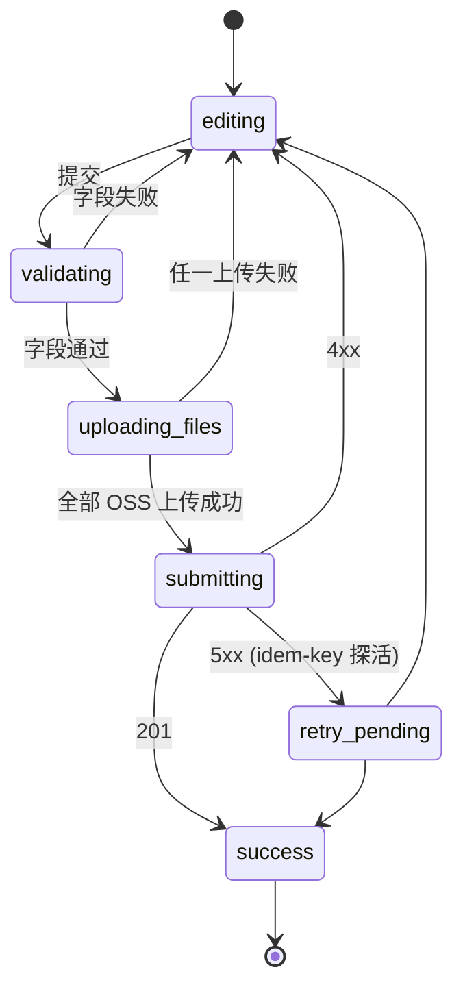
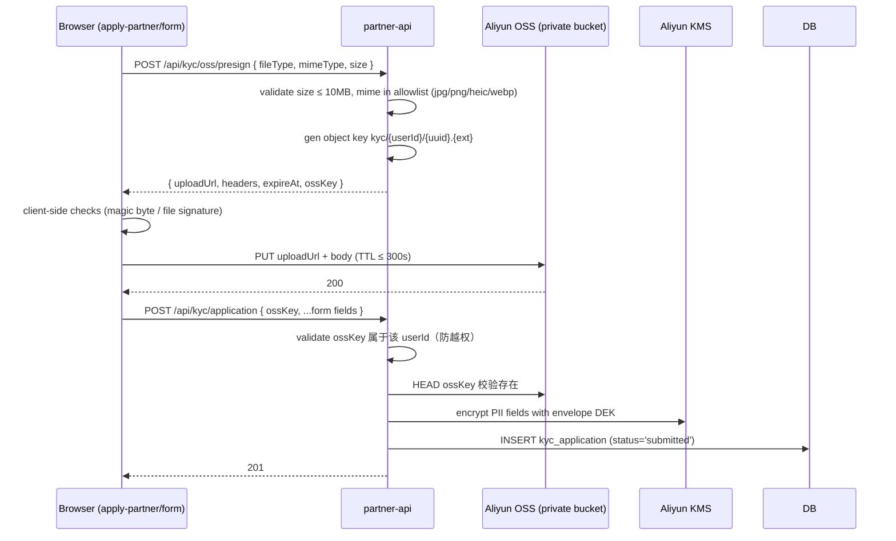
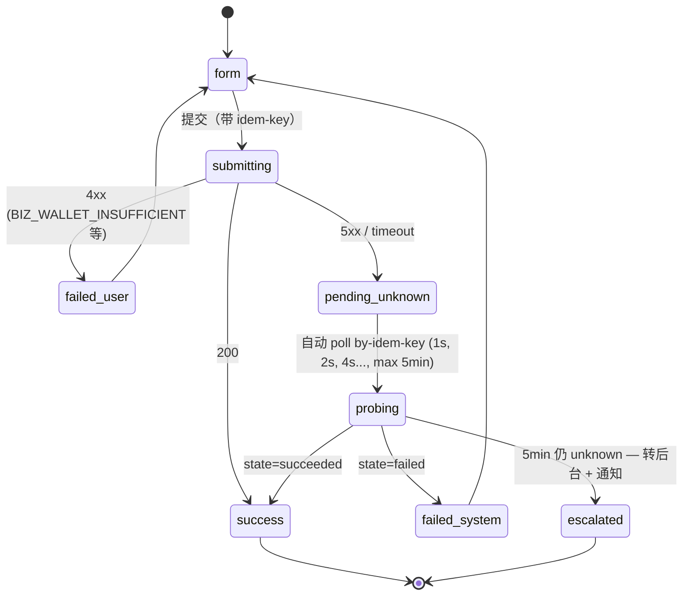

# Frontend Design — TraceNex Partner Web

> 版本：**v1.0 定稿（Round 2 PASS, 2026-05-11）**
> 维护人：Frontend Architect
> 最后更新：2026-05-11（v0.2.2 → v1.0 收口）
> 上游契约（不可改）：
> - `docs/00-architecture-overview.md` v1.0
> - `docs/integration-design.md` v1.0
> - `prd/PRD-v1.0.md`（业务权威，2295 行）
> - `reviews/dev-round-1/{01-PM,02-Architect,03-Security,04-Compliance}-review.md`
> - `reviews/dev-round-2/{01-PM,02-Architect,03-Security,04-Compliance}-review.md`（4 方 PASS）
> 下游：与 backend-design v1.0 并行；本文不定义后端 service / DB 结构。
>
> 本文目标：把上述契约落地为**前端工程蓝图**——三个站点 + 一个扩展面板的代码组织、路由、状态、表单、鉴权、PII 处理、可观测、测试、Phase 切片。每条决策都引用 PRD / overview / integration-design 章节，不复述。详细修订条目见本文末尾 §21 "v0.1 → v0.2 CHANGELOG" + §22/§23 ADDENDUM + 末段 "v0.2.2 → v1.0 收口"。
>
> ⚠️ 与 overview/integration-design 一致的"测试钩子"约定：每节末尾列出可机器验证的 invariant。

---

## 0. 目录

1. 三个站点 + 一个扩展面板（拓扑与子域）
2. 代码组织（monorepo / packages 切分）
3. 路由树（per site，含权限守卫）
4. 状态管理（TanStack Query + Zustand 边界）
5. API Client（OpenAPI codegen + 幂等 + trace_id）
6. 鉴权与会话（JWT + CSRF + 跨子域）
7. 关键页面 + 表单（wireframe + 状态机 + zod schema）
8. 通用组件库（表格 / 审批流 / 详情）
9. PII 处理前端规则
10. 国际化（i18n）
11. 设计系统 / theme / 可访问性
12. 安全 headers / CSP / CORS
13. 错误处理 / 用户提示
14. 性能预算
15. 可观测（前端日志 / Sentry / 埋点）
16. 测试策略（金字塔 + e2e 场景表）
17. 构建 / 部署 / env 切分
18. Phase 切片（页面 → Phase 1 / 2A / 2B / 3）
19. ADR（≥ 5 条）
20. 风险登记

---

## 1. 三个站点 + 一个扩展面板

> 1 句话引用 PRD §3.4 子域：`partner.tracenex.cn`（partner+customer 共用 web）/ `admin.tracenex.cn`（staff）/ 公开商城落地页。本节展开"前端工程视角下，这些站点怎么物理切"。

### 1.1 站点与受众矩阵

| 站点 | URL | 受众 | 鉴权 | SSR/SEO | Bundle 目标 | Phase |
|---|---|---|---|---|---|---|
| **公开商城 / 招商落地页** | `www.tracenex.cn`（或根域）| 匿名访客 | 无（注册前）| ✅ 必须（SEO + 首屏 < 1.5s）| ≤ 180KB gz initial | 1 |
| **客户后台** | `partner.tracenex.cn/customer/*` | `customer` 角色 | Fy-api JWT (cookie `tnbiz_access`) | ❌ CSR | ≤ 250KB gz initial / route | 1 |
| **渠道商后台** | `partner.tracenex.cn/partner/*` | `partner` 角色 | Fy-api JWT (cookie `tnbiz_access`) + MFA（KYC 通过即强制，PRD §22.1 F-9）| ❌ CSR | ≤ 250KB gz initial / route | 1 |
| **平台管理后台** | `admin.tracenex.cn/*` | `staff`（4 子角色，PRD §3.2）| Fy-api JWT + step-up MFA + WebAuthn | ❌ CSR | ≤ 280KB gz initial / route | 1 (基础) / 2A (完整) |

> ⚠️ **客户/渠道商共域**：M2-11（PRD §7.2）允许同一账号在 customer 与 partner 视图间切换。共用 `partner.tracenex.cn` 域 + 顶部下拉，避免跨子域 cookie 切换 PII。**禁止**同账号是 partner_X 同时是 partner_Y 的 customer（PRD §M2-11 footer，避免左右手交易）——前端在 actor switcher 处守卫。

### 1.2 ADR-F1：平台管理后台 = 独立 SPA on `admin.tracenex.cn`，不嵌入 Fy-api 既有 admin

- **决策**：admin 站点是 TraceNexBiz monorepo 的一个独立 Vite app（`apps/admin`），独立打包、独立 CSP、独立部署到 `admin.tracenex.cn`，不复用 Fy-api 的现有 admin web。
- **为什么不嵌入 Fy-api admin**：
  1. Fy-api admin 是上游 React/Semi 资产，月度 sync 必有冲突（PRD §22.1 F-13、A-1）；嵌入后 OVERLAY.md 行数失控
  2. partner_db RBAC 与 Fy-api user 表 RBAC 是两套权限矩阵（PRD §3.4 22 verbs × 6 角色 vs Fy-api 原生 admin/common）；混在一起会破坏 BOLA 测试矩阵（Security I-CI #1）
  3. partner-api 是 partner_db 的唯一写入方，admin 必须只调 partner-api `/api/admin/*`，不应直接打 Fy-api `/api/*`
  4. Phase 2A 后 admin 要嵌入 KMS 操作 / 个税审批 / 内容安全审核中心（PRD M4-17），合规上需要独立审计边界 + 屏幕水印（§9.4），独立站点更易控制
- **为什么不"内嵌于 Fy-api admin 的 iframe / micro-frontend"**：iframe 的 CSP / cookie / postMessage 边界比 SSO 还复杂；Module Federation 在 Vite 下需要插件，月度 sync 受 Fy-api Webpack/CRA 配置影响。
- **代价**：需要维护两套登录 UI（Fy-api 原生 admin 仍存在；TraceNexBiz admin 是新站）。可接受——staff 大多只用其中一个。
- **引用**：overview §3.4 子域 / §9 ADR-007；PRD §22.1 F-13。

### 1.3 公开商城是否走 SSR？

- **结论**：Phase 1 用 **Vite + vite-plugin-ssr**（或 Astro）做 hybrid SSR：商城首页 / 模型详情 / 招商落地页 SSR，其它路由 CSR。
- **为什么不全 CSR**：M1-01 模型展示需要 SEO（Google / 百度 / Bing）；招商落地页需要快速首屏（PRD §1.4 Phase 1 GMV / 5 家种子渠道商 KPI）。
- **为什么不 Next.js**：避开第二个框架；Vite 已是技术栈钦定（README.md 关键事实）。如果 SSR 复杂度证明合理，Phase 2A 评估迁 Next.js（**ADR-F5** 候选）。
- **为什么不 Astro**：Astro 的 React island 模型对 Semi UI 表单交互不友好。

### 1.4 测试钩子（§1）

- F-1.1 `admin.tracenex.cn` 与 `partner.tracenex.cn` 的 cookie 不可共享：浏览器 e2e 验证 `Set-Cookie` Domain 不跨子域（与 Security M-r2-8 一致）
- F-1.2 公开商城路由 SSR 输出 HTML 含 `<title>` / `<meta name="description">` 且不需 JS 即可被爬虫抓取（lighthouse SEO 评分 ≥ 90）
- F-1.3 customer / partner 视图切换通过 `/api/me/switch-actor`，前端不持久化 actor 在 localStorage（防 XSS 提权）

---

## 2. 代码组织（monorepo）

> 1 句话引用 README："TraceNex Partner，前端 React 18 + Vite + Semi UI"。本节给出工程结构。

### 2.1 ADR-F2：pnpm workspaces + Turborepo

- **决策**：`pnpm workspaces`（依赖管理 + hoisting）+ `Turborepo`（构建编排 / 缓存）。
- **为什么不 Nx**：Nx 强约定（plugin-based code gen）对小团队（< 10 人）边际收益低；Turborepo 的 `turbo.json` 配置量更轻。
- **为什么不 Lerna**：Lerna 已停止维护；pnpm workspaces 是事实标准。
- **为什么不 Rush**：Rush 学习曲线陡，企业级特性（如 phantom dep 检测）我们用 pnpm 严格模式 + `dependency-cruiser` 替代。

### 2.2 目录结构

```
TraceNexBiz/web/                    （新仓库 or 子目录，待 Phase 1 D-day 决定）
├── package.json                    pnpm workspaces root
├── pnpm-workspace.yaml
├── turbo.json
├── tsconfig.base.json              extends across packages
├── apps/
│   ├── storefront/                 公开商城 / 招商落地（SSR-hybrid）
│   │   ├── vite.config.ts
│   │   ├── src/
│   │   │   ├── pages/
│   │   │   ├── routes.ts
│   │   │   └── main.tsx
│   │   └── package.json
│   ├── portal/                     客户后台 + 渠道商后台（共域 SPA）
│   │   ├── vite.config.ts
│   │   ├── src/
│   │   │   ├── routes/
│   │   │   │   ├── customer/
│   │   │   │   └── partner/
│   │   │   ├── App.tsx
│   │   │   └── main.tsx
│   │   └── package.json
│   └── admin/                      平台管理后台（独立 SPA）
│       ├── vite.config.ts
│       ├── src/
│       └── package.json
│
├── packages/
│   ├── ui-kit/                     基于 Semi UI 的二次封装（Table / Form / Detail / AuditTimeline / ApprovalSteps）
│   │   ├── src/
│   │   │   ├── DataTable/          带筛选 / 分页 / 导出
│   │   │   ├── ApprovalSteps/      审批流步骤条 + state machine viz
│   │   │   ├── DetailLayout/       Tab + AuditTimeline 复合布局
│   │   │   ├── PiiField/           PII 脱敏展示组件（§9）
│   │   │   ├── MoneyDisplay/       quota → ¥ 格式化（PRD §20）
│   │   │   ├── StateBadge/         状态机 enum → 颜色 / 文字（PRD §14）
│   │   │   └── theme/              Semi tokens 定制
│   │   └── package.json
│   │
│   ├── api-client/                 OpenAPI codegen 输出 + 幂等 / trace_id middleware（§5）
│   │   ├── generated/              ← orval 自动生成（不进 git；CI 重新生成）
│   │   │   ├── partner-api.ts
│   │   │   └── schemas.ts
│   │   ├── src/
│   │   │   ├── client.ts           axios instance + interceptors
│   │   │   ├── idempotency.ts      uuid + retry helpers
│   │   │   ├── error-mapping.ts    BIZ_* → toast i18n key（§13）
│   │   │   └── trace.ts            X-Oneapi-Request-Id 透传（overview §4.4）
│   │   └── package.json
│   │
│   ├── auth/                       JWT (cookie tnbiz_access) + CSRF (tnbiz_csrf) + refresh + revocation（§6；v1.0 cosmetic #2）
│   │   ├── src/
│   │   │   ├── jwt.ts
│   │   │   ├── csrf.ts
│   │   │   ├── refresh.ts
│   │   │   ├── permission.ts       PRD §3.4 enum 镜像
│   │   │   └── guards.tsx          <RequireRole>, <RequireScope>
│   │   └── package.json
│   │
│   ├── i18n/                       react-i18next setup + zh-CN/en-US 文案
│   │   ├── locales/zh-CN/*.json
│   │   ├── locales/en-US/*.json
│   │   └── src/
│   │       ├── index.ts
│   │       └── format.ts            日期 / 货币 / 数字格式
│   │
│   ├── validators/                 共享 zod schema（partner 申请 / KYC / 充值 / 退款）
│   │   └── src/
│   │       ├── kyc.ts
│   │       ├── partner-application.ts
│   │       ├── allocate.ts
│   │       └── refund.ts
│   │
│   ├── observability/              Sentry init + custom logger + PII scrubber 客户端版（§15）
│   │   └── src/
│   │       ├── sentry.ts
│   │       ├── logger.ts
│   │       └── scrubber.ts
│   │
│   ├── config/                     env loader / feature flags / biz_setting client mirror
│   │   └── src/index.ts
│   │
│   └── test-utils/                 vitest setup + MSW handlers + Playwright fixtures
│       └── src/
│
├── tools/
│   ├── openapi-pull.ts             从 backend 拉取最新 spec → 触发 orval
│   ├── permission-matrix-check.ts  CI gate：每个 router 必须引用 permission.X enum
│   └── pii-tag-lint.ts             custom eslint rule（§9）
│
└── e2e/                            Playwright 顶层（跨 app）
    ├── fixtures/
    ├── tests/
    └── playwright.config.ts
```

### 2.3 依赖边界（dependency-cruiser 强制）

```
apps/storefront ─┐
apps/portal ─────┼──► packages/ui-kit ──► Semi UI
apps/admin ──────┤                  ──► packages/i18n
                 ├──► packages/api-client ──► packages/auth ──► packages/observability
                 ├──► packages/validators (zod)
                 └──► packages/config

packages/* 之间 strict DAG，无循环依赖；任何 app 不可直接 import 另一个 app。
```

### 2.4 拆分大文件指引

> 引用 user 全局规则 "200-400 lines typical, 800 max"。

- 任何页面组件超过 250 行 → 拆 `pages/X/index.tsx` + `pages/X/components/*` + `pages/X/hooks.ts`
- 任何 API hook 文件超过 300 行 → 按 endpoint 域拆（codegen 默认按 OpenAPI tag 分文件）
- 任何 i18n locale 单文件超过 500 行 → 按命名空间分（`common.json` / `customer.json` / `partner.json` / `admin.json` / `errors.json`）

### 2.5 测试钩子（§2）

- F-2.1 dependency-cruiser CI gate：`apps/admin` 不能 import `apps/portal/**`（grep gate）
- F-2.2 任何提交后 `pnpm -r build` 必须在 5 分钟内完成（Turborepo 缓存命中率 ≥ 70%）
- F-2.3 `packages/api-client/generated/**` 不进 git；CI 在 build 前重新生成且 diff 必须为空（drift 防护，A-1）

---

## 3. 路由树（per site）

> 1 句话引用 PRD §3.4 + overview §3.3。本节给完整路由 + 权限守卫挂载点。

### 3.1 公开商城（`apps/storefront`）

```
/                           Home（招商落地 + 模型展示精选）       Phase 1, SSR
/models                     模型市场                              Phase 1, SSR
/models/:id                 模型详情（PRD M1-02，含服务声明）       Phase 1, SSR
/pricing                    价目表（v0.2 Compliance MED-20：ICP 经营许可证拿证前仅显示"招商内测"，feature flag `compliance.icp_license_active`） Phase 1, SSR
/apply-partner              渠道商申请落地页（PRD M1-05）            Phase 1, SSR
/apply-partner/form         渠道商申请表单（PRD M1-06）              Phase 1, CSR
/legal/privacy              隐私政策（附录 A）                       Phase 1, SSR
/legal/terms                用户协议（附录 B）                       Phase 1, SSR
/legal/partner-agreement    渠道商合作协议                          Phase 1, SSR
/legal/dpo                  DPO 联系入口（v0.2 Compliance HIGH-8）    Phase 1, SSR
/legal/complaint            PIPL 投诉受理（v0.2 Compliance HIGH-8）   Phase 1, CSR (POST → /pipl-complaint)
/auth/login                 登录（M1-04，复用 Fy-api JWT 端点）       Phase 1, CSR
/auth/register              注册（带可选邀请码）                     Phase 1, CSR
/auth/forgot                密码重置 — 阶段 1：发起（PRD §17.5；backend §7.9.1）   Phase 1, CSR
/auth/reset/:token          密码重置 — 阶段 2：双因子确认（v0.2.2 ADDENDUM 登记） Phase 1, CSR
*                           404                                   Phase 1
```

> SSR 路由的 hydration data 不含 PII；任何 form submission 在 CSR 完成。
> **v0.2 Compliance CRIT-1 / M-8**：所有 storefront / portal / admin 三站全局 layout 必须挂载 `<ComplianceFooter>` 组件（见 §11 设计系统）；该组件消费 backend `biz_setting` 9 个 `compliance.*` key（ICP 备案号 / ICP 经营许可证号 / 公网安备号 / 生成式 AI 备案号 / 算法备案号 / 深度合成备案号 / DPO 邮箱 / DPO 电话 / 12377 链接），任一为空则 storefront CI build 失败。

### 3.2 客户/渠道商共域（`apps/portal`，`partner.tracenex.cn`）

```
/                           顶层选择 actor（auto-redirect 单一身份）      Phase 1
/me                         账号设置 / MFA / 通知偏好                     Phase 1

# Customer 视图（PRD §7.2 M2-*）
/customer                                                          Phase 1
├── /dashboard              M2-01 仪表盘 + outbox "截至 HH:MM:SS"   Phase 1
├── /balance                M2-02 余额 + 由 X 提供（M9-01；全局 PartnerBrandBanner v0.2 PM MEDIUM-2）  Phase 1
├── /orphan-notice          v0.2 PM HIGH-2 / 场景 I：渠道商已终止，30 天宽限内选新渠道商           Phase 2A
├── /topup                                                       
│   ├── /licensed           M2-03 持牌方收单                         Phase 2A
│   └── /offline            M2-04 线下转账                           Phase 2A
├── /api-keys               M2-05 API Key 管理                       Phase 1
├── /usage                  M2-08 账单中心                           Phase 1
│   ├── /export             M2-09 CSV/PDF 导出                       Phase 1
│   └── /:logId/dispute     v0.2 PM HIGH-4 / 场景 K：账单争议（dispute 入口）  Phase 2B
├── /seats                  M2-06 席位管理                           Phase 3
├── /models                 M2-07 模型配置                           Phase 1
├── /invoices               M2-10 发票申请                           Phase 2B
├── /kyc                    M2-12 认证中心（含"本年度已驳回 X/3"banner，v0.2 PM MEDIUM-7）  Phase 1 (stub) / 2A (full)
├── /tickets                M2-14 工单                              Phase 1
├── /notifications          M2-15 通知中心（v0.2 PM HIGH-1：从 Phase 2A 改 Phase 3，对齐 PRD §12.4）  Phase 3
├── /notifications/preferences  M11-03 通知偏好                      Phase 2A
├── /pipl-rights            M13-01..05 用户权利中心（NEW-3）          Phase 2A
└── /switch-partner         场景 H 申请切换渠道商                     Phase 2A

# Partner 视图（PRD §7.3 M3-*）
/partner                                                           Phase 1
├── /dashboard              M3-01                                   Phase 1
├── /customers              M3-03 客户列表 + 详情                    Phase 1
│   └── /:id                                                       
│       ├── /overview                                              
│       ├── /allocate       M3-04 saga 入口（带 wallet hold）        Phase 1
│       ├── /pricing        M3-08 客户级 markup                      Phase 2A
│       └── /transfer       M3-14 切出（场景 H）                      Phase 2A
├── /invitations            M3-02 邀请码管理                         Phase 1
├── /pricing                M3-08 + M3-12 + M3-13 markup 设置 + 历史  Phase 1 (单层) / 2A (多层)
├── /wallet                 M3-09 应付台账 + holds 视图              Phase 1
├── /statements             M3-10 / M5-07 账单 + 月结                Phase 2B
├── /disputes               v0.2 PM HIGH-4：partner 处理 dispute       Phase 2B
├── /tickets                工单                                    Phase 1
├── /notifications          M11 partner 通知（v0.2 PM MEDIUM HIGH-1：补 partner 入口）  Phase 1
├── /sandbox                M9-04 demo                              Phase 3
└── /settings               通知 / 联系信息 / KYC 续审               Phase 1

# 共用
/auth/login
/auth/mfa
/auth/recovery
*                           404
```

### 3.3 平台管理后台（`apps/admin`，`admin.tracenex.cn`）

```
/                           Dashboard 总览（M4-10）                  Phase 1
/partners                   M4-01 / M4-02                           Phase 1
├── /:id                                                          
│   ├── /overview                                                 
│   ├── /kyc                M4-03 KYC 审核 + presigned URL 预览       Phase 2A
│   ├── /wallet             M4-04 台账调整 / 冻结                     Phase 1
│   ├── /topup              M4-05 平台预拨 / 充值                     Phase 1
│   └── /annual-review      M4-16 年审                              Phase 2A
/customers                  M4-06 + M4-07（filter / drilldown）       Phase 1
├── /:id                    elevated audit on read（PRD §3.4 🅰）
├── /orphaned               v0.2 PM HIGH-2 / 场景 I：孤儿客户池视图（30 天宽限）  Phase 2A
└── /transfers              v0.2 PM MEDIUM-6 / 场景 H：staff 终审客户切换列表    Phase 2A
/models                     M4-08 模型 + 上游渠道                    Phase 2A
/plans                      M4-09 套餐管理                           Phase 2A
/settlements                M4-11 / M5-*                            Phase 2B
/refunds                    M4-12                                  Phase 2A
/invoices                   M4-13                                  Phase 2B
├── /:id/red-flush          v0.2 PM HIGH-3：M8 红冲 UI（reason + 操作日志） Phase 2B
/disputes                   v0.2 PM HIGH-4 / 场景 K：account 争议仲裁          Phase 3
/audit-log                  M4-15 操作日志（哈希链 viewer）            Phase 1
/content-safety             M4-17 内容安全审核中心                    Phase 2A
├── /events                 命中事件审核                              Phase 2A
├── /reports                v0.2 Compliance CRIT-2 / M-11：12377 上报记录 + 应上报但超期看板 Phase 2A
└── /models                 模型白名单（含月度对齐 cron 状态）         Phase 1
/pia                        v0.2 Compliance HIGH-7：PIA 报告管理（DPO 写）    Phase 2A
/pipl-complaints            v0.2 Compliance HIGH-8：PIPL 投诉受理工单池        Phase 1
/staff                      staff 管理（super_admin only）            Phase 2A
/system                     biz_setting + 配置变更审计                Phase 1
├── /security               v0.2 SEC CRIT-7：security-critical 配置（jwt_verify_key_pem 等；dual-control）Phase 1
/tickets                    工单分配 / SLA + drill-down 客户上下文（v0.2 PM MEDIUM-4）Phase 1
├── /:id                    详情：左侧工单内容；右侧"客户上下文面板"（用量 / 账单 / KYC 状态）M10-03 Phase 1
/saga/:id/force-resolve     v0.2 SEC CRIT-5：dual-control + 30min cooldown UI Phase 1
*                           404
```

### 3.4 路由守卫挂载

```tsx
// apps/portal/src/App.tsx (示意)
<RoleGuard expect="customer">
  <PermissionGuard verb="customer.read_self">
    <CustomerDashboardPage />
  </PermissionGuard>
</RoleGuard>
```

- `<RoleGuard>` 校验 JWT scope（`customer` / `partner` / `staff`）；不通过 → redirect `/auth/login` 或 `/`
- `<PermissionGuard verb="...">` 校验 PRD §3.4 矩阵；不通过 → 渲染 404（与服务端 `BIZ_RES_NOT_FOUND` 行为一致，Security CI #1）
- `<MfaGuard required>`：partner KYC 通过即强制（PRD §22.1 F-9）；admin 任何 elevated 动作 step-up MFA（≤ 15 min，Security M-R2-1）

### 3.5 测试钩子（§3）

- F-3.1 每条路由必须有对应 `permission.X` enum 引用（custom eslint rule + CI fail，与 overview I-3.2 对应）
- F-3.2 任何 partner 路由直接访问别家 partner 的 `/customers/:id` 必须 redirect 到 404 页（前端早返回；服务端 BOLA 是 last line of defense）
- F-3.3 admin 路由进入时必发起 `audit_log.read.elevated` 服务端记录（Security `🅰` action）

---

## 4. 状态管理

### 4.1 ADR-F3：服务器状态 = TanStack Query；客户端状态 = Zustand

- **决策**：所有从 partner-api 读 / 写的数据走 **TanStack Query**（`@tanstack/react-query` v5）；纯客户端 UI 状态（modal open、表单 step、actor switcher 选中）走 **Zustand v4** + `immer` middleware。
- **为什么不 Redux Toolkit + RTK Query**：RTK Query 与 Zustand 重叠，且 boilerplate 多；TanStack Query 的 cache 模型（per-query stale/gc time）对 outbox 数据"截至 HH:MM:SS"语义友好（PRD M2-01 / M3-01）。
- **为什么不 Jotai / Recoil**：状态原子粒度对 dashboard 类页面意义不大；Zustand store-per-domain 更易理解。

### 4.2 边界规则

| 数据类别 | 工具 | TTL / 策略 |
|---|---|---|
| 列表 / 详情 / 统计（GET）| TanStack Query | `staleTime: 30s`（dashboard）/ `5min`（KYC、settlement 静态）/ `0`（钱包余额，always refetch）|
| Mutation（POST/PUT/DELETE）| `useMutation` + 服务端 `Idempotency-Key` | retry 仅 5xx；4xx 不 retry |
| Auth state（JWT exp / 当前 actor）| Zustand `useAuthStore` | persist 在内存；token in httpOnly cookie，不 store |
| UI state（modal / drawer / step）| Zustand `useUiStore` | per-page slice |
| 表单状态 | react-hook-form | 不进 store |
| 通知 toast 队列 | Zustand `useToastStore` | ephemeral |
| Feature flags / biz_setting 镜像 | TanStack Query (`/api/me/flags`) | `staleTime: 60s` |

### 4.3 Zustand store 形态（immutable update）

```ts
// packages/auth/src/store.ts (示意)
import { create } from 'zustand'
import { immer } from 'zustand/middleware/immer'

interface AuthState {
  actor: { type: 'customer' | 'partner' | 'staff'; id: number; permissions: string[] } | null
  jwtExp: number | null
  mfaSatisfied: boolean
  setActor: (actor: AuthState['actor']) => void
  clearActor: () => void
}

export const useAuthStore = create<AuthState>()(
  immer((set) => ({
    actor: null,
    jwtExp: null,
    mfaSatisfied: false,
    setActor: (actor) => set((s) => { s.actor = actor }),     // ✅ immer：看似 mutate，实际新对象
    clearActor: () => set((s) => { s.actor = null; s.jwtExp = null; s.mfaSatisfied = false }),
  }))
)
```

> immer middleware 保证每次 `set` 产出新对象，符合用户全局规则 "ALWAYS create new objects, NEVER mutate existing ones"。

### 4.4 缓存失效

- Wallet allocate 成功后：`queryClient.invalidateQueries({ queryKey: ['partner-wallet'] })` + `['customer', customerId]` + `['wallet-holds']`
- KYC 提交后：`['kyc', userId]`
- 退款成功：`['revenue-log']`、`['partner-wallet']`、`['customer', customerId, 'usage']`
- biz_setting 改动：partner-api 通过 SSE/Websocket 推送（Phase 2A 评估；Phase 1 用 60s 轮询 fallback）

### 4.5 乐观更新规则

- **允许乐观更新**：通知"已读"切换、UI 偏好修改、ticket reply 显示
- **禁止乐观更新**：钱包 allocate / topup / refund / KYC 提交 / 任何 saga 端点
  - 理由：saga 走 by-idem-key 探活，"成功"必须服务端确认；optimistic 乐观会让 UI 显示已加额度但实际 saga 未 commit
  - 替代：用"提交中 → 待确认 → 成功"三阶段 UI（详见 §7.4）

### 4.6 测试钩子（§4）

- F-4.1 任何 mutation hook 必须读取 `Idempotency-Key`（运行时 assert + eslint 自定义规则）
- F-4.2 钱包余额 query 在每次 mutation 后必须 invalidated（integration test 验证）
- F-4.3 zustand store 不允许 `set((s) => s.field = value)` 缺 immer middleware（lint）

---

## 5. API Client

### 5.1 ADR-F4：从 OpenAPI 自动生成 → orval（推荐）

- **决策**：用 **orval**（`orval`@7.x）从 `openapi/partner-api.yaml` 生成 TS types + TanStack Query hooks。Phase 1 也生成 axios client；codegen 输出在 `packages/api-client/generated/`，不进 git。
- **为什么不 openapi-typescript**：仅生成 types，不生成 hooks；hand-rolled hooks 与 spec drift 风险大（A-1）。
- **为什么不 swagger-codegen / openapi-generator**：JVM 依赖；生成代码冗余（per-endpoint class）。
- **为什么不 hey-api/openapi-ts**：较新，生态弱于 orval。
- **CI 强制**：`pnpm openapi:gen` 在 lint 前跑；diff 非空 = fail（spec drift 检测）。

### 5.2 axios client + interceptors

```ts
// packages/api-client/src/client.ts (示意)
import axios from 'axios'
import { v7 as uuidv7 } from 'uuid'
import { getCsrfToken, getJwt } from '@tnbiz/auth'
import { mapApiError } from './error-mapping'
import { propagateTrace } from './trace'

export const apiClient = axios.create({
  baseURL: import.meta.env.VITE_API_BASE,
  withCredentials: true,
  timeout: 15_000,
})

apiClient.interceptors.request.use((config) => {
  // trace_id：浏览器侧用 UUIDv7（按 overview §4.4，与 Fy-api/X-Oneapi-Request-Id 同源）
  config.headers['X-Oneapi-Request-Id'] ??= uuidv7()
  // CSRF（PRD §17.3）
  if (['post', 'put', 'delete', 'patch'].includes(config.method ?? '')) {
    config.headers['X-Csrf-Token'] = getCsrfToken()
  }
  // Idempotency for state-changing endpoints（PRD §18 / overview §4.3）
  if (config.idempotent !== false && ['post', 'put', 'delete'].includes(config.method ?? '')) {
    config.headers['Idempotency-Key'] ??= uuidv7()
  }
  return config
})

apiClient.interceptors.response.use(
  (res) => res,
  (err) => Promise.reject(mapApiError(err))   // 错误码 → toast i18n key + UX 决策
)
```

### 5.3 调用示例（含幂等 + 错误处理）

```ts
// apps/portal/src/routes/partner/customers/AllocateForm.tsx (示意)
import { useMutation, useQueryClient } from '@tanstack/react-query'
import { v7 as uuidv7 } from 'uuid'
import { allocateQuota } from '@tnbiz/api-client/generated/partner-api'

export function useAllocateQuota() {
  const qc = useQueryClient()
  return useMutation({
    mutationFn: (input: AllocateInput) =>
      allocateQuota({
        ...input,
        // 客户端生成 idem-key；同一表单提交按钮多次点击复用
        idempotencyKey: input.idempotencyKey ?? uuidv7(),
      }),
    retry: (failureCount, err) => {
      // 5xx 不在前端 retry — 服务端 saga 已经走 unknown 分支 + 探活
      // 422 / 4xx 立即停止
      return false
    },
    onSuccess: (data, vars) => {
      qc.invalidateQueries({ queryKey: ['partner-wallet'] })
      qc.invalidateQueries({ queryKey: ['customer', vars.customerId] })
    },
    onError: (err) => {
      // 5xx → "请求已提交，结果确认中" UI 状态（saga unknown 分支）
      if (err.code === 'BIZ_FYAPI_5XX' || err.code === 'BIZ_FYAPI_TIMEOUT') {
        usePendingSagaStore.getState().push(err.idempotencyKey, err.tracedAs)
      }
    },
  })
}
```

### 5.4 错误码 → toast 映射（i18n）

> 引用 overview §11.3 错误 envelope。

```ts
// packages/api-client/src/error-mapping.ts
const TOAST_MAP: Record<string, { i18nKey: string; severity: 'error' | 'warning' | 'info' }> = {
  BIZ_AUTH_JWT_REVOKED:           { i18nKey: 'errors.auth.jwt_revoked',     severity: 'error' },
  BIZ_PERM_FORBIDDEN:             { i18nKey: 'errors.perm.forbidden',       severity: 'error' },
  BIZ_VALID_AMOUNT_OUT_OF_RANGE:  { i18nKey: 'errors.valid.amount_range',   severity: 'warning' },
  BIZ_IDEM_KEY_REUSED_DIFFERENT_BODY: { i18nKey: 'errors.idem.reused',      severity: 'warning' },
  BIZ_WALLET_INSUFFICIENT_AVAILABLE: { i18nKey: 'errors.wallet.insufficient', severity: 'warning' },
  BIZ_PRICING_OVERLAP_WINDOW:     { i18nKey: 'errors.pricing.overlap',      severity: 'error' },
  BIZ_SAGA_STUCK_UNKNOWN:         { i18nKey: 'errors.saga.unknown',         severity: 'warning' },
  BIZ_FYAPI_5XX:                  { i18nKey: 'errors.fyapi.unknown',        severity: 'warning' },
  BIZ_KYC_REJECTED:               { i18nKey: 'errors.kyc.rejected',         severity: 'error' },
  BIZ_PAYMENT_AMOUNT_MISMATCH:    { i18nKey: 'errors.payment.mismatch',     severity: 'error' },
  BIZ_CONTENT_BLOCKED_INPUT:      { i18nKey: 'errors.content.blocked',      severity: 'warning' },
  BIZ_RES_NOT_FOUND:              { i18nKey: 'errors.not_found',            severity: 'info' },  // 越权也走这里（PRD §16.3）
}
```

> ⚠️ `BIZ_RES_NOT_FOUND` 在前端永远显示"资源不存在"——不暴露存在性，与 overview §11.3 注一致。

### 5.5 重试策略

| 触发 | 是否 retry | 退避 |
|---|---|---|
| 网络错误 / `ERR_NETWORK` | 是（最多 3 次）| 指数 500ms / 1s / 2s |
| 4xx（含 409 idem 冲突）| 否 | — |
| 5xx | 否（服务端 saga retry）| 用户得到"提交中"UI |
| timeout（15s）| 否 | 弹"网络较慢，请稍后" + 提供 by-idem-key 探活 button |

### 5.6 测试钩子（§5）

- F-5.1 MSW 拦截测试：每个 state-changing call 必有 `Idempotency-Key` header，UUIDv7 格式
- F-5.2 spec drift CI gate：codegen output 哈希与 spec 哈希同步（与 overview I-4.1 对齐）
- F-5.3 5xx 模拟下，UI 必显示"提交中"且不重复发起请求

---

## 6. 鉴权与会话

> 引用 PRD §17 + ADR-007 + Security M-r2-8。本节展开"前端怎么写"。

### 6.1 鉴权链路

```
1. 用户在 /auth/login 提交 username + password (+ TOTP/WebAuthn)
2. partner-api 转发到 Fy-api 鉴权端点（或 partner-api 自身做 password / MFA，待 backend-design 决定）
3. partner-api 返回：
   - 设置 httpOnly Cookie `tnbiz_access`（access_token） + `tnbiz_refresh`（refresh_token，Path=/auth/refresh） + non-httpOnly `tnbiz_csrf`（double-submit token）（v1.0 cosmetic #2：移除 `tnbiz_session`，UI ttl 由 access_token exp + router guard 替代）
   - 返回 JWT（access_token，TTL 15min）+ refresh_token（TTL 8h，also httpOnly cookie）
   - 返回 csrf_token（**non-httpOnly** cookie 或 body field，前端读到后存 zustand）
4. 前端：
   - Zustand `useAuthStore.setActor({ type, id, permissions })`，permissions 来自 JWT claims
   - axios interceptor 在 4xx 失败 + WWW-Authenticate: refresh_required 时调用 /auth/refresh
   - 不存 access_token 在 localStorage（防 XSS 提权）
5. 登出：DELETE /auth/session → 服务端把 jti 加入 Redis revoked:jti:* + 清 cookie + 前端 clearActor()
```

### 6.2 ADR-F5：JWT 走 httpOnly cookie，不走 Authorization header

- **决策**：access_token 在 `tnbiz_access` httpOnly cookie；refresh_token 在 `tnbiz_refresh` httpOnly cookie；csrf_token 在 `tnbiz_csrf` non-httpOnly cookie（double-submit pattern）。
- **为什么不 Authorization: Bearer in localStorage**：XSS 直接窃取；即使 short-lived 也能在窗口内造成 wallet 操作。
- **为什么不 Authorization: Bearer in memory + refresh in cookie**：单页刷新时丢失 access_token，依赖 refresh 路径，复杂度更高 + 有竞态。
- **为什么不 sessionStorage**：仍可被同源 JS 读取。
- **CSRF 防御**：double-submit cookie + Origin/Referer 校验（PRD §17.3）；mutation 必带 `X-Csrf-Token` header == cookie 值。
- **跨子域**：`partner.tracenex.cn` 与 `admin.tracenex.cn` cookie scope **不共享**（各自 Domain）；同账号在两站登录是两次独立 session（与 Security M-r2-8 一致）。
- **客户/渠道商共域**：`partner.tracenex.cn` 一份 session 可在 customer ↔ partner actor 间切换（POST /api/me/switch-actor 服务端换 JWT）。

### 6.3 SSO 跨站策略

- Phase 1：不实现 SSO；staff 在 admin 站独立登录，partner/customer 在 portal 站独立登录。
- Phase 2A 评估：用 partner-api 做 OIDC provider，把 Fy-api admin / partner-web / admin-web 都接入。

### 6.4 Refresh 与登出

```ts
// packages/auth/src/refresh.ts (示意)
let refreshPromise: Promise<void> | null = null
export async function ensureFresh() {
  if (!isExpiringSoon(useAuthStore.getState().jwtExp)) return
  refreshPromise ??= apiClient.post('/auth/refresh').finally(() => { refreshPromise = null })
  await refreshPromise
}
```

> 单 in-flight refresh promise 防止并发刷新。失败 → clearActor() + redirect /auth/login。

### 6.5 MFA UI

- TOTP 设置：QR code（otpauth URL）+ 6 位输入校验；启用后写入 `staff.mfa_secret` / `partner.mfa_*`
- WebAuthn：`navigator.credentials.create()` for register；`navigator.credentials.get()` for assert
- Step-up：admin 进入 elevated action（如 KYC export PII）触发 step-up MFA（PRD §22.1 引述 Security M-R2-1，`Elevated=true` ≤ 15 min）

### 6.6 测试钩子（§6）

- F-6.1 access_token 不出现在 `document.cookie`（must be httpOnly），可由 e2e 用 CDP 验证
- F-6.2 mutation 不带 X-Csrf-Token 必返 403
- F-6.3 jti 加入 revocation list 后 60s 内（缓存窗口）任何 API 必返 401

---

## 7. 关键页面 + 表单

> 每个页面给 ASCII wireframe + 状态机（mermaid）+ zod schema 片段。引用 PRD 模块 ID。

### 7.1 招商落地页 / 渠道商申请表单（PRD M1-05/06）

#### Wireframe（apply-partner/form）

```
┌───────────────────────────────────────────────────┐
│ TraceNex  [产品] [文档] [价格] [申请渠道商] [登录]   │
├───────────────────────────────────────────────────┤
│                                                   │
│   申请成为渠道商                                    │
│   ━━━━━━━━━━━━━━━━━                              │
│                                                   │
│   主体类型  ( ) 企业    ( ) 个人                    │
│                                                   │
│   ┌─ 企业资料 ──────────────────────────────────┐  │
│   │ 公司名称*       [_________________]         │  │
│   │ 统一社会信用代码* [_________________]        │  │
│   │ 法人姓名*       [_________________] [PII]   │  │
│   │ 法人身份证号*   [_________________] [PII]   │  │
│   │ 营业执照*       [📷 拍照 / 上传]             │  │
│   │ 法人身份证 (正)* [📷 拍照 / 上传]             │  │
│   │ 法人身份证 (反)* [📷 拍照 / 上传]             │  │
│   └────────────────────────────────────────────┘  │
│                                                   │
│   联系信息                                         │
│   ┌────────────────────────────────────────────┐  │
│   │ 联系人*  [____]   电话* [____]  邮箱* [____] │  │
│   └────────────────────────────────────────────┘  │
│                                                   │
│   ☐ 我已阅读《用户协议》《隐私政策》《渠道商合作协议》│
│   ☐【单独同意】我同意 TraceNex 收集和处理我的       │
│      身份证号、法人姓名、营业执照等敏感个人信息       │
│      （PRD §15.5 + Compliance NEW-3）             │
│                                                   │
│   [取消]                            [提交申请 →]   │
└───────────────────────────────────────────────────┘
```

#### 状态机



#### zod schema

```ts
// packages/validators/src/partner-application.ts
import { z } from 'zod'

export const PartnerEnterpriseSchema = z.object({
  type: z.literal('enterprise'),
  companyName: z.string().min(2).max(128),
  uscc: z.string().regex(/^[0-9A-HJ-NPQRTUWXY]{18}$/, '统一社会信用代码格式错误'),
  legalPersonName: z.string().min(1).max(64),                         // PII (§16.5 敏感)
  legalPersonIdNo: z.string().regex(/^\d{17}[\dXx]$/, '身份证号格式错误'),  // PII (§16.5 敏感)
  businessLicenseOssKey: z.string().min(1),                            // OSS object key
  legalPersonIdFrontOssKey: z.string().min(1),
  legalPersonIdBackOssKey: z.string().min(1),
  contactName: z.string().min(1).max(64),
  contactPhone: z.string().regex(/^1[3-9]\d{9}$/, '请填写有效的中国大陆手机号'),
  contactEmail: z.string().email().max(128),
  consentGeneralAccepted: z.literal(true, { errorMap: () => ({ message: '请勾选用户协议同意' }) }),
  consentSensitivePiAccepted: z.literal(true, { errorMap: () => ({ message: '请单独同意敏感个人信息处理' }) }),
})

export const PartnerIndividualSchema = z.object({
  type: z.literal('individual'),
  realName: z.string().min(1).max(64),                                // PII (敏感)
  idNo: z.string().regex(/^\d{17}[\dXx]$/),                           // PII (敏感)
  alipayAuthCode: z.string().min(1),                                  // 走支付宝芝麻认证（PRD M7-02），不收身份证图片
  consentGeneralAccepted: z.literal(true),
  consentSensitivePiAccepted: z.literal(true),
})

export const PartnerApplicationSchema = z.discriminatedUnion('type', [
  PartnerEnterpriseSchema, PartnerIndividualSchema,
])
```

### 7.2 KYC 拍照上传 + presigned URL 流程（PRD M7-01/03 + §19.6）

> ⚠️ **CRITICAL**：所有 KYC 文件**直传 OSS 私有桶**（partner-api 颁发 presigned PUT URL，TTL ≤ 300s），不经 partner-api 中转；image bytes 不进 partner-api 进程内存。

#### 时序



#### 客户端约束

- 拍照：使用 `<input type="file" accept="image/*" capture="environment">`（移动端调起后置摄像头）
- 大小检查：JS 侧拒 > 10MB
- 类型检查：读前 4 字节 magic byte 验证（避免改后缀名绕过）
- 进度条：`XMLHttpRequest.upload.onprogress`（fetch 不支持上传进度直到 Streams API 普及）
- 失败重试：按 OSS X-Amz-Request-Id 抓 retry-able 错误；重试上限 3
- 上传中页面禁止刷新（`beforeunload` warning）
- presigned URL **绝不**进 console.log / Sentry breadcrumb（OSS 域名 query string 在 observability scrubber 中过滤，与 PRD §19.6 一致）

### 7.3 渠道商仪表盘（PRD M3-01）

```
┌─────────────────────────────────────────────────────────────┐
│ 当前余额（应付台账）¥ 12,450  | 可用余额 ¥ 11,200           │
│ Hold 中 ¥ 1,250 (3 笔进行中)   | 数据截至 14:23:05         │
├─────────────────────────────────────────────────────────────┤
│ ┌─ 本月概览 ────┐ ┌─ 客户活跃度 ──┐ ┌─ 即将到期 KYC ─┐    │
│ │ Gross  ¥3,400 │ │  活跃 42      │ │ 2 项 / 30天内  │    │
│ │ Cost   ¥2,800 │ │  新增 5       │ │  [ 查看 ]      │    │
│ │ Net    ¥  600 │ │  流失 1       │ └─────────────────┘    │
│ └────────────────┘ └────────────────┘                       │
│ ┌─ 收益趋势（最近 30 天）────────────────────────────┐    │
│ │  [LineChart - lazy loaded ECharts/recharts]       │    │
│ └────────────────────────────────────────────────────┘    │
│ ┌─ 待办（3）─────────────────────────────────────────┐    │
│ │ ! 客户 Acme 余额低（剩余 ¥45）— 一键充值            │    │
│ │ • 工单 #1234 等待回复                                │    │
│ │ • saga 待确认 1 笔（系统正在确认，预计 1h 内）       │    │
│ └────────────────────────────────────────────────────┘    │
└─────────────────────────────────────────────────────────────┘
```

> "数据截至 HH:MM:SS" 来源：response header `X-Outbox-Lag-Seconds` + `X-Data-As-Of`；对应 overview §9 outbox SLO。

### 7.4 客户额度分配（PRD M3-04，wallet hold + saga）

#### Wireframe（drawer in /partner/customers/:id）

```
┌─ 给 Acme Corp 充值额度 ───────────────────────────┐
│                                                  │
│  当前可用余额 ¥ 11,200                             │
│  本次分配金额  [_________] ¥                       │
│                                                  │
│  备注（可选）  [____________________________]     │
│                                                  │
│  ⚠️ 一旦提交，将立即 hold 你的余额；提交成功后       │
│     额度将进入客户钱包。                            │
│                                                  │
│  [取消]                              [提交 →]     │
└──────────────────────────────────────────────────┘

提交后切换到三阶段 UI：

┌─ 处理中... ───────────────────────────────────────┐
│  ① 锁定余额  ✓                                    │
│  ② 给客户增加额度  ⏳                              │
│  ③ 完成对账  …                                    │
│                                                  │
│  请勿关闭此窗口；如已超过 30s，可关闭后稍后查看      │
│  「我的提交记录」（saga 后台继续运行）              │
└──────────────────────────────────────────────────┘
```

#### 状态机（前端 UI 视角）



#### zod schema

```ts
export const AllocateSchema = z.object({
  customerId: z.number().int().positive(),
  amount: z.number().int().min(1).max(1_000_000_000),       // overview §11.3 + integration-design §2.2.2
  note: z.string().max(256).optional(),
  idempotencyKey: z.string().uuid(),                          // UUIDv7
})
```

### 7.5 客户充值流程（PRD M2-03 + §22.1 F-3）

#### 时序（前端视角）

```mermaid
sequenceDiagram
    participant UI as customer UI
    participant API as partner-api
    participant LIC as 持牌方收银台
    UI->>API: POST /api/customer/topup-intent { amount, channel } + idem-key
    API-->>UI: 200 { intentId, redirectUrl }
    UI->>UI: 跳转 redirectUrl（持牌方托管页）
    LIC-->>UI: 持牌方完成支付后 302 回 /customer/topup/return?intent=...
    UI->>API: GET /api/customer/topup-intent/:id
    alt status=funded
        UI->>UI: 显示"充值成功，余额已增加 ¥X"
    else status=processing
        UI->>UI: 轮询每 2s, max 60s; 60s 后转 pending_unknown UI
    else status=pending_unknown (v0.2.1 PM-HIGH-6)
        UI->>UI: 显示"已收到您的付款，正在确认到账..." + 隐式后台轮询每 30s, max 5min
    else status=escalated (v0.2.1 PM-HIGH-6)
        UI->>UI: 显示"已联系平台运营协助处理（工单 #saga_id），结果将通过 inapp + email 通知"
        UI->>UI: 触发 inapp notification badge + 注册 customer_update 频道（30s stale 兜底）
    else status=failed
        UI->>UI: 显示原因 + "重试"按钮（新 idem-key）
    end
```

> ⚠️ 与 integration-design §4.5 saga 一致：`topup_intent.saga_id`（v0.2.1 起为 UUIDv7 字符串）即 saga_id；前端不直接携带 idem-key 给持牌方。
>
> **v0.2.1 PM-HIGH-6 escalated UX**（与 §7.4 三阶段 UI 对齐）：客户端状态机 `processing → pending_unknown(60s) → escalated(5min)`：
>
> - **processing**：充值返回后 60s 内的乐观显示
> - **pending_unknown**：5xx / saga unknown 后的中间态；UI 文案"已收到您的付款，正在确认到账"，后台轮询间隔放大到 30s
> - **escalated**：5min 仍未 funded → backend §5.7 invariant 触发 `notification_outbox event_code='payment.topup.escalated'`，前端订阅后显示工单号 + 升级提示；customer 可关闭页面，到账后通过 inapp + email 通知

### 7.6 发票申请表单（PRD M8-02 / §7.8）

```ts
export const InvoiceTitleSchema = z.object({
  titleType: z.enum(['individual', 'enterprise']),
  title: z.string().min(2).max(128),
  taxNumber: z.string().regex(/^[0-9A-HJ-NPQRTUWXY]{15,20}$/).optional(),  // 企业必填
  bankInfo: z.string().max(256).optional(),
}).refine((v) => v.titleType === 'individual' || !!v.taxNumber, {
  path: ['taxNumber'], message: '企业开票必须填写税号',
})

export const InvoiceApplicationSchema = z.object({
  titleId: z.number().int().positive(),
  amount: z.number().int().min(100).max(100_000_000),  // 0.01 元为最小单位
  period: z.string().regex(/^\d{4}-\d{2}$/),           // YYYY-MM
  mailAddress: z.string().max(256).optional(),         // 个人邮件抄送
  notes: z.string().max(512).optional(),
})
```

### 7.7 切换渠道商（场景 H，PRD §4.8）

#### UI 流（customer 侧）

```
1. /customer/switch-partner 列出可申请的接收方（输入接收方邀请码 / 邮箱）
2. 显示风险提示 + 同意承诺：当月已发生 revenue 归 A 结算，KYC 数据 A 30d 后归档
3. 提交申请 → 状态 'pending_partner_a_consent'（partner A drawer 收到通知）
4. partner A approve → 状态 'pending_partner_b_consent'
5. partner B approve → 状态 'pending_staff_arbitration'
6. staff 终审 → 切换完成
```

> 任一环节驳回 → 前端展示驳回理由 + 7 天 cooldown。前端不暴露 A/B 真实公司名给对方未授权角色（只显示邀请码 / 部分脱敏名称）。

### 7.8 退款（场景 J，PRD §4.10 + integration-design §4.4）

- staff 进入 `/admin/refunds` 创建：选择 revenue_log → 选择类型（客户主动 / 风控 / 计费错误）→ 填写 idem-key（自动生成）→ 二次 MFA 确认（金额 > ¥500 走 finance scope）
- 分支 UI 显示三种场景（未结算 / 已结算未支付 / 已支付）的影响摘要——把 backend 计算的 preview 用红色 badge 显示给操作员
- 提交后状态机同 §7.4

### 7.9 PIPL 单独同意 UI（PRD §15.5 + Compliance NEW-3）

```
┌─────────────────────────────────────────────────────┐
│ 隐私同意                                              │
│                                                      │
│ ☐ 我已阅读《用户协议》《隐私政策》（必勾，不勾选不能下一步）│
│   [展开阅读]                                         │
│                                                      │
│ ── 以下为单独同意（PIPL §29 敏感个人信息）──             │
│                                                      │
│ ☐ 我【单独同意】TraceNex 为下列目的收集与处理我的         │
│   ▸ 身份证号 / 法人姓名（用途：实名认证；保留：5 年）       │
│   ▸ 营业执照 / 法人身份证图片（用途：企业资质；保留：30天热+5年冷）│
│   ▸ 银行账户信息（用途：分润下账；保留：账户注销 + 5 年）    │
│                                                      │
│ ☐ 我【单独同意】数据处理规则可能更新，更新后将通过站内信通知 │
│                                                      │
│ ☐ 我【单独同意】（仅 SG 用户）我的数据可能被传输至           │
│    新加坡 region 进行处理（CAC 标准合同已签署）              │
│                                                      │
│ 撤回同意请前往 [我的 → 隐私偏好]                          │
│                                                      │
│ [上一步]                                  [同意并提交]  │
└─────────────────────────────────────────────────────┘
```

#### 实现细节

- 每个 checkbox = `consent_log` 一条 row（前端调 `/api/consent/grant` 提交 ConsentType + ConsentTextVersion）
- 拒绝勾选必填项 → 表单不能提交
- 撤回同意 = 调 `/api/consent/withdraw`（M13-03 用户权利中心）
- ConsentTextVersion 来自 `biz_setting.consent_text_versions`（hashlock）

### 7.10 内容安全：用户上报 + 屏蔽内容展示（PRD §7.12 / M12-04）

- 任何 chat completion 命中输出审核 → API 返回 422 + `BIZ_CONTENT_BLOCKED_OUTPUT`，前端展示"该回答被合规审核拦截，已记录"
- 用户可选择"上报疑似违法内容"按钮 → 进入工单（category='content_report'）
- staff 后台 `/admin/content-safety` 看命中事件 + 审核操作（确认违法 → 走 24h 上报通道）

### 7.11 测试钩子（§7）

- F-7.1 KYC 上传 mock：presigned URL TTL ≤ 300s（解析 X-Amz-Expires header）
- F-7.2 表单 zod 校验：所有金额字段必拒 0 / 负数 / > 1e9（与 PRD §16.4 baseline 对齐）
- F-7.3 saga 5xx UI 必须在 5 分钟内自动转 escalated 状态（fake timer test）
- F-7.4 单独同意未全部勾选 → 提交按钮 disabled

---

## 8. 通用组件库（packages/ui-kit）

### 8.1 `<DataTable>`：列表筛选 / 分页 / 导出

```tsx
<DataTable
  query={useCustomersList}                      // TanStack Query hook
  columns={[
    { key: 'id', header: 'ID' },
    { key: 'fyUserId', header: 'Fy User ID' },
    { key: 'name', header: '客户', render: PiiName },     // PiiField (§9)
    { key: 'phone', header: '手机', render: PiiPhone },
    { key: 'balance', header: '余额', render: MoneyDisplay },
    { key: 'status', header: '状态', render: StateBadge },
    { key: 'actions', render: (row) => <CustomerActions customer={row} /> },
  ]}
  filters={[
    { key: 'status', kind: 'select', options: CUSTOMER_STATUS_ENUM },
    { key: 'partnerId', kind: 'partnerPicker', visibleTo: ['staff'] },
    { key: 'createdAt', kind: 'dateRange' },
  ]}
  pagination={{ kind: 'cursor', pageSize: 50 }}    // overview §7（cursor 分页）
  exportable={{
    formats: ['csv', 'pdf'],
    onExport: (filters, format) => apiClient.post('/api/customers/export', { filters, format }),
  }}
  emptyState={<EmptyState title="暂无客户" />}
  errorState={(err) => <ErrorBanner error={err} />}
  rowKey="id"
/>
```

要点：
- 虚拟列表：列表行数 > 100 时启用 `react-window`（首屏 < 2s，PRD §10.1）
- 服务端排序 / 筛选；前端不做全量缓存
- 导出走服务端任务 + email 链接（大数据集），不在 UI 阻塞
- BOLA 守卫：filter `partnerId` 仅 staff 可见（前端 hide UI；服务端 last line）

### 8.2 `<ApprovalSteps>`：审批流步骤条

用于 KYC、partner application、客户切换、退款、saga 状态。

```tsx
<ApprovalSteps
  current={kyc.status}
  steps={[
    { id: 'submitted', label: '已提交', icon: 'check' },
    { id: 'under_review', label: '审核中', meta: '通常 24h 内完成' },
    { id: 'approved', label: '通过', success: true },
  ]}
  failureStep={{ id: 'rejected', label: '驳回', reason: kyc.rejectReasonText }}
  timeline={kyc.history}      // 渲染审批时间线
/>
```

### 8.3 `<DetailLayout>`：详情 Tab + AuditTimeline

```
┌────────────────────────────────────────────────┐
│ 渠道商：Acme Corp（partner_42）                  │
├────────────────────────────────────────────────┤
│ [概览] [客户] [钱包] [KYC] [年审] [操作日志]     │
├────────────────────────────────────────────────┤
│ ...active tab content...                       │
├──────────────────────────────────┬─────────────┤
│ ...                              │ AuditTimeline│
│                                  │ • 12:30 启用 │
│                                  │ • 11:00 KYC通过│
│                                  │ • 09:15 KYC提交│
└──────────────────────────────────┴─────────────┘
```

- AuditTimeline 数据：`/api/audit-log?target_type=partner&target_id=42`
- 每条带 trace_id（hover copy）
- staff 视角下显示 ActorType + ActorId（脱敏 staff name 仅 super_admin 可见全名）

### 8.4 测试钩子（§8）

- F-8.1 DataTable 空状态 / 错误状态 / 加载状态都有 a11y attribute（aria-live）
- F-8.2 ApprovalSteps 渲染 falsey states 不崩溃（snapshot test）
- F-8.3 AuditTimeline 一行点击展开必显示 trace_id（用于 SLS 跳转）

---

## 9. PII 处理前端规则

> 引用 PRD §16.5 PII 矩阵 + §16.6 scrubber + §19 KMS。前端不做加密；只做"展示脱敏 + 输入控制 + 不缓存 PII"。

### 9.1 脱敏展示（`<PiiField>`）

| PII 类型 | 脱敏规则 | 复制行为 |
|---|---|---|
| 手机号（PRD §16.5 一般 PI）| `138****1234` | 复制完整明文需 `staff Elevated` |
| 邮箱 | `j***@example.com` | 同上 |
| 身份证号（敏感）| `110101********1234` | **永不**前端复制；查看明文必走专用 endpoint + audit elevated |
| 银行卡号（敏感）| `**** **** **** 1234` | 同上 |
| 法人姓名（敏感）| `张*` | 同上 |
| 营业执照 / 身份证图片 | OSS presigned URL（TTL ≤ 300s，§19.6）| 不允许下载到本地（设置 `Content-Disposition: inline` + 仅展示，与 §19.6 默认 attachment 不同；图片预览专用桶）|

### 9.2 PiiField 组件

```tsx
<PiiField
  type="phone"
  value="13812341234"
  reveal={{ permission: 'customer.read.elevated', auditOnReveal: true }}
  copy={false}              // 默认禁复制
/>
```

### 9.3 屏幕水印（admin 站全局）

- admin 站全局 `<ScreenWatermark>`：staff_name + IP + ts，半透明，固定 layer
- partner / customer 站不加（避免品牌干扰）；但 KYC 详情页加临时水印
- 水印 hash 写入 audit_log（screenshot trace 用）

### 9.4 客户端不缓存 PII

- 任何含 PII 的 GET response：服务端必带 `Cache-Control: no-store`（前端在 axios interceptor 检查 `Vary: X-Pii` 头并走 `staleTime: 0` query）
- Service Worker 不缓存任何 `/api/*` 路径（仅 static assets）
- IndexedDB / localStorage 永远不存 PII；form draft 暂存使用 `sessionStorage` + 离开 form 自动 clear（`useEffect(()=>()=>cleanup,[]) `）

### 9.5 类型系统强制（M-r2-1）

```ts
// packages/api-client/src/types.ts (生成或手写 view types)
type CustomerForPartnerView = {
  id: number
  fyUserId: number
  name: string             // already redacted server-side
  emailMasked: string
  phoneMasked: string
  balance: number
  status: CustomerStatus
  // NO `apiKey`, NO `idNo`, NO `legalPersonName` raw
}
```

> 服务端契约：`/api/partner/customers/:id` 只返回 `CustomerForPartnerView`；`apiKey` 字段在该 endpoint **不存在**。

### 9.6 Eslint 自定义规则

- `no-pii-in-jsx`：禁止 `{customer.idNo}` 直接展示；必须 `<PiiField type="idNo" value={customer.idNo} />`
- `no-pii-in-localStorage`：禁止 `localStorage.setItem` 时值含已知 PII 字段名

### 9.7 测试钩子（§9）

- F-9.1 任何含 PII 的 React tree snapshot 必须不出现明文（snapshot 比对正则）
- F-9.2 admin 截屏 → OCR 必能识别水印中的 staff_id（手动 acceptance test）
- F-9.3 form draft sessionStorage 在路由 leave 时被清空（unit test with userEvent）

---

## 10. 国际化（i18n）

### 10.1 配置

- `react-i18next` v14 + `i18next-browser-languagedetector`
- 默认 zh-CN；备选 en-US
- 命名空间：`common` / `customer` / `partner` / `admin` / `errors` / `legal`
- 占位符规范：ICU MessageFormat（`{count, plural, one {1 项} other {{count} 项}}`）
- 动态加载：每个 namespace lazy-load（route-level code split）

### 10.2 文案规范

- key 格式：`<namespace>.<page>.<element>`，e.g. `partner.dashboard.balance_label`
- 不允许字符串拼接（使用 `t('key', { name })`）
- 错误码 key：`errors.<code_lowercase>`，e.g. `errors.biz_wallet_insufficient_available`
- legal 文档：MD 格式 + 多版本（每次更新 bump version，写入 `consent_log.consent_text_version`）

### 10.3 格式化工具

```ts
// packages/i18n/src/format.ts
export const formatMoney = (quota: number, locale = 'zh-CN') =>
  new Intl.NumberFormat(locale, { style: 'currency', currency: 'CNY', maximumFractionDigits: 4 }).format(quota / 1_000_000)

export const formatDate = (ts: string | number, locale = 'zh-CN') =>
  new Intl.DateTimeFormat(locale, { dateStyle: 'medium', timeStyle: 'short', timeZone: 'Asia/Shanghai' }).format(new Date(ts))

export const formatRelative = (ts: string | number, locale = 'zh-CN') =>
  new Intl.RelativeTimeFormat(locale, { numeric: 'auto' }).format(...)
```

### 10.4 locale 切换

- footer 切换器；写入 `tnbiz_locale` cookie（non-httpOnly，scope 子域）
- staff 强制 zh-CN（合规审计文本需中文）—— admin 站锁 zh-CN
- en-US 在 SG / 国际站启用（Phase 3+）

### 10.5 测试钩子（§10）

- F-10.1 所有 hardcoded 中文字符串在 PR 阶段必触发 lint 警告（`i18next/no-literal-string`）
- F-10.2 文案 key 缺失 fallback 到 zh-CN，不显示 `.t.unknown`
- F-10.3 货币格式四位小数（quota 单位 = $1e-6）

---

## 11. 设计系统 / theme / 可访问性

### 11.1 Semi UI tokens 自定义

```ts
// packages/ui-kit/src/theme/index.ts
import { defineSemiTheme } from '@douyinfe/semi-ui'

export const tnbizTheme = defineSemiTheme({
  primary: '#3D5AFE',                   // TraceNex 主品牌色（待 brand-guidelines 确认）
  primary_hover: '#324DD8',
  primary_active: '#2840BF',
  semantic_success: '#00B383',
  semantic_warning: '#F59E0B',
  semantic_danger:  '#EF4444',
  borderRadius_medium: '6px',
  font_family: '"PingFang SC", "Microsoft YaHei", -apple-system, BlinkMacSystemFont, sans-serif',
  // 暗色：v0.1 不实现；Phase 2A 评估
})
```

### 11.2 暗色模式

- Phase 1：仅 light；admin 站考虑暗色（staff 长时间使用，眼疲劳）但不阻塞 Phase 1
- Phase 2A：实现 dark；通过 `<ConfigProvider theme={...}>` 切换
- 高对比模式（WCAG AAA）：仅在 admin 提供 toggle

### 11.3 可访问性（WCAG 2.1 AA）

- 所有 form input 有 `<label>` 关联（react-hook-form `register` 自动）
- color contrast ratio ≥ 4.5:1（text）/ 3:1（large text、UI）
- focus ring 不被 CSS 移除；自定义 focus-visible 样式
- skip-link 跳转 main content
- aria-live 用于 toast / loading state
- 键盘导航：所有 interactive element Tab 可达；modal `<dialog>` trap focus
- screen reader：DataTable header 加 `scope="col"`；状态变化 announcement

### 11.4 品牌一致性

- TraceNex 主品牌色与 Fy-api 公开站 brand-guidelines 同步（待 design 团队 sync）
- logo / favicon 三套（公开站 / partner 站 / admin 站）
- 邮件模板（M11 通知）也用同一 token 集合（MJML 模板 + tnbizTheme 注入）

### 11.5 `<ComplianceFooter>` 组件（v0.2 Compliance CRIT-1 / M-8 新增）

挂载位置：storefront / portal / admin 三站全局 layout。消费 `biz_setting` 9 个 `compliance.*` key（详见 backend §3.15 与 overview §8.5），按以下结构展示：

```tsx
// packages/ui-kit/ComplianceFooter.tsx
export function ComplianceFooter({ keys }: { keys: ComplianceKeys }) {
  return (
    <footer className="compliance-footer">
      <p><a href="https://beian.miit.gov.cn">{keys.icp_record_no}</a></p>
      <p>ICP 经营许可证号：{keys.icp_license_no}</p>
      <p> {keys.public_security_filing_no}</p>
      <p>生成式 AI 服务提供者备案号：{keys.gen_ai_filing_no}</p>
      <p>算法备案号：{keys.algorithm_filing_no}</p>
      {keys.deep_synthesis_filing_no && <p>深度合成备案号：{keys.deep_synthesis_filing_no}</p>}
      <p>违法不良信息举报：<a href={keys.report_phone_12377_link}>12377</a></p>
      <p>DPO 联系：<a href={`mailto:${keys.dpo_contact_email}`}>{keys.dpo_contact_email}</a> · {keys.dpo_contact_phone}</p>
      <p><a href="/legal/dpo">数据保护官（DPO）</a> · <a href="/legal/complaint">投诉受理</a></p>
    </footer>
  );
}
```

CI build 检查：任一 key 为空（`null` / `''`）则 storefront build 失败（vite plugin `compliance-keys-required`）。

### 11.6 `<PartnerBrandBanner>` 组件（v0.2 PM MEDIUM-2 / M9-01 新增）

customer 视图全局 header 固定显示"由 X 渠道商提供服务"+ 联系入口；不可被 CSS 隐藏（使用 inline style + DOM 检测钩子）。

```tsx
// packages/ui-kit/PartnerBrandBanner.tsx
export function PartnerBrandBanner({ partner }: { partner: { name: string; supportContact: string } | null }) {
  if (!partner) return null; // 直营客户不显示
  return (
    <div className="partner-brand-banner" data-test-required>
      由 <strong>{partner.name}</strong> 渠道商提供服务（M9-01）
      · <a href={`mailto:${partner.supportContact}`}>联系</a>
    </div>
  );
}
```

测试钩子：e2e 必须断言 `[data-test-required]` 元素的 computed style `display !== 'none' && visibility !== 'hidden'`，否则 fail（M9-01 防白标绕过）。

### 11.7 测试钩子（§11）

- F-11.1 axe-core 在 e2e 跑每个 critical page，violations = 0
- F-11.2 Lighthouse a11y 评分 ≥ 90 on 5 个 representative pages
- F-11.3 CI build 检测 hardcoded color value（应通过 token）
- F-11.4 ComplianceFooter 9 keys 必须全部非空才能 build（v0.2）
- F-11.5 customer 站 `<PartnerBrandBanner>` 在 partner-attributed 客户视图必须可见（v0.2）

---

## 12. 安全 headers / CSP / CORS

> 引用 PRD §17.6 / §17.7。

### 12.1 CSP（严格策略）

```
default-src 'self';
script-src 'self' 'nonce-{NONCE}' 'strict-dynamic';
style-src 'self' 'nonce-{NONCE}';
img-src 'self' data: https://*.aliyuncs.com;
font-src 'self' data:;
connect-src 'self' https://api.partner.tracenex.cn wss://api.partner.tracenex.cn https://*.oss-cn-hangzhou.aliyuncs.com;
frame-ancestors 'none';
form-action 'self';
base-uri 'self';
object-src 'none';
upgrade-insecure-requests;
report-uri /api/csp-report;
```

- **不允许 inline script**：所有 script 走外联 + nonce；`<script nonce="{NONCE}">` 由 SSR 注入
- **不允许 eval**：禁用 Vite dynamic import-from-string
- nonce 由 NGINX/Edge 注入，每请求新生成（与 NGINX `ngx_http_sub_module` 配合，或 SSR pipeline）

### 12.2 SRI

- 第三方 CDN 资源（如 Sentry CDN，若使用）必须 `<script integrity="sha384-..." crossorigin="anonymous">`
- v0.1 决策：所有第三方包 self-host 到 OSS+CDN，不引用外部 CDN，避免 SRI 维护成本

### 12.3 CORS

- partner-api `Access-Control-Allow-Origin` allowlist：
  - `https://www.tracenex.cn`（或根域）
  - `https://partner.tracenex.cn`
  - `https://admin.tracenex.cn`
  - `https://*.dev.tracenex.cn`（仅 dev env）
- `Access-Control-Allow-Credentials: true`
- `Access-Control-Allow-Headers`: Content-Type, Idempotency-Key, X-Csrf-Token, X-Oneapi-Request-Id
- 不接受通配符（与 PRD §17.6 一致）

### 12.4 Cookie

> **v1.0 cosmetic #2 / M-6 闭环**：v0.2.2 列了 5 个 cookie，与 overview ADR-007 v0.2 立场（仅 `tnbiz_access` + `tnbiz_csrf` 鉴权 + `tnbiz_refresh` refresh + `tnbiz_locale` UX）不闭环；本表 v1.0 删除 `tnbiz_session`（其 idle TTL / UI 引导职责由 `tnbiz_access` exp 字段 + 前端 router guard 承担，PRD §17.1 一致）；`tnbiz_locale` 标注为"非鉴权 UX 偏好"以澄清角色。

| Cookie | scope | flags | 用途 | 角色 |
|---|---|---|---|---|
| `tnbiz_access` | partner.tracenex.cn / admin.tracenex.cn | HttpOnly, Secure, SameSite=Lax | JWT access | **鉴权** |
| `tnbiz_refresh` | 同 | HttpOnly, Secure, SameSite=Lax, Path=/auth/refresh | refresh | **鉴权** |
| `tnbiz_csrf` | 同 | Secure, SameSite=Lax（**non-HttpOnly**）| double-submit | **鉴权防护** |
| `tnbiz_locale` | 同 | Secure, SameSite=Lax | 语言偏好 | 非鉴权 UX 偏好（v1.0 cosmetic #2 标注）|

### 12.5 其他 headers

- `Strict-Transport-Security: max-age=31536000; includeSubDomains; preload`
- `X-Frame-Options: DENY`
- `Referrer-Policy: strict-origin-when-cross-origin`
- `Permissions-Policy: camera=(self), microphone=(), geolocation=(), payment=()`（KYC 拍照需要 camera）
- `X-Content-Type-Options: nosniff`
- `Cross-Origin-Opener-Policy: same-origin`
- `Cross-Origin-Embedder-Policy: require-corp`（admin only）

### 12.6 测试钩子（§12）

- F-12.1 CSP report-uri 累计 inline-script violations = 0 in dev/staging（CI gate）
- F-12.2 securityheaders.com 评分 ≥ A（每发布 check）
- F-12.3 CORS preflight 不接受 Origin: evil.com

---

## 13. 错误处理 / 用户提示

### 13.1 Error Boundary

- 三级：app-level → route-level → component-level
- 顶层：`<RootErrorBoundary>` 显示"出错了，已上报"+ trace_id 复制按钮 + Sentry replay
- 路由级：`<RouteErrorBoundary>` 给单 page fallback；不阻塞其他 route
- 组件级：DataTable / Chart 子树独立 boundary，避免一个 component error 把整页废掉

### 13.2 网络错误

| 场景 | UI | 操作 |
|---|---|---|
| `ERR_NETWORK` | banner "网络异常，正在重试..." | 自动 retry 3 次 |
| `ERR_TIMEOUT` | toast "请求超时" + retry 按钮 | 手动 |
| 5xx (saga) | inline status "提交中，正在确认..." | by-idem-key 探活 |
| 5xx (non-saga) | toast "服务暂时不可用" + alert ops | 不 retry |

### 13.3 字段级错误（zod + react-hook-form）

```tsx
const { register, formState: { errors } } = useForm({
  resolver: zodResolver(PartnerEnterpriseSchema),
})
<Input {...register('legalPersonIdNo')} aria-invalid={!!errors.legalPersonIdNo} />
{errors.legalPersonIdNo && <FieldError>{t('errors.field.id_no')}</FieldError>}
```

- field-level error 用 i18n key（zod custom errorMap）
- form-level error（如 KYC 已提交一次驳回前不能再提）用顶部 banner

### 13.4 全局 toast 规范

- severity 四级：success / info / warning / error
- 同一错误 5s 内不重复（dedup by message hash）
- 长文案 → Notification（带 action button）；短文案 → Toast
- error toast 必带 trace_id（小字 + 复制图标）

### 13.5 降级 UX

- 服务端 503 / partial outage：admin 显示"部分功能不可用"banner + 仅显示读端点
- outbox lag 高 → dashboard 显示"数据可能延迟"提示 + lag 秒数
- saga 卡 unknown > 5min → "我们正在处理，可关闭页面" + 邮件通知 toggle

### 13.6 测试钩子（§13）

- F-13.1 5xx mock：UI 不重复发起请求（msw counter assertion）
- F-13.2 zod field error 必显示 i18n message（不显示英文 zod 默认）
- F-13.3 trace_id 出现在 error toast 上（regex match）

---

## 14. 性能预算

> 引用 PRD §10.1：列表首屏 < 2s；overview §7。

### 14.1 Bundle 预算

| App | initial bundle (gz) | per-route bundle (gz) | 大型组件懒加载 |
|---|---|---|---|
| storefront | ≤ 180KB | — (SSR) | 视频、3D、ECharts |
| portal | ≤ 250KB | ≤ 80KB | 图表、富文本编辑器、PDF preview |
| admin | ≤ 280KB | ≤ 100KB | 同上 + 哈希链 viewer |

CI gate：`size-limit` 在每 PR 检查；超 5% 即 fail。

### 14.2 Code splitting

- React.lazy on every route（react-router v6 lazy）
- ECharts / recharts 懒加载（dashboard 进入才 import）
- Semi UI 单组件 import（`@douyinfe/semi-ui/lib/es/...`）

### 14.3 Prefetch

- 静态路由 prefetch on hover（Link prefetch）
- API prefetch：`queryClient.prefetchQuery` on Link hover for high-traffic targets（如 customer detail from list）

### 14.4 关键 Web Vitals 目标

| 页 | LCP | INP | CLS | TTI |
|---|---|---|---|---|
| storefront `/` | < 1.5s | < 200ms | < 0.05 | < 2.5s |
| portal `/dashboard` | < 2.5s | < 200ms | < 0.1 | < 3.5s |
| admin `/dashboard` | < 3s | < 250ms | < 0.1 | < 4s |

测量：Lighthouse CI on PR；Real User Monitoring via Sentry Performance（§15）。

### 14.5 优化清单

- 字体子集化（仅 zh-CN 常用字 + 拉丁）
- WebP / AVIF for 图片
- Critical CSS inline（仅 storefront SSR）
- Preconnect to api.partner.tracenex.cn / OSS
- HTTP/2 + Brotli on CDN
- React.memo 与 useMemo 仅用于 measured 热点

### 14.6 测试钩子（§14）

- F-14.1 size-limit CI gate
- F-14.2 Lighthouse CI on storefront / dashboard，分数 ≥ 90 / 80 / 80
- F-14.3 Bundle analyzer 显示无重复 lib（Semi UI dedup）

---

## 15. 可观测

### 15.1 前端日志

```ts
// packages/observability/src/logger.ts
import { piiScrub } from './scrubber'

export const logger = {
  info: (msg: string, ctx?: Record<string, unknown>) => emit('info', msg, ctx),
  warn: (msg: string, ctx?: Record<string, unknown>) => emit('warn', msg, ctx),
  error: (msg: string, err?: Error, ctx?: Record<string, unknown>) => emit('error', msg, { ...ctx, error: err }),
}

function emit(level: string, msg: string, ctx: any) {
  const entry = piiScrub({
    ts: new Date().toISOString(),
    level,
    msg,
    trace_id: getCurrentTraceId(),
    actor_type: useAuthStore.getState().actor?.type,
    actor_id: useAuthStore.getState().actor?.id,
    ...ctx,
  })
  // 1) console（dev）
  // 2) batched POST /api/_logs/frontend（prod，1s flush）
}
```

- PII scrubber：浏览器侧匹配身份证 / 手机号 / 邮箱 pattern → mask（与 PRD §16.6 一致）
- 不记录 input value（form draft）

### 15.2 Sentry（v0.2 ARCH D-17 收敛）

- 错误上报：自动捕获未处理 Promise / Error
- **Replay**：**partner + customer 站完全禁用**（PII 泄露风险大于调试收益）；**仅 admin 启用且采样 10%**（v0.2 ARCH D-17）
- Performance：Core Web Vitals + custom transaction（critical user flows）
- DSN per-env；事件采样 10% 在 prod
- beforeSend hook：执行 piiScrub；丢弃 hostname 中含 PII 的 URL
- **breadcrumb scrubber 增强**（v0.2 SEC MED-3）：必过滤 `Idempotency-Key` header / `tnbiz_access` cookie value / `tnbiz_csrf` cookie value / OSS presigned URL query string

### 15.3 trace_id 透传

- 浏览器侧每次发起请求生成 UUIDv7（`X-Oneapi-Request-Id`）；Sentry transaction tag 同一 id；后端 SLS 同一 id（与 overview §4.4 / §9.4 一致）
- DevTools network panel 可见 trace_id；error toast 复制按钮带 trace_id

### 15.4 用户行为埋点（脱敏；v0.2 PM LOW-5 区分业务 KPI vs 行为埋点）

- **行为埋点**（默认）：`evt('partner.allocate.submit', { customerId, amount_bucket: '100-1000' })`
  - 数值 amount 必 bucket 化，不报具体数
  - customerId 是数据库 PK，**不**报 fy_user_id（一致性脱敏）
- **业务 KPI 埋点**（v0.2 新增）：用于 PRD §1.4 "GMV ≥ ¥10,000"等可测量指标，走精确金额 + 脱敏 partner_id / customer_id（不 bucket 化），独立 endpoint `/api/internal/kpi/event`，仅 admin SPA 写入；不进 Sentry breadcrumb
- 不埋：form draft input、PII 字段值、URL 含 token 的页面
- 用户可在 `/me/privacy` 关闭埋点（PIPL §44）

### 15.5 测试钩子（§15）

- F-15.1 注入身份证号到 logger.info → SLS / Sentry 事件中必 mask（regex 0 命中）
- F-15.2 Sentry replay 在 customer 站为 disabled
- F-15.3 trace_id 在 SLS 跨服务可关联（与 integration-design I-9.1 对齐）

---

## 16. 测试策略

### 16.1 金字塔

```
          ┌─────────┐
          │  E2E    │  Playwright，~30 critical flows
          │ (10%)   │
        ┌─┴─────────┴─┐
        │  Integration │  Vitest + MSW + Testing Library
        │   (30%)      │
      ┌─┴──────────────┴─┐
      │     Unit          │  Vitest，schema/utils/hooks/components
      │     (60%)         │
      └────────────────────┘
```

### 16.2 Unit 测试

- 工具函数 / formatter / scrubber：100% 覆盖
- zod schemas：每个有效 + 无效用例
- hooks（TanStack Query mutation / Zustand）：用 `@testing-library/react-hooks`
- coverage 目标：≥ 70%（PRD §10.9 后端 70 / 前端 60；本文从严 70）

### 16.3 Component 测试

- 关键组件：DataTable、PiiField、ApprovalSteps、AllocateForm、KycForm、PartnerApplyForm
- 渲染、交互、a11y、错误状态四套 case

### 16.4 E2E 关键流（Playwright）

| ID | 场景 | App | Phase |
|---|---|---|---|
| E-1 | partner 申请 → staff 审核通过 | apply + admin | 1 |
| E-2 | partner 邀请客户 → 客户注册 → 自动绑定 | portal | 1 |
| E-3 | partner 给客户分配额度（saga happy path）| portal | 1 |
| E-4 | partner 给客户分配额度（5xx → unknown → 自动恢复）| portal | 1 |
| E-5 | 客户 KYC 拍照上传企业资料 → staff 审核 | portal + admin | 2A |
| E-6 | 客户充值（持牌方 mock）→ Fy-api topup 成功 | portal | 2A |
| E-7 | 客户切换渠道商（场景 H 三方确认）| portal + admin | 2A |
| E-8 | 退款（已结算未支付场景）| admin | 2A |
| E-9 | 单独同意 UI 必勾 + consent_log 落库 | apply | 1 |
| E-10 | KYC 驳回 → 客户重提（≤ 3次/年）| portal + admin | 2A |
| E-11 | 月结 dashboard 渲染 + PDF 导出 | admin | 2B |
| E-12 | 发票申请 + 财务审核驳回 | portal + admin | 2B |
| E-13 | partner BOLA：B 不能看 A 的客户 | portal | 1 |
| E-14 | admin elevated read 写 audit_log | admin | 1 |
| E-15 | PIPL 删除请求（M13-03）→ 5d 软删 | portal + admin | 2A |
| E-16 | i18n 切换 zh-CN ↔ en-US 不破坏 form draft | portal | 1 |
| E-17 | XSS payload 注入：CSP 拒绝 | all | 1 |
| E-18 | CSRF 缺 token：mutation 必 403 | all | 1 |
| E-19 | 内容安全命中：UI 显示拦截 + 上报按钮 | portal | 2A |
| E-20 | saga 卡 unknown > 5min → escalated banner | portal | 1 |

### 16.5 每场景必测 invariant

- 钱包余额 mutation 后 invalidate 必发生（network 断言）
- 任何 mutation 必带 Idempotency-Key
- 错误响应必 toast + trace_id
- BOLA 越权必 redirect 到 404，不 200/403
- PII 字段在 DOM 中默认脱敏
- audit_log elevated 动作必 fire（mock 验证）

### 16.6 CI gates

- `pnpm test` (vitest unit + component) 必通过
- `pnpm test:e2e --shard` 在 PR 跑核心 8 case；nightly 跑全集
- coverage gate ≥ 70%
- size-limit gate
- a11y CI（axe）
- `permission-matrix-check` CI（与 overview I-3.2 一致）

### 16.7 测试钩子（§16）

- F-16.1 Playwright `expect(page).toHaveURL` 在 BOLA 测试断言 404
- F-16.2 mock saga 5xx → 5min 超时后必看到 escalated badge
- F-16.3 axe-core 0 violations on 10 critical pages

---

## 17. 构建 / 部署

### 17.1 Vite 配置要点

```ts
// apps/portal/vite.config.ts (示意)
import { defineConfig } from 'vite'
import react from '@vitejs/plugin-react-swc'
import { vanillaExtractPlugin } from '@vanilla-extract/vite-plugin'

export default defineConfig({
  plugins: [react()],
  build: {
    target: 'es2020',
    sourcemap: true,                    // upload to Sentry; strip from served files
    rollupOptions: {
      output: {
        manualChunks: {
          react: ['react', 'react-dom'],
          semi: ['@douyinfe/semi-ui'],
          query: ['@tanstack/react-query'],
        },
      },
    },
    cssCodeSplit: true,
    chunkSizeWarningLimit: 500,
  },
  define: {
    __APP_VERSION__: JSON.stringify(process.env.APP_VERSION),
  },
})
```

### 17.2 Env 切分

| Env | API base | Sentry DSN | feature flags |
|---|---|---|---|
| dev | http://localhost:8080 | (dev DSN) | all on |
| staging | https://api.stg.partner.tracenex.cn | staging DSN | mirror prod |
| prod (CN) | https://api.partner.tracenex.cn | prod DSN | controlled |
| prod (SG, Phase 3+) | https://api.partner.tracenex.sg | SG DSN | region-isolated |

env vars 经 Vite `import.meta.env.VITE_*`；secrets（如 Sentry auth token）在 CI 不暴露给 build。

### 17.3 静态托管

- 资源走 Aliyun OSS + CDN（CN region）
- HTML 不缓存（`Cache-Control: no-cache`）；带 hash 的 JS/CSS `max-age=31536000, immutable`
- SSR 部分（storefront）部署到 K8s + NGINX edge cache（30s TTL on `/`）

### 17.4 缓存策略

- HTML: no-cache（每次校验 ETag）
- chunks (`*.[hash].js`): immutable, 1y
- assets (`*.png`): immutable, 1y
- API responses: per `Cache-Control` header（PII 必 no-store）
- Service Worker：暂不启用（避免增加 PII 缓存风险）

### 17.5 回滚

- 每次 deploy 前一版本保留在 OSS（versioned bucket）；rollback = 切 CDN origin 配置
- DB-side 与前端 deploy 解耦（前端不带 schema migration）
- canary：staging → 5% prod 流量（OSS+CDN 路径权重）→ 全量；rollback 5min 内可执行

### 17.6 测试钩子（§17）

- F-17.1 dev / staging / prod 构建产物**不含明文 secret**（grep `sk-` `akia` `ghp_` `Sentry` token = 0）
- F-17.2 prod build 启用 sourcemap upload + strip from CDN（Sentry 可解析，公网 404）
- F-17.3 rollback 时 CDN cache 不残留旧 HTML（purge step on rollback）

---

## 18. Phase 切片

### 18.1 Phase 1（Week 1-4，MVP 内测）

#### 站点
- ✅ storefront：`/`, `/models`, `/models/:id`, `/pricing`, `/apply-partner/*`, `/legal/*`, `/auth/*`
- ✅ portal customer：`/dashboard`, `/balance`, `/api-keys`, `/usage`, `/usage/export`, `/models`, `/kyc (stub)`, `/tickets`
- ✅ portal partner：`/dashboard`, `/customers`, `/customers/:id/overview`, `/customers/:id/allocate`, `/invitations`, `/pricing (单层)`, `/wallet`, `/tickets`
- ✅ admin：`/`, `/partners`, `/partners/:id/(overview|wallet|topup)`, `/customers`, `/audit-log`, `/system`, `/tickets`

#### Packages
- ✅ ui-kit（DataTable/PiiField/MoneyDisplay/StateBadge/ApprovalSteps/DetailLayout）
- ✅ api-client（codegen + interceptors + idempotency + error-mapping）
- ✅ auth（JWT cookie + CSRF + permission matrix + guards + MFA UI）
- ✅ i18n（zh-CN 全量，en-US 公开商城页 only）
- ✅ validators（partner-application, allocate, kyc-stub, ticket）
- ✅ observability（logger + Sentry）
- ✅ config

#### Forms / 状态机
- ✅ Partner application form（含单独同意）
- ✅ Allocate form + saga 三阶段 UI
- ✅ Invitation code generation
- ✅ KYC stub 页面（仅 consent + 上传按钮 stub）
- ✅ Audit log viewer（基础筛选 + 哈希链 viewer hook 但内容待 Phase 1 audit_log_unsealed 上线）

#### NFR
- ✅ size-limit / Lighthouse CI / axe CI / BOLA matrix CI / spec drift CI

### 18.2 Phase 2A（Week 5-7）

- ✅ KYC 完整流：拍照上传、OCR 结果显示、driver license OSS preview；本年度驳回 X/3 banner（v0.2 PM MEDIUM-7）
- ✅ 充值持牌方 redirect 流（M2-03）+ 线下转账（M2-04）；EPay 对 partner-attributed customer 屏蔽 + toast（v0.2 PM MEDIUM-3）
- ✅ Pricing 多层（M3-08）
- ✅ Customer transfer 三方确认（M3-14）+ admin `/customers/transfers` staff 终审视图（v0.2 PM MEDIUM-6）
- ✅ admin KYC 审核工作流 + KMS-encrypted preview
- ✅ admin 内容安全审核中心（M4-17）+ `/admin/content-safety/reports` 12377 上报看板（v0.2 Compliance CRIT-2）
- ✅ admin 退款流（M4-12）+ MFA step-up
- ✅ **partner 通知偏好（M11-03，仅偏好不是中心）**（v0.2 PM HIGH-1：M2-15 通知**中心**移到 Phase 3，对齐 PRD §12.4）
- ✅ M13 PIPL 用户权利中心 + `/legal/dpo` + `/legal/complaint` 受理（v0.2 Compliance HIGH-8）
- ✅ outbox 数据 dashboard（lag 显示）
- ✅ orphan-notice 客户页 + admin `/customers/orphaned` 视图（v0.2 PM HIGH-2 / 场景 I）
- ✅ admin `/pia` PIA 报告管理（v0.2 Compliance HIGH-7）

### 18.3 Phase 2B（Week 8-10）

- ✅ 月结 dashboard / settlement viewer + PDF/CSV 导出（含 is_partial badge / progress_offset 续跑期注释，v0.2 PM MEDIUM-5）
- ✅ 个税预扣明细 UI（含 partner.tax_status 分档说明，v0.2 Compliance HIGH-1）
- ✅ 发票申请 / 抬头管理 / 财务审核
- ✅ **发票红冲流**（v0.2 PM HIGH-3）：admin `/invoices/:id/red-flush` 路径 + reason + 操作日志展示
- ✅ 账单争议 basic（M5-09，v0.2 PM HIGH-4）：customer `/usage/:logId/dispute` + partner `/disputes`
- ✅ Settlement_run 续跑监控（admin）

### 18.4 Phase 3（Week 10-13）

- ✅ Seats 席位 UI（M2-06 / M3-06）
- ✅ partner sandbox（M9-04）
- ✅ 完整争议工单（M5-09）
- ✅ 国际化 en-US 全量
- ✅ 暗色主题（admin）
- ✅ 白标支持评估（M9-03，可能延 v1.2）

### 18.5 测试钩子（§18）

- F-18.1 Phase 1 退出条件 e2e E-1..E-4 + E-9 + E-13..E-18 全部通过
- F-18.2 Phase 2A 退出条件 E-5..E-7, E-10, E-15, E-19 全部通过
- F-18.3 Phase 2B 退出条件 E-8, E-11, E-12 全部通过

---

## 19. ADR 索引

> 完整 ADR markdown 后续按 `docs/adr/ADR-FNN-title.md` 落地。本节是速查。

### ADR-F1：平台管理后台 = 独立 SPA on `admin.tracenex.cn`
- 详见 §1.2。引用 PRD §3.4 + overview §3.4 + Compliance NEW-3。

### ADR-F2：pnpm workspaces + Turborepo
- 详见 §2.1。

### ADR-F3：服务器状态 = TanStack Query；客户端状态 = Zustand + immer
- 详见 §4.1。引用 user 全局规则 immutability。

### ADR-F4：API client = orval codegen
- 详见 §5.1。引用 overview §4.1 + A-1（spec drift 风险）。

### ADR-F5：JWT 走 httpOnly cookie + double-submit CSRF
- 详见 §6.2。引用 PRD §17 + ADR-007 + Security M-r2-8。

### ADR-F6：PII 类型分离（view types）
- 决策：partner / customer 视图返回 `*ForPartnerView` 类型，不含 apiKey / idNo / 法人姓名 raw；codegen 输出独立类型，避免 `c.JSON(200, *Customer)` 误泄露。
- 引用：Security M-r2-1。

### ADR-F7：表单验证 = react-hook-form + zod
- 决策：客户端 zod schema 与服务端 backend-design 共享 contract；client 校验失败不发请求；服务端必 re-validate（never trust client）。
- 引用：user 全局规则 input validation；PRD §16.4。

### ADR-F8：storefront 走 SSR / portal+admin 走 CSR
- 详见 §1.3。理由：SEO + 首屏。

### ADR-F9：禁用 inline script + 禁用 localStorage 存 token
- 详见 §6.2 + §12.1。理由：XSS 提权防护。

### ADR-F10：客户端不持有完整 PII；presigned URL 流转
- 详见 §7.2 + §9。理由：image bytes 不进 partner-api，KYC 走 OSS direct。
- 引用：PRD §19.6 + §16.5。

---

## 20. 风险登记

| ID | 风险 | 等级 | 对策 |
|---|---|:---:|---|
| F-R1 | OpenAPI 与前端 codegen drift | 🟠 | spec drift CI gate（§5.6 F-5.2）|
| F-R2 | XSS via Semi UI / 第三方组件 | 🟠 | CSP strict + 不信任 dangerouslySetInnerHTML + 审计 deps |
| F-R3 | CSRF 防御失效 | 🟠 | double-submit + Origin/Referer + e2e 测试 E-18 |
| F-R4 | PII 泄露到 console / Sentry / 埋点 | 🔴 | piiScrub 三层（logger / Sentry beforeSend / 埋点 transformer）+ CI 注入测试 |
| F-R5 | localStorage / SW 缓存 PII | 🔴 | 禁止 SW；form draft 仅 sessionStorage；no-store header check |
| F-R6 | 跨子域 cookie 串扰 | 🟠 | 严格 Domain；e2e 验证（F-1.1）|
| F-R7 | saga 5xx 用户多次提交 | 🔴 | idem-key 客户端缓存 + 三阶段 UI + 按钮 disable |
| F-R8 | KYC 上传中页面崩溃 | 🟠 | localStorage 保存 ossKey draft；恢复后 resume；上传完成才 INSERT 业务 row |
| F-R9 | i18n 文案与法律文档版本不一致 | 🟠 | consent_text_version 锁定 + UI 显示版本号 |
| F-R10 | admin 屏幕截图泄露 PII | 🟠 | 屏幕水印（§9.3）+ canvas 渲染拦截（仅一些图层）|
| F-R11 | 第三方 deps 含已知 CVE | 🟠 | npm audit + Snyk 在 CI；`pnpm dedupe` 减少冗余 |
| F-R12 | 大表格虚拟列表与分页交互 bug | 🟡 | DataTable component 强测；列表 row > 1k 必虚拟化 |
| F-R13 | mobile UA 在 KYC 拍照失败（HEIC iOS）| 🟠 | 客户端转 JPG（heic2any）+ fallback prompt |
| F-R14 | i18n bundle 过大 | 🟡 | namespace 懒加载 + ICU 仅在需要的页加载 |
| F-R15 | TanStack Query cache 内存泄漏 | 🟡 | gc 配置 + page leave 主动 invalidate |

---

## 与 overview / integration-design 一致性矩阵

| 本文章节 | overview 引用 | integration-design 引用 |
|---|---|---|
| §1 站点拓扑 | §3.4 子域 / §3.3 React route | — |
| §3 路由 | §3.3 + §3.4 | §2 endpoint inventory |
| §4 状态 | §10 NFR (列表 < 2s) | — |
| §5 API client | §4.1 OpenAPI 契约 | §2 OpenAPI signatures |
| §6 鉴权 | §9 ADR-007 | §1 鉴权 4 元组 |
| §7.2 KYC | §3.2 ADR-009 KMS | §1 endpoint 鉴权 |
| §7.4 saga | §9 ADR-004 | §4.3 M3-04 时序图 |
| §7.5 充值 | — | §4.5 客户充值 saga |
| §9 PII | §11.4 + §11.3 | — |
| §13 错误 | §11.3 错误 envelope | §8 错误码映射 |
| §15 trace_id | §4.4 | §9.1 trace 生命周期 |

---

> 本文档为 v0.2（Round-1 反馈合入）。Phase 1 实施期 follow-ups：
>
> 1. 与 backend-design v0.2 同步 OpenAPI YAML 物理路径与 codegen pipeline（含新增 endpoint：`/api/me/switch-actor`、`/admin/customers/orphaned`、`/admin/customers/transfers`、`/admin/disputes/{id}/arbitrate`、`/admin/invoices/{id}/red-flush`、`/admin/content-safety/reports`、`/admin/pia` 等）
> 2. 与 brand 团队 sync 主品牌色 token + 邮件模板风格 + ComplianceFooter 视觉规范
> 3. 与 ops 决定 admin / portal / storefront 的 K8s ingress + CDN 配置；admin 站零信任 VPN（v0.2 SEC HIGH-9 / T-11）
> 4. F-R1..F-R15 中的 F-R1 / F-R3 / F-R4 / F-R7 进入 Phase 1 工程任务列表（其余 F-R 进 Phase 2A）

> 本文遵循 user 全局规则：immutability（§4.3 immer）、files ≤ 400 lines（§2.4 拆分指引）、PII 标签 + §16.5 矩阵引用、Phase 标签、中文正文 + 英文代码 / 字段。

---

## 21. v0.1 → v0.2 CHANGELOG（Round-1 合入）

> 状态枚举：**FIXED** / **ACCEPTED-AS-DEBT** / **DEFERRED-TO-PHASE-2A/2B** / **PRD-PATCH**。

### 21.1 CRITICAL（4 条与本文相关）

| ID | 来源 | 处置 | 本文落点 |
|---|---|---|---|
| ARCH-CRIT-1 / SEC-CRIT-1 | JWT 载体冲突（前端 cookie / 后端 Bearer） | **FIXED** | ADR-F5（v0.2 重申）+ §6.1/§6.2 cookie 鉴权链路；与 backend §7.2 v0.2 一致 |
| COMP-CRIT-1 / M-8 | 备案号公示 ComplianceFooter 缺失 | **FIXED** | §3.1 storefront `/legal/dpo` `/legal/complaint` 路由 + §11.5 `<ComplianceFooter>` 组件 + CI key 校验 + F-11.4 测试钩子 |
| COMP-CRIT-2 / M-11 | 12377 上报通道（admin 看板部分） | **FIXED** | §3.3 admin `/content-safety/reports` 路由 + §18.2 Phase 2A 清单 |
| COMP-CRIT-3 / M-7 | KYC 5y 冷归档销毁（admin 状态展示） | **FIXED**（backend 主落） | §18.4 Phase 3 监控 dashboard 引用 |

### 21.2 HIGH（与本文相关 ~12 条）

| ID | 处置 | 本文落点 |
|---|---|---|
| PM-HIGH-1 M2-15 通知中心 Phase 冲突 | **FIXED** | §3.2 portal customer `/notifications` 标 Phase 3（与 PRD §12.4 一致）；`/notifications/preferences` Phase 2A 保留；§18.2 Phase 2A 清单只含 M11-03 偏好；§18.4 Phase 3 含 M2-15 中心 |
| PM-HIGH-2 场景 I 孤儿客户 UX | **FIXED** | §3.2 portal customer `/orphan-notice`；§3.3 admin `/customers/orphaned`；§18.2 Phase 2A 清单 |
| PM-HIGH-3 红冲 UI 缺失 | **FIXED** | §3.3 admin `/invoices/:id/red-flush`；§18.3 Phase 2B 清单 |
| PM-HIGH-4 场景 K 争议全链路缺失 | **FIXED** | §3.2 customer `/usage/:logId/dispute`；§3.2 partner `/disputes`；§3.3 admin `/disputes`；§18.3 Phase 2B basic / §18.4 Phase 3 full |
| ARCH-HIGH-6 (#2) CSRF 不一致 | **FIXED** | §6.2 ADR-F5 v0.2 与 backend §7.6 v0.2 同步（double-submit）|
| SEC-HIGH-9 admin 零信任 | **ACCEPTED-AS-DEBT T-11** | §17.6 ops follow-up；overview §10 风险登记 |
| SEC-MED-3 Idempotency-Key Sentry breadcrumb | **FIXED** | §15.2 v0.2 scrubber 列入 |
| SEC-MED-10 CSP connect-src OSS | **FIXED** | §12.1 v0.2 加 `https://*.oss-cn-hangzhou.aliyuncs.com` |
| ARCH D-17 Sentry replay disable for partner/customer | **FIXED** | §15.2 v0.2：admin only + 10% 采样 |
| Compliance HIGH-8 DPO 入口 | **FIXED** | §3.1 storefront `/legal/dpo` `/legal/complaint`；admin `/pipl-complaints`；§11.5 `<ComplianceFooter>` |
| ARCH D-18 同账号禁止跨 partner customer | **FIXED**（backend 主落） | §6.2 注释引用；frontend 注册流弹错 toast |
| Compliance HIGH-7 PIA admin UI | **FIXED** | §3.3 admin `/pia` 路由；§18.2 Phase 2A |
| ARCH D-15 `/api/me/switch-actor` | **FIXED** | §6.2 ADR-F5 已含；与 backend §4.5 v0.2 endpoint 同步 |

### 21.3 MEDIUM / LOW（与本文相关）

- PM-MEDIUM-1 备案号展示路径 → **FIXED** §11.5 ComplianceFooter
- PM-MEDIUM-2 M9-01 全局 banner → **FIXED** §11.6 `<PartnerBrandBanner>` + F-11.5 测试钩子
- PM-MEDIUM-3 EPay 边界 partner-attributed customer → **FIXED** §18.2 注释
- PM-MEDIUM-4 工单 drill-down 客户上下文 → **FIXED** §3.3 admin `/tickets/:id` 详情说明
- PM-MEDIUM-6 staff 终审 customer transfer → **FIXED** §3.3 admin `/customers/transfers`
- PM-MEDIUM-7 KYC 3 次/年 banner → **FIXED** §3.2 customer `/kyc` 注释；详见 backend §5.6 invariant I-K-4
- ARCH-LOW-22 LOC 文案 / LOW-23 UUIDv7 canonical / LOW-25 sourcemap strip → **FIXED**（§17.6 + §15.3）
- PM-LOW-3 主品牌色 #3D5AFE 待 brand 团队 → **ACCEPTED-AS-DEBT T-12-frontend**（不影响 Phase 1 kickoff）
- PM-LOW-5 业务 KPI 埋点精确 vs 行为 bucket → **FIXED** §15.4 v0.2 区分
- PM-LOW-6 monorepo 顶层 Go + bun 协调 → **DEFERRED**（overview §3.1 ops 决议）

### 21.4 起草人原 §20 F-R1..F-R15 处置

按 ARCH D-19 verdict：F-R1（spec drift）/ F-R3（CSRF）/ F-R4（PII Sentry）/ F-R7（saga 多次提交）进 Phase 1 工程 issue tracker；其余 F-R 是 Phase 2A 工程任务，不在 review scope。

---

> 本文档为 v0.2。下一步：进入 Round-2 review；目标 0 CRITICAL / HIGH ≤ 4 后进入 Phase 1 实施。

---

## 22. v0.2 → v0.2.1 ADDENDUM（Round-1 stale 摘要修正）

### 22.1 PM-HIGH 增量

| ID | 处置 | 本文落点 |
|---|---|---|
| **PM-HIGH-5** 发票 backend §3 DDL 缺失 | **CONFIRMED-ALREADY-FIXED**（backend 主落，§7.6 zod 已与 backend §3.12 对齐）|
| **PM-HIGH-6** 客户充值 saga escalated UX | **FIXED** | §7.5 时序图增 `pending_unknown` 与 `escalated` 两态；UI 文案与 inapp/email 升级路径明示；与 §7.4 三阶段 UI 对齐 |

### 22.2 跨文档对齐

- backend §5.7 invariant：saga 进入 escalated 写 `notification_outbox event_code='payment.topup.escalated'`
- §16.4 e2e E-23（v0.2 已有"客户充值持牌方 5xx 兜底"）继续覆盖 escalated 转换；本轮无需新增 e2e
- §15.4 行为埋点不变；escalated 状态额外打 `payment.topup.escalated.viewed` 事件（business KPI 用）

---

## 23. v0.2.1 → v0.2.2 ADDENDUM（Round-2 预防性闭环）

### 23.1 闭环 3 项（前端受影响项）

| ID | 自查问题 | v0.2.2 处置 | 本文落点 |
|---|---|---|---|
| **R2-Risk-3** | backend §7.9 `password_reset_token` 流程化后，前端路由表只有 `/auth/forgot`，缺阶段 2 的 `/auth/reset/:token` | §6 路由表追加 `/auth/reset/:token`（Phase 1 / CSR / 双因子 OTP+new_password 表单 / 不需 JWT / cookieless CSRF token）；与 backend §7.9.1 阶段 2 时序图字面对齐 | §6 路由表（v0.2.2 行）|

### 23.2 本文未变项

- R2-Risk-1（idempotency middleware）：纯 backend 内部实现，前端不感知
- R2-Risk-2（outbox.purge cron）：纯后台 job，无前端表面

### 23.3 跨文档对齐

- backend §7.9.1 阶段 2 重定向到 `/auth/login`；前端 `/auth/reset/:token` 成功后 `clearActor()` + redirect `/auth/login`，与 §6 SPA 行为一致
- §7 zod schema 密码强度规则（v0.2 已有 ≥12 / 大小写+数字+符号 / HIBP 前 5 字符 prefix 上传）继续覆盖 reset 表单，无需新增

---

## 24. CHANGELOG: v0.2.2 → v1.0 收口

> 4 reviewer Round-2 verdict（2026-05-12）：PM PASS / Architect PASS-CONDITIONAL / Security PASS-CONDITIONAL-ACCEPT / Compliance PASS_WITH_NOTES。本节列本文相关的 cosmetic 修复 + 落点。

### 24.1 本文相关 cosmetic 修复（1 条主修 + 关联 ✅FIXED）

| # | Cosmetic | 本文落点 |
|:---:|---|---|
| 2 | 删 `tnbiz_session` 残留引用 | §12.4 cookie 表 5→4（删 tnbiz_session 行 + 顶部注释说明 + tnbiz_locale 标"非鉴权 UX 偏好"） + §1.1 站点矩阵两行 + §2.2 目录注释 + §6.1 鉴权链路 step 3 |
| 1/3/5/6/7/8/9/10（关联）| 主落 backend；前端不感知 | — |
| 4（关联）| 主落 integration / Fy-api repo | — |
| 11/12（关联）| 主落 overview 附录 A/B | — |

### 24.2 与 overview ADR-007 v0.2 立场闭环

cookie 收敛到 4 个：`tnbiz_access`（access 鉴权）+ `tnbiz_refresh`（refresh 鉴权）+ `tnbiz_csrf`（double-submit 防护）+ `tnbiz_locale`（非鉴权 UX 偏好），与 overview ADR-007 v0.2 + Architect Round-2 矩阵 #2 严格对齐。

### 24.3 4 reviewer Round-2 verdict 摘要

| Reviewer | Verdict |
|---|---|
| PM | ✅ **PASS**（0C/0H/4M/5L；MEDIUM-NEW-1/2 工单 + KYC banner wireframe Phase 2A 必修；不阻塞）|
| Architect | ✅ **PASS — CONDITIONAL**（0C/0H/6M/4L；M-6 frontend cookie ✅FIXED；F-11.4 ComplianceFooter build gate 已落）|
| Security | ✅ **PASS — CONDITIONAL-ACCEPT**（CSP `connect-src` OSS 域 v0.2 已落；breadcrumb scrubber 含 Idempotency-Key / cookie / OSS URL；T-11 admin VPN ACCEPT-AS-DEBT）|
| Compliance | ✅ **PASS_WITH_NOTES**（ComplianceFooter 9 keys ✅；ICP 拿证前 storefront `/pricing` readiness gate 阻断；DPO + 投诉路径 ✅）|

**v1.0 定稿条件全部达成**。Phase 1 工程编码立即从本文 §18.1 启动。

