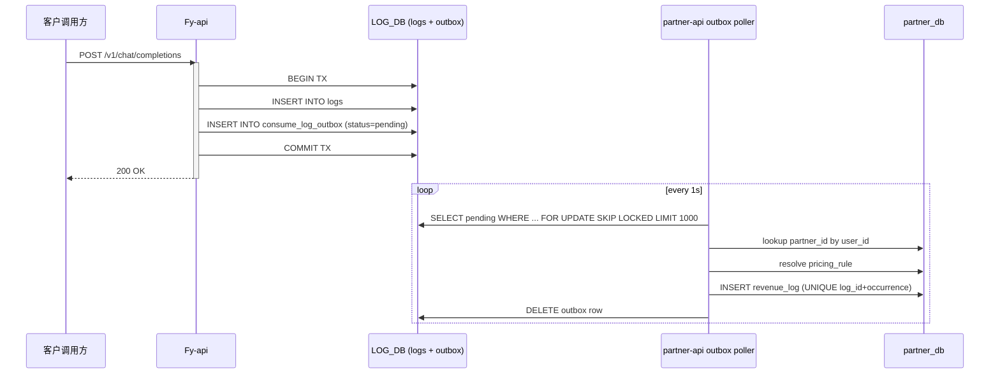
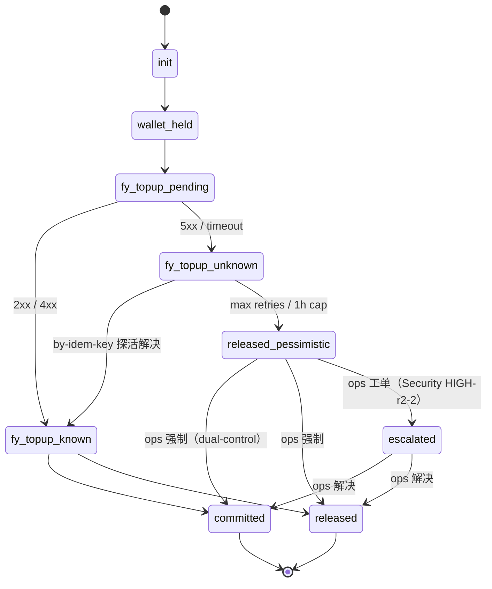
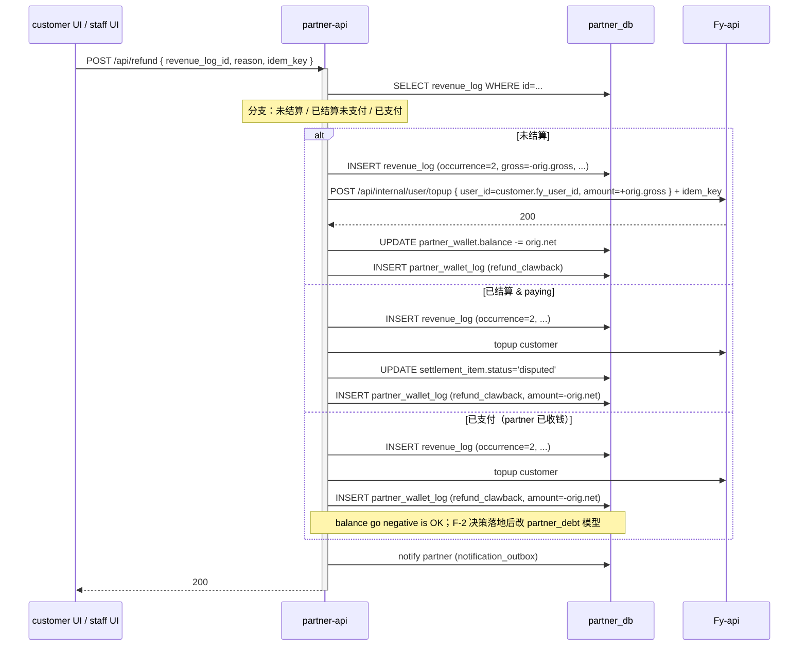

# Integration Design — TraceNex Partner ↔ Fy-api 集成层

> 版本：**v1.2（Fy-api round-2 cosmetic 收口, 2026-05-11）**
> 维护人：Architect (主架构师)
> 最后更新：2026-05-11（v1.1 → v1.2：Fy-api round-2 残余 4 项文字级补强）
> 上游输入：`prd/PRD-v1.0.md`（2295 行，已定稿）+ `docs/00-architecture-overview.md` v1.2
> Round-1 review：`reviews/dev-round-1/*`
> Round-2 review：`reviews/dev-round-2/*`（4 方 PASS）
> Fy-api review：`reviews/fy-api-review/01-fy-api-side-review.md`（ACCEPT-WITH-CHANGES, 2026-05-12）+ `02-fy-api-round2-review.md`（ACCEPT, 2026-05-13）
> 关联输出：本文是 backend-design 的硬依赖；后续 backend 文档基于本文契约开发，不可改动 API / 表 / 消息 schema。详细修订条目见本文末尾 §10 "v0.1 → v0.2 CHANGELOG" + §11/§12 ADDENDUM + §13 "v0.2.2 → v1.0 收口" + §14 "v1.0 → v1.1 CHANGELOG（合入 Fy-api review）" + §17 "v1.0 → v1.1 工程级修订" + §18 "v1.1 → v1.2 CHANGELOG（Fy-api round-2 cosmetic）"。

---

## 0. 阅读说明

本文是 **TraceNex Partner ↔ Fy-api 之间所有集成边界的权威设计**。它是 PRD §6 / §9 / 附录 C 的工程级展开，不是复述。

**它定义**：

- Fy-api 覆盖层（OVERLAY）9 类（C-1..C-9）的工程级展开（路径、字段、伪代码、migration SQL）
- `/api/internal/*` 每个 endpoint 的 OpenAPI 风格签名（method + path + request schema + response schema + 错误码 + 鉴权头 + 幂等头）
- `consume_log_outbox` 事件 schema、partition key、订阅者 / DLQ 策略
- saga 详细规约（M3-04、退款、客户充值 F-3）的步骤幂等保证 + 补偿 + 时序图
- 跨服务幂等三段链路（client → partner-api → Fy-api）
- partner_db / fy_api_db 边界 + GRANT 表
- settlement freshness gate
- Fy-api 错误 → partner-api 错误码映射
- trace propagation + 关键 SLO

**它不定义**：

- partner-api 内部 service 拆分（backend-design）
- React 组件（frontend-design）
- 业务规则的 corner case 解释（PRD 已定）

> ⚠️ 每节末尾都有"测试钩子"，列契约级 invariant 给 e2e 团队当 baseline。

---

## 0.1 目录

1. Fy-api 覆盖层（OVERLAY）清单（C-1..C-9 工程化展开）
2. `/api/internal/*` API 契约（OpenAPI 签名）
3. Outbox 事件 schema + 订阅 + DLQ
4. Saga 详细规约（M3-04 / 退款 / F-3 客户充值）
5. 跨服务幂等契约
6. 数据库边界 + GRANT
7. Settlement freshness gate
8. 错误传播 + 错误码映射
9. 观测：trace propagation + SLO
10. 测试钩子全集

---

## 1. Fy-api 覆盖层（OVERLAY）清单

> 对照 PRD 附录 C（C-1..C-9）逐项展开。每条都标注 **来源** / **新文件 vs 上游 patch** / **预计 LOC**。
> Phase 标签：所有 Phase 1（除 KMS rotation 等少数 Phase 2A 才上线的细节）。

### 1.1 C-1：内部路由 + 鉴权（HMAC + mTLS）

#### 1.1.1 文件

- `Fy-api/router/api-internal-router.go`（**NEW**，~50 LOC）
- `Fy-api/middleware/internal_auth.go`（**NEW**，~80 LOC）
- 由 `Fy-api/router/main.go::SetRouter` 在装载阶段调用 `SetInternalRouter(router)`（注意：**Fy-api 现状的 router 变量名是 `router *gin.Engine`，没有 `server`**；v1.0 文档原文"`router.SetInternalRouter(server)`"措辞不准，v1.1 修正）—— **upstream-file patch ~1 LOC**，必须打 `// Fy-api overlay: TraceNex Partner B-12` 注释，并在 OVERLAY.md 增 **B-12** 条目（见 §1.8）。
- **路由组挂载注意（v1.1，Fy-api review HIGH-10）**：`/api/internal/*` **不**挂在 `apiRouter := router.Group("/api")` 之下（`apiRouter` 全局挂了 `gzip.Gzip` + `BodyStorageCleanup` + `GlobalAPIRateLimit`，会误伤 partner-api 的 outbox poller / saga retry 高频探活）。改为在 `SetInternalRouter` 内独立 `router.Group("/api/internal")`：显式不挂 `GlobalAPIRateLimit`，改用 §6.3 per-kid quota（Security MED-5）；保留 `BodyStorageCleanup`；新加 `RouteTag("api-internal")` 便于 SLS 索引。

#### 1.1.2 路由树

```
/api/internal/
├── user/
│   ├── POST   /create
│   ├── POST   /topup
│   ├── POST   /deduct
│   ├── PUT    /group
│   ├── PUT    /group_ratio_override
│   └── POST   /erase
├── token/
│   └── POST   /create
├── usage/
│   ├── GET    /by-user
│   └── GET    /by-group
├── group/
│   ├── POST   /
│   └── GET    /by-idem-key
├── topup/
│   └── GET    /by-idem-key
└── health/
    └── GET    /
```

> 全部走 `internal_auth.go` middleware。明文 HTTP 直接拒收（在 Nginx 反代层强制：`/api/internal/*` location 设 `ssl_verify_client on`，HTTP listen 不挂该 location；详见 §6.4 v1.1）。

#### 1.1.3 鉴权 middleware（HMAC 4 元组 + mTLS）

伪代码（**v1.1 修订：Redis client 全文统一为 `github.com/go-redis/redis/v8` v8.11.5，对齐 Fy-api `go.mod`，避免引入第二个 redis client；Fy-api review CRITICAL-2**）：

```go
// Fy-api overlay: middleware/internal_auth.go (NEW)
package middleware

import (
    "crypto/hmac"
    "crypto/sha256"
    "encoding/base64"
    "fmt"
    "io"
    "net/http"
    "strconv"
    "time"

    "github.com/gin-gonic/gin"
    "github.com/go-redis/redis/v8" // v1.1：与 Fy-api go.mod 对齐（v8.11.5），原 v9 移除
)

const (
    HeaderAuthKeyId    = "X-Auth-KeyId"
    HeaderAuthTs       = "X-Auth-Timestamp"  // unix epoch seconds (Round-2 Security LOW-1 修订)
    HeaderAuthNonce    = "X-Auth-Nonce"      // UUIDv4
    HeaderSignature    = "X-Signature"       // base64(HMAC-SHA256(secret, canonical))
    HeaderIdempotency  = "Idempotency-Key"
    HeaderTraceId      = "X-Oneapi-Request-Id"

    SkewSeconds = 300
    NonceTTL    = 5 * time.Minute
)

type KeyStore interface {
    Lookup(keyId string) (secret []byte, allowedEndpoints []string, ok bool)
}

func InternalAuth(keys KeyStore, rdb *redis.Client) gin.HandlerFunc {
    return func(c *gin.Context) {
        kid := c.GetHeader(HeaderAuthKeyId)
        tsStr := c.GetHeader(HeaderAuthTs)
        nonce := c.GetHeader(HeaderAuthNonce)
        sig := c.GetHeader(HeaderSignature)
        if kid == "" || tsStr == "" || nonce == "" || sig == "" {
            abort401(c, "missing auth headers")
            return
        }
        // 1) timestamp window
        ts, err := strconv.ParseInt(tsStr, 10, 64)
        if err != nil || abs(time.Now().Unix()-ts) > SkewSeconds {
            abort401(c, "stale or invalid timestamp")
            return
        }
        // 2) key lookup + endpoint allowlist
        secret, allow, ok := keys.Lookup(kid)
        if !ok || !endpointAllowed(allow, c.Request.URL.Path) {
            abort401(c, "key not authorised for endpoint")
            return
        }
        // 3) nonce dedup（Redis SETNX；v8 API：ctx-first 签名 SetNX(ctx, key, value, ttl).Result() → (bool, error)）
        nonceKey := fmt.Sprintf("internal:nonce:%s:%s", kid, nonce)
        if set, _ := rdb.SetNX(c.Request.Context(), nonceKey, "1", NonceTTL).Result(); !set {
            abort401(c, "nonce replay")
            return
        }
        // 4) HMAC verify（method\npath\ncanonical_query\nts(int)\nnonce\nsha256(body)）
        body, _ := io.ReadAll(c.Request.Body)
        c.Request.Body = io.NopCloser(bytes.NewReader(body))
        h := sha256.Sum256(body)
        canonical := strings.Join([]string{
            c.Request.Method,
            c.Request.URL.Path,
            canonicalQuery(c.Request.URL.RawQuery),
            strconv.FormatInt(ts, 10),
            nonce,
            hex.EncodeToString(h[:]),
        }, "\n")
        mac := hmac.New(sha256.New, secret)
        mac.Write([]byte(canonical))
        want := base64.StdEncoding.EncodeToString(mac.Sum(nil))
        if !hmac.Equal([]byte(want), []byte(sig)) {
            abort401(c, "bad signature")
            return
        }
        // 5) trace_id 透传
        if tid := c.GetHeader(HeaderTraceId); tid != "" {
            c.Set("trace_id", tid)
        }
        c.Set("auth_kid", kid)
        c.Next()
    }
}
```

> 备注：
>
> - `X-Auth-Timestamp` 在签名串内一律使用 unix epoch seconds（整数），传输形式可同时接受 RFC3339（middleware 解析后 normalize），消除 RFC3339 字符串歧义（Security LOW-r2-1）。
> - **mTLS 终结层（v1.1 重写，Fy-api review CRITICAL-4）**：Fy-api 实际部署形态是 **Podman + Nginx 反代**（CN/SG ECS 单机，`compose.prod.yml` 暴露 `127.0.0.1:3001`，前端 Nginx 反代终结 TLS），**不是 K8s + Istio/Linkerd**。v1.0 文档假设 mesh sidecar 失实。Phase 1 按 Nginx mTLS 落地（详见 §6.4 v1.1）：Nginx 配 `ssl_client_certificate` + `ssl_verify_client on` 终结 mTLS，注入 `X-Client-Verified=$ssl_client_verify` / `X-Client-CN=$ssl_client_s_dn_cn` 给 gin middleware；middleware 仅信任来自 loopback 的请求（`c.RemoteIP() in 127.0.0.0/8`）；删除 `c.Request.TLS != nil` 兜底（Nginx 反代后永远 nil，误导）。**HMAC 是应用层第二道防线，永远启用**；mTLS 是网络层防线，由 ops feature flag `OVERLAY_MTLS_ENABLED` 控制（Phase 1 默认 false → 走 VPC 内网 + HMAC；Phase 2A 开启后由 Nginx 终结）。
> - Key rotation：`KeyStore.Lookup` 返回 N+1 keys（current + previous），允许 7 天 overlap，audit usage = 0 后停旧（Security M-R2-2）。
> - **`KeyStore` 实现归属（v1.1，Fy-api review §13 反向请求-5）**：`KeyStore` 由 Fy-api 内嵌实现，key 数据存 fy_api_db 新表 `internal_api_key`（与 §1.7 idem 表同 migration PR）；partner-api 通过 staff verb 经内部 admin endpoint 写入。Phase 1 secret 注入走 env-file（`/opt/fy-api/config/fy-api.env`），Phase 2A 接 KMS Secret Manager（详见 §6.3）。

#### 1.1.4 设计决策：为什么不简单 API key

- **为什么不 static API key**：泄露后没有时效性；replay 攻击毫无门槛。
- **为什么不 OAuth2 client_credentials**：需要 token endpoint，多一跳；token 持久化反而扩大泄露面。
- **为什么不仅 mTLS（不 HMAC）**：mTLS 防嗅探不防应用层 replay；KeyId 滚动需要单独机制。HMAC + mTLS 双重 belt-and-braces。

**测试钩子**：

- C1.1 nonce replay 第二次必返 401
- C1.2 X-Auth-Timestamp ±301s 必返 401
- C1.3 endpoint allowlist 不包含的 key 调用必返 401（即使签名正确）
- C1.4 明文 HTTP 客户端无法发起请求（v1.1：在 Nginx 反代层 `ssl_verify_client on` 拒绝；Phase 2B 切回 sidecar mesh 时由 Istio 拒绝）

### 1.2 C-2：内部 Controllers 函数签名

#### 1.2.1 文件

- `Fy-api/controller/internal_user.go`（NEW，~120 LOC）
- `Fy-api/controller/internal_token.go`（NEW，~30 LOC）
- `Fy-api/controller/internal_usage.go`（NEW，~40 LOC）
- `Fy-api/controller/internal_group.go`（NEW，~30 LOC）
- `Fy-api/controller/internal_idempotency.go`（NEW，~20 LOC）

#### 1.2.2 函数签名（Go）

```go
// Fy-api overlay: controller/internal_user.go (NEW)
package controller

func InternalCreateUser(c *gin.Context)              // POST /api/internal/user/create
func InternalTopup(c *gin.Context)                   // POST /api/internal/user/topup
func InternalDeduct(c *gin.Context)                  // POST /api/internal/user/deduct
func InternalSetGroup(c *gin.Context)                // PUT  /api/internal/user/group
func InternalSetGroupRatioOverride(c *gin.Context)   // PUT  /api/internal/user/group_ratio_override
func InternalEraseUser(c *gin.Context)               // POST /api/internal/user/erase

// internal_token.go
func InternalCreateToken(c *gin.Context)             // POST /api/internal/token/create

// internal_usage.go
func InternalUsageByUser(c *gin.Context)             // GET  /api/internal/usage/by-user
func InternalUsageByGroup(c *gin.Context)            // GET  /api/internal/usage/by-group

// internal_group.go
func InternalUpsertGroupRatio(c *gin.Context)        // POST /api/internal/group
func InternalGroupByIdemKey(c *gin.Context)          // GET  /api/internal/group/by-idem-key

// internal_idempotency.go
func InternalTopupByIdemKey(c *gin.Context)          // GET  /api/internal/topup/by-idem-key
```

#### 1.2.3 Controller 通用骨架

```go
func InternalTopup(c *gin.Context) {
    idemKey := c.GetHeader("Idempotency-Key")
    kid := c.GetString("auth_kid")
    if idemKey == "" {
        respondErr(c, 400, "BIZ_IDEM_KEY_REQUIRED", "Idempotency-Key required")
        return
    }
    var req TopupReq
    if err := c.ShouldBindJSON(&req); err != nil {
        respondErr(c, 400, "BIZ_VALID_BODY", err.Error()); return
    }
    // 1) idempotency check（internal_idempotency 表）
    if cached, ok := internalIdem.Lookup(kid, idemKey, req.Hash()); ok {
        c.JSON(cached.Status, cached.Body); return
    }
    if reused, _ := internalIdem.LookupByKey(kid, idemKey); reused != nil && reused.RequestHash != req.Hash() {
        respondErr(c, 409, "BIZ_IDEM_REUSED_DIFFERENT_BODY", "Idempotency-Key reused"); return
    }
    // 2) 业务执行（GORM TX：扣 / 加 quota + log）
    // 3) 落库 internal_idempotency
    // 4) 返回
}
```

> 关键：每个 endpoint 入口的"幂等检查"必须是先于业务的第一步，且 internal_idempotency 表落库与业务 TX **同事务**（避免幂等记录有但业务回滚的边缘）。

**测试钩子**：

- C2.1 同 idem-key 同 body 多次调用必返同结果（balance 改一次）
- C2.2 同 idem-key 不同 body 必返 409
- C2.3 erase 服务账户 key**不允许**调用 topup（M-r2-3：scope 边界）

### 1.3 C-3：BIGINT 字段升级（三方言 migration）

#### 1.3.1 文件

- `Fy-api/migrations/2026_05_xx_widen_quota_to_bigint.go`（NEW，GORM-driven 三方言分支，~120 LOC）

#### 1.3.2 列清单（Architect H-3 + F-11 修订）

| 表 | 列 | 现状 | 目标 |
|---|---|---|---|
| `users` | `quota` | int (32) | BIGINT |
| `users` | `used_quota` | int (32) | BIGINT |
| `users` | `request_count` | int (32) | BIGINT |
| `users` | `aff_quota` | int (32) | BIGINT |
| `users` | `aff_history_quota` | int (32) | BIGINT |
| `logs` | `id` | int (32) | BIGINT（PK） |
| `logs` | `quota` | int (32) | BIGINT |

#### 1.3.3 三方言 SQL（v1.1 重写：MySQL `logs.id` 必须走在线 DDL 工具，Fy-api review CRITICAL-3）

> **关键约束**：MySQL `logs.id` PK widening 在 MySQL 8 < 8.0.31 **不能 INPLACE**，且生产 `logs` 表已亿级（CN ≥ 100M、SG 自 2026-05-07 legacy 迁入后存量 ≥ 80M），上有 5 个二级索引（`idx_created_at_id` / `idx_user_id_id` / `idx_logs_request_id` / ...）。v1.0 原方案 `ALGORITHM=COPY` 会全表重写 + 重建索引，**至少分钟级锁表，生产不可接受**。v1.1 改为在线 DDL 工具（gh-ost / pt-online-schema-change），并把 BIGINT migration 单独列为 **PR-1（不可回滚，独立走）**，参见 §15.2。

```sql
-- MySQL：users 表（< 100K 行，INPLACE OK）
ALTER TABLE users
  MODIFY COLUMN quota BIGINT NOT NULL DEFAULT 0,
  MODIFY COLUMN used_quota BIGINT NOT NULL DEFAULT 0,
  MODIFY COLUMN request_count BIGINT NOT NULL DEFAULT 0,
  MODIFY COLUMN aff_quota BIGINT NOT NULL DEFAULT 0,
  MODIFY COLUMN aff_history_quota BIGINT NOT NULL DEFAULT 0,
  ALGORITHM=INPLACE, LOCK=NONE;

-- MySQL：logs.quota (列加宽，非 PK，INPLACE OK)
ALTER TABLE logs
  MODIFY COLUMN quota BIGINT NOT NULL DEFAULT 0,
  ALGORITHM=INPLACE, LOCK=NONE;

-- MySQL：logs.id PK widening —— 必须 gh-ost / pt-osc，不得 ALGORITHM=COPY
-- 见下方"在线 DDL 命令模板"
```

**在线 DDL 命令模板（gh-ost，CN/SG 双区皆同；引用 `docs/Phase3-DB-migration-runbook.md`）**：

```bash
# 前置 invariant 检查
mysql -e "SELECT MAX(id), COUNT(*) FROM logs;"  # 必须 MAX(id) < 1.5e9（INT32 上限 2.1e9，留 30% 余量）；
                                                # 越界 → emergency rollback：暂停业务、清旧日志、再迁

gh-ost \
  --user="$DBA_USER" --password="$DBA_PWD" \
  --host=cn-rds-master.aliyuncs.com --assume-master-host=... \
  --database=fy_api_db --table=logs \
  --alter="MODIFY COLUMN id BIGINT NOT NULL AUTO_INCREMENT" \
  --chunk-size=1000 \
  --max-load='Threads_running=25' \
  --critical-load='Threads_running=50' \
  --max-lag-millis=1500 \
  --hooks-path=/opt/gh-ost/hooks \
  --postpone-cut-over-flag-file=/tmp/gh-ost.postpone \
  --serve-socket-file=/tmp/gh-ost.sock \
  --execute
# cut-over：观察 lag、replica delay；ops 决定 rm /tmp/gh-ost.postpone 触发 cut-over（< 1s 锁）
```

**预估时长 + 风险表**：

| 表/区域 | 估算行数 | gh-ost 复制阶段 | cut-over 锁窗口 | 主要风险 | 回滚方案 |
|---|---|---|---|---|---|
| MySQL `logs` (CN, 阿里云 RDS 8.0) | 100M-300M | 4-8h | < 1s | replica lag 飙升导致 throttle；磁盘空间 +30%（影子表）；中途 cancel 留下 `_logs_gho` 影子表需手动清理 | gh-ost cancel + DROP `_logs_gho` 影子表 + 不动原表（前向兼容失败时唯一回滚途径） |
| MySQL `logs` (SG, 阿里云 RDS 8.0) | 80M | 3-6h | < 1s | 同上 | 同上 |
| PG `users` / `logs` | 全表重写（PG <12） | < 30min（users）+ 维护窗口 | 维护窗口（数小时） | 必须停业务；`ALTER COLUMN ... TYPE BIGINT` 全表重写 | 维护窗口失败回滚到备份 |
| SQLite | dev only | 全 table-rebuild | 进程独占 | 仅 dev 使用，prod 无 | DROP + restore |

**CN 与 SG 区域不同步执行**：先 SG（流量低）再 CN（更高峰），间隔 ≥ 24h 给 ops 缓冲观察。

```sql
-- PostgreSQL（生产无 PG，dev 可能存在；保留以备 partner-api 选 PG）
ALTER TABLE users ALTER COLUMN quota TYPE BIGINT;
ALTER TABLE users ALTER COLUMN used_quota TYPE BIGINT;
ALTER TABLE users ALTER COLUMN request_count TYPE BIGINT;
ALTER TABLE users ALTER COLUMN aff_quota TYPE BIGINT;
ALTER TABLE users ALTER COLUMN aff_history_quota TYPE BIGINT;
ALTER TABLE logs ALTER COLUMN id TYPE BIGINT;
ALTER TABLE logs ALTER COLUMN quota TYPE BIGINT;
-- PG <12 全表重写；维护窗口必须

-- SQLite（无 ALTER COLUMN，table-rebuild；dev only）
BEGIN;
CREATE TABLE users_new (
    id INTEGER PRIMARY KEY,
    quota INTEGER NOT NULL DEFAULT 0,
    used_quota INTEGER NOT NULL DEFAULT 0,
    request_count INTEGER NOT NULL DEFAULT 0,
    aff_quota INTEGER NOT NULL DEFAULT 0,
    aff_history_quota INTEGER NOT NULL DEFAULT 0
    -- ...其他列与 users 完全相同；详见 migration Go 文件
);
INSERT INTO users_new SELECT * FROM users;
DROP TABLE users;
ALTER TABLE users_new RENAME TO users;
-- 重建所有索引
COMMIT;
-- 同样套路重建 logs 表（SQLite 仅 dev，prod 不涉及）
```

**新增字段（partner_id / customer_id 等）默认值 / NULL 处理（v1.1 注释，Fy-api review CRITICAL-3）**：BIGINT 升级 PR-1 **只改列宽**，不引入新列（`partner_id` / `customer_id` 等业务关联键属于 partner_db，不进 fy_api_db）；fy_api_db 侧的 `User.GroupRatioOverride` 字段加列在 PR-4（B-15）走，与 BIGINT PR 解耦。这样 PR-1 在线 DDL 不需考虑 `DEFAULT NULL` 兼容性问题。

#### 1.3.4 gh-ost 在阿里云 RDS 8.0 trigger 权限 fallback（v1.2 新增，Fy-api round-2 残余 #2）

> ⚠️ gh-ost 依赖 **CREATE TRIGGER + DROP TRIGGER** 权限（迁移期间在原表上挂 INSERT/UPDATE/DELETE trigger 同步增量到影子表）。阿里云 RDS MySQL 8.0 默认账号（包括项目 `tnbiz_app`）**没有 SUPER 权限，trigger DDL 通常被拒**。本节给出 staging dry-run 失败时的 fallback 路径。

**1) 权限预检（PR-1 dry-run 第 1 步必跑）**：

```sql
-- 检查当前账号是否有 TRIGGER 权限
SHOW GRANTS FOR CURRENT_USER();
-- 期望命中 GRANT TRIGGER ON `fy_api_db`.* TO ...

-- 实测能否在 logs 表上 CREATE TRIGGER（不真创建，只测 DDL 权限）
DELIMITER $$
CREATE TRIGGER _ghost_perm_test BEFORE INSERT ON logs FOR EACH ROW BEGIN END$$
DELIMITER ;
DROP TRIGGER IF EXISTS _ghost_perm_test;
-- 若报 "Access denied; you need (at least one of) the SUPER or TRIGGER privilege" → 进入 fallback
```

**2) 权限不足时的 fallback 优先级**：

| 优先级 | 方案 | 适用场景 | 限制 |
|---|---|---|---|
| **F-1** | 联系阿里云开 ticket / 临时授予 DBA 角色给 `tnbiz_dba` 账号，gh-ost 用 DBA 账号执行 | 普通 RDS 实例 + DBA 配合 | 须有 ops + DBA 申请窗口；批准 1-3 工作日；最干净的方案 |
| **F-2** | **DMS 无锁结构变更**（阿里云 DataWorks / DMS 控制台 → 无锁结构变更） | RDS MySQL 5.7/8.0 通用 | 仅支持有限 DDL 类型（`MODIFY COLUMN` widening 支持，PK widening 部分版本支持需先验证）；执行限速由 DMS 自动控制不可调；只能在 DMS 控制台触发，不能脚本化；监控只在 DMS 控制台 |
| **F-3** | **DTS 数据同步 + 切流**（创建影子表 `logs_v2(id BIGINT)` → DTS 实时同步 → 应用切流 → 旧表 archive） | DDL 类型 DMS 不支持 / 极端容量 | 工作量大 ≈ 5 人天；需应用代码改一次（dual-read 切到 logs_v2）；详见 `docs/Phase3-DB-migration-runbook.md` |
| **F-4** | **pt-online-schema-change** | 私有部署 MySQL（非 RDS） | 同样依赖 trigger 权限；阿里云 RDS 拒了 gh-ost 大概率也拒 pt-osc，**只在私有 MySQL 才有意义** |

**3) 监控 / 限速对比**：

- gh-ost：原生 `--max-load` / `--critical-load` / `--max-lag-millis` 调速 + `--serve-socket-file` 实时观测 + replica lag 自动 throttle。
- DMS 无锁结构变更：限速由阿里云后台自动控制，**不可手工调整**；监控仅 DMS 控制台进度条；replica lag 不暴露给用户。**建议 staging dry-run 时强制把 staging RDS 流量打到接近 prod 峰值再跑，验证 lag 表现**。
- DTS 切流：监控走 DTS 控制台 + 应用层 dual-read metric；最可控但工作量最大。

**4) 强制流程（Fy-api round-2 round-3 收口）**：

1. **staging 必须先跑 dry-run** 验证权限（步骤 1 SQL 落实），不通过即转 fallback；不能直接上 prod。
2. dry-run 文档归档：CN/SG 各一份《gh-ost staging dry-run 报告》，含权限验证截图 / gh-ost 日志 / 时长 / replica lag 曲线 / 是否触发 fallback 及哪一档。
3. 进入 §16 hand-off #4 BLOCKER 闭环时，dry-run 报告作为前置交付物的一部分。
4. 若进入 F-3（DTS 切流）→ PR-1 工作量从 3.5 人天上调到 ≈ 8.5 人天，§1.9 / §15.1 排期需重估并通知 PM 重新对齐 §16 #7。

> 模板参考：`Fy-api/model/main.go::migrateTokenModelLimitsToText`（PRD §22.1 F-11）。SQLite path 受 `if !common.UsingSQLite` guard 包裹外的 PG/MySQL 分支。

#### 1.3.4 执行顺序

1. **先升 Fy-api 库**（users / logs）→ 运行回归
2. **再启用 TraceNexBiz `revenue_log.fy_api_log_id` BIGINT 写入**（partner_db）
3. 任何阶段 `LogId int` 的 Go struct 类型同步修正

**测试钩子**：

- C3.1 三方言 migration 在 dev / staging 都跑通；运行后 `SELECT * FROM users` 不报类型错误
- C3.2 `INSERT ... SELECT` 不丢行（用 `COUNT(*)` 对比迁移前后）

### 1.4 C-4：GroupRatioOverride 实现（per-customer 细粒度倍率）

#### 1.4.1 文件

- `Fy-api/model/user.go`（**upstream patch ~3 LOC**）：加字段 `GroupRatioOverride float64 \`gorm:"default:0"\``
- `Fy-api/setting/ratio_setting/group_ratio.go`（**upstream patch ~15 LOC**）：加 `GetEffectiveGroupRatio(user, group string) float64`
- `Fy-api/controller/internal_user.go::InternalSetGroupRatioOverride`：写字段 + Pub/Sub publish `user_update`（M-1 修订）

#### 1.4.2 hook 伪代码（v1.1 重写：Fy-api review HIGH-5/CRITICAL-6）

> **关键修订**：v1.0 文档暗示"hot path 一行替换"是错的。实地查 Fy-api 现状（Fy-api review §6.1）：
> - 当前 `setting/ratio_setting/group_ratio.go` 的 API 是 `GetGroupRatio(name string) float64` 和 `GetGroupGroupRatio(userGroup, usingGroup) (float64, bool)`，**不接受 `*model.User` 参数**。
> - hot-path 实测有 **6 个调用站，分布在 4 个文件**（不是 1 处），见下表。
> - 强行把所有调用站签名改为 `*model.User` 会侵入 6 处调用 + 增加 hot-path 一次取数，merge 风险大。
>
> v1.1 推荐方案：**扩展 `RelayInfo` 字段**（A 方案），从 distributor 阶段把 override 拷贝进 RelayInfo，hot-path 仅做"非 0 优先"分支检查，不改老 API 签名。

```go
// Fy-api overlay: setting/ratio_setting/group_ratio.go (PATCH，新加函数；不改老签名)
// B-15
func GetEffectiveGroupRatio(override float64, group string) float64 {
    if override > 0 {
        return override   // PRD §9.2 per-customer pricing
    }
    return GroupRatio[group]
}

// Fy-api overlay: relay/common/relay_info.go (PATCH +1 字段)
type RelayInfo struct {
    // ...既有字段
    UserGroupRatioOverride float64 // B-15: per-user 倍率 override，0 表示不启用
}

// Fy-api overlay: middleware/distributor.go (or middleware/auth.go) PATCH +5 LOC
// 在 distributor 把 user load 出来后注入 RelayInfo
relayInfo.UserGroupRatioOverride = user.GroupRatioOverride
```

**实施清单（hot-path 6 调用站 / 4 文件，按 patch 顺序）**：

| # | 文件 | 函数 | 行号（v1.1 实测，HEAD） | 改法（伪代码） |
|---|---|---|---|---|
| 1 | `relay/common/relay_info.go` | struct `RelayInfo` | struct 末尾 +1 | 加字段 `UserGroupRatioOverride float64` |
| 2 | `middleware/distributor.go` 或 `middleware/auth.go` | distributor | distributor 写 RelayInfo 段 +5 LOC | `info.UserGroupRatioOverride = user.GroupRatioOverride` |
| 3 | `service/quota.go` | `CalculatePostConsumeQuota` | 行 110-121 | `groupRatio := setting_ratio.GetEffectiveGroupRatio(info.UserGroupRatioOverride, info.UsingGroup)` 替换原 `GetGroupRatio` |
| 4 | `relay/helper/price.go` | price helper | 行 53-61 | 同上替换 |
| 5 | `service/task_billing.go` | `BillingByPostConsumePrice` | 行 276-277 | 同上替换 |
| 6 | `service/group.go` | group ratio resolver | 行 60-64 | 同上替换 |

> 每处 patch 都打 `// Fy-api overlay: TraceNex Partner pricing override (B-15)` 注释，便于上游 sync 期识别。
>
> **性能预算重估（vs v1.0 暗示"一行替换"）**：
> - 真实增量 = 4 文件 × 5 LOC + 1 文件 +5 LOC（distributor）+ 1 文件 +1 LOC（RelayInfo struct）+ 1 文件 +15 LOC（`GetEffectiveGroupRatio`）= **~30-40 LOC + 4 hot-path 文件 + 单测**。
> - hot-path 增量：1 次 float64 读 + 1 次 `> 0` 比较，**纳秒级**，对 P99 影响 < 0.01ms（可忽略）。
> - 上游 rebase 成本：4 个 hot-path 文件全是上游高活跃区（计费），每周 sync 期望 0-2 个文件冲突；merge 注释充分时 ops 0.5 小时内可处理。

> 上游 hot path 调用方改为：`ratio := setting_ratio.GetEffectiveGroupRatio(info.UserGroupRatioOverride, info.UsingGroup)`（参数从 user pointer 改为 RelayInfo 字段，避免 6 处调用站签名变更）。

#### 1.4.3 缓存失效（Architect M-1）

- 写操作：`InternalSetGroupRatioOverride` 在 `DB.Save(user)` 后 **publish `user_update` channel**：`{user_id, kind:"group_ratio_override"}`
- 订阅：`Fy-api/main.go::startup` 起 goroutine 订阅 `user_update`，收到后 `model.InvalidateUserCache(user_id)`
- Fy-api 现有 `getUserGroupCache`（`model/user.go:818-843`，**Fy-api review §6.1 实测：updateUserGroupCache 仅在 fire-and-forget gopool.Go 中写，没有 InvalidateUserCache 函数**）需要新增至少 1 个 invalidator 函数（**upstream patch ~30-50 LOC + 单测**，v1.1 修正 v1.0"~10 LOC"低估），OVERLAY 注释 B-17。函数职责：DEL 单 user 的 redis key（`user_group:{id}`、`user:{id}`）+ 重建（可选惰性）。

#### 1.4.4 F-1 决策窗口（per-model markup）

- 当前实现仅支持 per-user 单标量 override。
- F-1 决策（Phase 2A 前）：是否扩展为 `user_model_ratio_override` 表（per (user_id, model_name)）。本架构师 v0.1 倾向**扩展**：
  - 新表 `user_model_ratio_override(user_id, model_name, ratio)` 在 fy_api_db；hot path 在 GetEffectiveGroupRatio 之前查（带本地 LRU + Pub/Sub 失效）
  - 但 Phase 1 不开发，文档 `partner_pricing_rule.ModelName` 字段 schema-only
- 否决方案：在 `User` 表加 JSON 列存 model→ratio 映射 — JSON 解析 hot path 太贵；与 Fy-api 现有 schema-flatten 风格不兼容

**测试钩子**：

- C4.1 `user.GroupRatioOverride > 0` 时计费 ratio == override（端到端发起一次 chat completion 验证扣额度）
- C4.2 写 override → 200 ms 内全 pod 反映（多 pod 测试）
- C4.3 override = 0 → 退回 group ratio（默认行为）

### 1.5 C-5：consume_log_outbox 表 + 同事务写入（CRITICAL）

#### 1.5.1 文件

- `Fy-api/migrations/2026_05_xx_consume_log_outbox.go`（NEW）
- `Fy-api/model/log_outbox.go`（NEW，~80 LOC）
- `Fy-api/model/log.go::RecordConsumeLog`（**upstream patch ~25 LOC**，TX wrap）

#### 1.5.2 表 DDL（Architect §9.3 修订 + F-12 LOC 修订）

```sql
-- LOG_DB（与 logs 表同库；SG/CN 各自 region-isolated，Compliance M-6 / CRIT-4）
CREATE TABLE consume_log_outbox (
    id            BIGINT PRIMARY KEY AUTO_INCREMENT,
    log_id        BIGINT NOT NULL UNIQUE,
    user_id       BIGINT NOT NULL,
    group_name    VARCHAR(255),
    quota         BIGINT NOT NULL,
    channel_id    INT,
    model_name    VARCHAR(255),
    occurred_at   TIMESTAMP NOT NULL,
    consumed_at   TIMESTAMP NULL,
    -- ADR-014 v0.2：状态枚举扩展为 5 态，加入 in_flight（两阶段 claim）
    status        VARCHAR(16) NOT NULL DEFAULT 'pending', -- pending/in_flight/consumed/failed/dead_letter
    locked_by     VARCHAR(128),   -- ADR-014：claim poller hostname
    locked_until  TIMESTAMP NULL, -- ADR-014：续租；超时视为 orphaned，可重新 claim
    retry_count   INT NOT NULL DEFAULT 0,
    last_error    TEXT,           -- Security MED-6：Fy-api 原始 error 写入前须经 scrubber 去 PII
    trace_id      VARCHAR(64),
    data_region   VARCHAR(8) NOT NULL DEFAULT 'cn', -- Compliance CRIT-4：'cn' / 'sg'；跨境隔离 invariant，SG 启用前固定 'cn'
    INDEX idx_unconsumed (status, id),
    INDEX idx_inflight_lease (status, locked_until), -- 续租超时检索
    INDEX idx_occurred (occurred_at)
);
-- 不使用 gorm.DeletedAt（ADR-011 / ARCH D-1：物理 DELETE，不软删；避免索引 churn 与歧义 row）
```

> Architect §9.3 / ADR-014 v0.2：多 poller 用 `FOR UPDATE SKIP LOCKED` 仅用于"short claim tx"阶段，然后 UPDATE 到 `in_flight` 即 commit。跨库 partner_db 写操作在**无锁**阶段进行，最后短 tx DELETE 或 UPDATE 为 `dead_letter`。SQLite 不支持 SKIP LOCKED → Phase 1 dev / sqlite 模式仅单 poller，prod 跑 MySQL/PG。

#### 1.5.3 RecordConsumeLog 改造（25 LOC vs 5 LOC，F-12）

**现状**（`Fy-api/model/log.go:204-253`）：`LOG_DB.Create(log)` 单条非事务。

**目标**：

```go
// Fy-api overlay: model/log.go (PATCH ~25 LOC)
func RecordConsumeLog(ctx context.Context, log *Log) error {
    return LOG_DB.WithContext(ctx).Transaction(func(tx *gorm.DB) error {
        if err := tx.Create(log).Error; err != nil {
            return fmt.Errorf("logs insert: %w", err)
        }
        outboxRow := &ConsumeLogOutbox{
            LogID:      log.Id,
            UserId:     log.UserId,
            GroupName:  log.Group,        // 取自 user.Group 在写 log 时已注入
            Quota:      int64(log.Quota),
            ChannelId:  log.ChannelId,
            ModelName:  log.ModelName,
            OccurredAt: log.CreatedAt,
            Status:     "pending",
            TraceId:    common.TraceIdFromCtx(ctx),
        }
        if err := tx.Create(outboxRow).Error; err != nil {
            return fmt.Errorf("outbox insert: %w", err)
        }
        return nil
    })
}
```

> 上游 5 个其他 `LOG_DB.Create(log)` 调用（topup / error / task billing 等，行 87/112/139/183/292）**不**触发 outbox（Architect §C-5 末段：scope = consume only）。**v1.1 PR review checklist（Fy-api review HIGH-8）**：上游每加一个 `LogTypeXxx` 的 `LOG_DB.Create(log)` 都必须经 reviewer 确认是否进 outbox；OVERLAY PR 必须在 5 个非 consume 的调用站附近打 `// Fy-api overlay: B-16 outbox scope = consume only; do NOT add outbox here` 注释（lint check：grep `LOG_DB.Create` 数量未变，>5 命中即报警）。
>
> **`LogQuotaData` fire-and-forget goroutine 与 outbox 关系（v1.1，Fy-api review HIGH-8）**：`RecordConsumeLog` 末尾的 `if common.DataExportEnabled { gopool.Go(...LogQuotaData) }` 是异步导出（**不进事务**），与新加的 outbox.Create **没有事务关系**。实施约束：
> 1. `gopool.Go(LogQuotaData)` 必须在 `Transaction` 闭包**外**（commit 之后）；
> 2. 若放在 TX 闭包内，TX 提交失败时 LogQuotaData 不会触发，但 outbox.Create 也不会触发，整体一致；
> 3. **推荐位置**：`Transaction` 返回成功后 `if common.DataExportEnabled { gopool.Go(LogQuotaData) }`，与 v1.0 现状的"末尾追加"一致。

#### 1.5.4 物理位置（Architect H-1）

- outbox 表必须在 `LOG_DB`（即 `LOG_SQL_DSN` 指向的库；fallback 时 = 主 DB）。
- partner-api 的 outbox poller 必须在 LOG_DB 上有 `SELECT, UPDATE(status, retry_count, last_error, consumed_at) ON consume_log_outbox`（详见 §6 GRANT）。
- **设计决策**：outbox 不放 partner_db。否决理由：会引入跨实例事务（XA / 2PC）；§10.4 强禁。

#### 1.5.5 否决方案

- **CDC（canal/maxwell）**：MySQL 专属，违反三方言契约（PRD §9.3）。
- **同步 webhook**：Fy-api → partner-api 在请求 hot path 多一跳，影响 P95（PRD §10.1）。

**测试钩子**：

- C5.1 logs INSERT 回滚 → outbox 必无对应行（TX 一致性）
- C5.2 outbox 表只存在于 LOG_DB；`SHOW TABLES IN transnext_db LIKE 'consume_log_outbox'` 必空（如 LOG_SQL_DSN 拆分）
- C5.3 5 个非 consume 的 LOG_DB.Create 调用不触发 outbox

### 1.6 C-6：Pub/Sub + SyncFrequency 缩短

#### 1.6.1 文件

- `Fy-api/model/option.go::UpdateOption`（**upstream patch ~10 LOC**）：DB.Save 提交后 publish
- `Fy-api/main.go::startup`（**upstream patch ~30 LOC**）：起订阅 goroutine
- `Fy-api/common/init.go`：**不改默认值**（F-13），通过 `biz_setting.sync_freq_seconds` 在 Fy-api 启动期写入 `common.SyncFrequency`

#### 1.6.2 publish-after-commit（Architect C-1 caveat 3）

```go
// Fy-api overlay: model/option.go (PATCH)
func UpdateOption(key, value string) error {
    var option Option
    DB.Where("key = ?", key).Assign(...).FirstOrCreate(&option)
    if err := DB.Save(&option).Error; err != nil { return err }
    if err := updateOptionMap(key, value); err != nil { return err }
    // Fy-api overlay: publish 必须在 DB 提交后（Architect Round-2 §C-6 要求）
    redisClient.Publish(context.Background(), "option_update",
        fmt.Sprintf(`{"key":%q,"version":%d}`, key, option.UpdatedAt.Unix()))
    return nil
}
```

#### 1.6.3 订阅 goroutine

```go
// Fy-api overlay: main.go (PATCH)
go model.SubscribeOptionInvalidations(redisClient)
```

```go
// Fy-api overlay: model/option.go (NEW function) —— v1.1 改为 coalescing 模式（Fy-api review HIGH-7）
// 原 v1.0 在每条消息前 <-rateLimit.C 会让 Subscribe.Channel() buffer 满后断订阅，且消息全量降级 5 msg/s 不必要。
// v1.1：消息进来设 dirty=true；独立 ticker 200ms 检查；coalescing reload 仅在 dirty 时触发。
func SubscribeOptionInvalidations(rdb *redis.Client) {
    sub := rdb.Subscribe(context.Background(), "option_update")
    defer sub.Close()
    msgs := sub.Channel()

    var dirty atomic.Bool
    go func() {
        ticker := time.NewTicker(200 * time.Millisecond) // M-r2-4 防 reload-storm
        defer ticker.Stop()
        for range ticker.C {
            if dirty.CompareAndSwap(true, false) {
                loadOptionsFromDatabase()
            }
        }
    }()
    for range msgs {
        dirty.Store(true)
    }
}
```

> **SyncOptions polling goroutine 不删（v1.1，Fy-api review MED-13）**：`common/init.go::SyncFrequency` 的 polling refresh 作为 Pub/Sub 失败时的最终一致兜底**保留**。Phase 1 默认值缩短建议范围 **5-15 秒**（v1.0 现状 60s；CN/SG 当前各单 pod，5-15s reload 对 DB 无压力）；超过 50 pod 时回到 30s 以避免 DB QPS 翻倍。具体值通过 `biz_setting.sync_freq_seconds` 启动期注入 `common.SyncFrequency`。
>
> **Pub/Sub 选型（v1.1，Fy-api review MED-10）**：本文 §3 outbox 走 **DB 表 + poller**（不引入新中间件）；`option_update` / `user_update` 走 **Redis Pub/Sub**（Fy-api 已依赖阿里云托管 Redis，零增量）。**否决 Aliyun MNS / RocketMQ**：(1) Fy-api 当前部署没有 RocketMQ broker；(2) MNS 需要新接 SDK + 新 secret + 跨实例失败处理；(3) Redis Pub/Sub + DB outbox 已覆盖所有可靠性场景。Phase 2A 大流量后如需 MQ broker，单独走 ADR。

#### 1.6.4 安全（Security M-r2-4）

- Redis ACL：仅 `fy-api` 角色对 `option_update` 频道有 PUBLISH 权限
- partner-api `tnbiz_app` 角色**无 publish 权限**（订阅也不需要）
- Redis AUTH + TLS + 内网

**测试钩子**：

- C6.1 publish 在 Save 之前发生 → 订阅者读到 stale row（必须确保 commit-then-publish 顺序）
- C6.2 高频 publish（1000/s）下，订阅者 `loadOptionsFromDatabase` 调用频率 ≤ 5/s（rate-limit 生效）
- C6.3 partner-api 进程对 `option_update` PUBLISH 必返 NOPERM

### 1.7 C-7：内部 idempotency 表

#### 1.7.1 文件

- `Fy-api/migrations/2026_05_xx_internal_idempotency.go`（NEW）
- `Fy-api/model/internal_idempotency.go`（NEW，~50 LOC）

#### 1.7.2 表

```sql
CREATE TABLE internal_idempotency (
    id              BIGINT PRIMARY KEY AUTO_INCREMENT,
    auth_kid        VARCHAR(64) NOT NULL,
    idempotency_key VARCHAR(64) NOT NULL,
    endpoint        VARCHAR(128) NOT NULL,
    request_hash    VARCHAR(64) NOT NULL,
    response_status INT NOT NULL,
    response_body   TEXT,
    created_at      TIMESTAMP NOT NULL,
    expires_at      TIMESTAMP NOT NULL,
    UNIQUE KEY uk_idem (auth_kid, idempotency_key, endpoint)
);
-- TTL 7 天（cover saga 1h wall-clock cap，Security LOW-r2-2）
```

> 注意：`UNIQUE KEY` 包含 endpoint，避免不同 endpoint 间的 idem-key 串扰。
>
> **v1.1 字段语义对齐（Fy-api review HIGH-9）**：本表（`internal_idempotency`）与 §5.3 `idempotency_record`（partner-api 侧）是**两张独立的表**，所以字段语义可以不同。Phase 1 本表暂存明文 `response_body TEXT`（够用，hot-path 缓存重放）；§5.3 partner-api 侧的 `idempotency_record` 走 KMS envelope 加密（Security CRIT-2）。Phase 2A 视审计需要再决定是否对本表做 KMS envelope（如启用，预估 +7 人天，详见 §13）。

**测试钩子**：

- C7.1 不同 endpoint 同 idem-key 同时调用各自互不影响（UNIQUE 约束）
- C7.2 7 天后过期记录不影响新请求（TTL 清理 cron）

### 1.8 C-8：OVERLAY.md 编号（v1.1 重写，Fy-api review CRITICAL-1）

> **v1.0 错处**：原文档说"从 B-8 起"，但 Fy-api `OVERLAY.md` 现状已用到 **B-11**（B-1, B-1.1, B-2..B-7, **B-8 [gemini]**, **B-9 [claude]**, **B-10 [relay 500→400]**, **B-11 [/v1/messages 二级反序列化 + 图片块 nil-deref]**）。v1.1 修正为**从 B-12 起**。

Fy-api `OVERLAY.md` 新增条目从 **B-12** 起，按下表 patch（每条注明 范围 + 文件清单 + 冲突风险 + Merge 策略，Fy-api 团队照 §8.3 review 模板复制粘贴即可）：

```markdown
### B-12 [tnbiz] TraceNex Partner 集成内部 API 路由 + HMAC 鉴权
- **新增文件**：
  - router/api-internal-router.go
  - middleware/internal_auth.go
  - openapi/internal-api.yaml（新建目录）
- **修改文件**：router/main.go（+1 行 SetInternalRouter）
- **冲突风险**：低
- **Merge 策略**：router/main.go 1 行加在 SetRelayRouter 之后；不挂在 apiRouter Group 下（避开 GlobalAPIRateLimit）
- **Feature flag**：OVERLAY_INTERNAL_API（默认 false）

### B-13 [tnbiz] 内部 controllers
- **新增文件**：controller/internal_user.go / internal_token.go / internal_usage.go / internal_group.go / internal_idempotency.go
- **修改文件**：无
- **冲突风险**：极低（独立文件）
- **Feature flag**：与 B-12 共用 OVERLAY_INTERNAL_API

### B-14 [tnbiz] BIGINT 升级（users / logs）
- **新增文件**：migrations/2026_05_xx_widen_quota_to_bigint.go
- **修改文件**：无 Go 代码改动；DB schema 改动经 gh-ost 在线执行
- **冲突风险**：中（与 model/main.go 的 AutoMigrate 启动期协同；users 表 INPLACE OK，logs.id 必须走 gh-ost）
- **执行说明**：MySQL 走 gh-ost；PG <12 维护窗口；SQLite table-rebuild
- **Feature flag**：OVERLAY_BIGINT（schema-level，开关后无业务侧逻辑变化；用于 ops gating 部署阶段，PR-1 上线后即可置 true）

### B-15 [tnbiz] User.GroupRatioOverride + GetEffectiveGroupRatio
- **新增文件**：无
- **修改文件**：
  - model/user.go（+1 字段 GroupRatioOverride）
  - setting/ratio_setting/group_ratio.go（+1 函数 GetEffectiveGroupRatio）
  - relay/common/relay_info.go（+1 字段 UserGroupRatioOverride）
  - middleware/distributor.go 或 middleware/auth.go（+5 LOC 注入）
  - service/quota.go（行 110-121 替换调用）
  - relay/helper/price.go（行 53-61 替换调用）
  - service/task_billing.go（行 276-277 替换调用）
  - service/group.go（行 60-64 替换调用）
- **冲突风险**：HIGH（hot-path 多文件，上游高活跃区）
- **Merge 策略**：每个 hot-path 修改点都加 `// Fy-api overlay: TraceNex Partner pricing override (B-15)` 注释；统一 grep 即可定位
- **Feature flag**：OVERLAY_GROUP_RATIO_OVERRIDE（默认 false；hot-path 在 distributor 写 RelayInfo 时受 flag 控制，flag false 时退化为 GetGroupRatio 行为）

### B-16 [tnbiz] consume_log_outbox 表 + RecordConsumeLog TX wrap
- **新增文件**：
  - model/log_outbox.go
  - migrations/2026_05_xx_consume_log_outbox.go
- **修改文件**：model/log.go::RecordConsumeLog（包成 TX，+25 LOC）
- **冲突风险**：HIGH（log.go 是上游高活跃区，几乎每周改）
- **Merge 策略**：函数顶部加 `// Fy-api overlay: B-16 TX wrap with outbox`；TX 结束后 fire-and-forget LogQuotaData 不变
- **Feature flag**：OVERLAY_OUTBOX（默认 false；flag false 时 RecordConsumeLog 退化为单语句 LOG_DB.Create，不写 outbox 行）

### B-17 [tnbiz] Pub/Sub option_update + user_update + InvalidateUserCache
- **新增文件**：无
- **修改文件**：
  - model/option.go::UpdateOption（+publish ~10 LOC）
  - model/option.go::SubscribeOptionInvalidations（NEW 函数 ~30 LOC）
  - model/user.go::InvalidateUserCache（NEW 函数 ~30-50 LOC + 单测）
  - main.go::startup（+订阅 goroutine ~10 LOC）
- **冲突风险**：MEDIUM
- **Feature flag**：OVERLAY_PUBSUB（默认 true；polling SyncOptions 兜底永远启用，所以 flag false 时仍能最终一致）

### B-18 [tnbiz] internal_idempotency 表 + internal_api_key 表
- **新增文件**：
  - model/internal_idempotency.go
  - model/internal_api_key.go
  - migrations/2026_05_xx_internal_idempotency.go
  - migrations/2026_05_xx_internal_api_key.go
- **修改文件**：无
- **冲突风险**：极低
- **Feature flag**：与 B-12 共用 OVERLAY_INTERNAL_API
```

> **OVERLAY.md PR 合入规则**：每个 OVERLAY PR 合入时同步在 `Fy-api/OVERLAY.md` 追加对应条目；CI gate 校验 PR diff 与 OVERLAY.md 新增条目一致（grep `B-1[2-8]` 命中数 = 期望 patch 文件数）。

### 1.9 C-9：LOC 修正 + 工作量重估（v1.1，Fy-api review HIGH-7）

**v1.0 原文 vs v1.1 修订**：v1.0 暗示"~575 LOC / 1-1.5 周"被 Fy-api 团队反驳：欠估 4-5 倍。v1.1 工作量正式重估为 **~29 人天**（单人 6 周 / 双人 3 周）。LOC 估算保留作为代码体量参考，但**不作为排期依据**。

| 模块 | LOC 估算 | 编码 | 单测 | 集成测 | 文档/OVERLAY | 小计（人天）|
|---|---|---|---|---|---|---|
| 路由 + middleware | 130 | 1.5 | 1 | 0.5 | 0.5 | 3.5 |
| 内部 controllers（13 endpoint） | 500-600（含单测） | 2.5 | 2 | 1 | 0.5 | 6 |
| Migration（含 gh-ost runbook） | 120 | 1.5 | 0.5 | 1 | 0.5 | 3.5 |
| `consume_log_outbox` + TX | 100 | 1.5 | 1 | 1（含压测）| 0.5 | 4 |
| GroupRatioOverride（4 文件 hot-path） | 30-40 | 1.5 | 1 | 0.5 | 0.5 | 3.5 |
| Pub/Sub + InvalidateUserCache | 60-80（含单测）| 1 | 1 | 0.5 | 0.5 | 3 |
| internal_idempotency 表 + cleanup cron | 50 | 0.5 | 0.5 | 0.5 | — | 1.5 |
| OpenAPI spec + dredd / schemathesis | — | 0.5 | — | 0.5 | — | 1 |
| Feature flag 框架（5 个 OVERLAY_* + biz_setting）| — | 0.5 | 0.5 | — | — | 1 |
| 部署 runbook + Nginx mTLS 配置 | — | — | — | 0.5 | 1 | 1.5 |
| 上游 sync runbook 更新（B-12..B-18）| — | — | — | — | 0.5 | 0.5 |
| **合计** | **~1000-1100**（含单测）| | | | | **~29 人天** |

> **PRD 附录 C-9 估算被覆盖为 v1.1 重估**（Fy-api review §13 反向请求-7）：PRD §C-9 文案"~575 LOC / 1-1.5 周"在 Phase 1 排期中**以本节 29 人天为准**；PRD 不动（已定稿），但项目排期对齐到 v1.1 估算。
>
> 5-PR 拆分（每 PR 独立 feature flag + 独立测试 + 独立回滚）见 §15。

---

## 2. `/api/internal/*` API 契约

> 全部为 OpenAPI 3.0 风格签名（YAML 片段）。**完整 spec 物理路径 = `Fy-api/openapi/internal-api.yaml`**（**v1.0 cosmetic #4 / Architect H-10 闭环**：落 Fy-api 仓库而非 TraceNexBiz 仓库，因为 `/api/internal/*` 是 Fy-api 覆盖层暴露的对外契约 —— 所有权 / 版本周期 / migration 协调全部在 Fy-api 侧；TraceNexBiz partner-api 在 Phase 1 第 1 周通过 Fy-api 覆盖层 PR 同步合入，CI contract test（dredd / schemathesis）从 Fy-api repo 拉取 spec 与本文 §2 endpoints 做 drift 校验）。

### 2.1 公共部分

```yaml
openapi: 3.0.3
info:
  title: Fy-api Internal API (TraceNex Partner overlay)
  version: 0.1.0
servers:
  - url: https://api.aitracenex.com (mTLS only)
components:
  parameters:
    AuthKeyId:        { in: header, name: X-Auth-KeyId,    required: true,  schema: { type: string } }
    AuthTimestamp:    { in: header, name: X-Auth-Timestamp,required: true,  schema: { type: string, description: "unix epoch seconds; RFC3339 also accepted (normalized server-side)" } }
    AuthNonce:        { in: header, name: X-Auth-Nonce,    required: true,  schema: { type: string, format: uuid } }
    Signature:        { in: header, name: X-Signature,     required: true,  schema: { type: string, description: "base64(HMAC-SHA256(secret, canonical))" } }
    IdempotencyKey:   { in: header, name: Idempotency-Key, required: true,  schema: { type: string, format: uuid } }
    TraceId:          { in: header, name: X-Oneapi-Request-Id, required: false, schema: { type: string } }
  responses:
    Unauthorized:
      description: Missing / invalid HMAC or mTLS
      content: { application/json: { schema: { $ref: '#/components/schemas/Error' } } }
    IdemConflict:
      description: Idempotency-Key reused with different body
      content: { application/json: { schema: { $ref: '#/components/schemas/Error' } } }
  schemas:
    Error:
      type: object
      required: [success, error]
      properties:
        success: { type: boolean, enum: [false] }
        data:    { type: 'null' }
        error:
          type: object
          required: [code, message_en, trace_id]
          properties:
            code:       { type: string }
            message_zh: { type: string }
            message_en: { type: string }
            trace_id:   { type: string }
            details:    { type: object }
```

### 2.2 endpoints

#### 2.2.1 POST /api/internal/user/create

```yaml
/api/internal/user/create:
  post:
    summary: 创建客户/渠道商账号
    parameters: [$ref: '#/components/parameters/AuthKeyId', ...4 个 X-Auth, IdempotencyKey, TraceId]
    requestBody:
      required: true
      content:
        application/json:
          schema:
            type: object
            required: [username, role]
            properties:
              username:  { type: string, minLength: 4, maxLength: 64 }
              email:     { type: string, format: email, maxLength: 128 }
              role:      { type: string, enum: [common, partner] }
              group:     { type: string, default: default }
              quota:     { type: integer, format: int64, minimum: 0, default: 0 }
              note:      { type: string, maxLength: 256 }
    responses:
      201: { description: created, content: { application/json: { schema: { $ref: '#/components/schemas/UserView' } } } }
      400: { description: validation error }
      401: { $ref: '#/components/responses/Unauthorized' }
      409: { $ref: '#/components/responses/IdemConflict' }
```

#### 2.2.2 POST /api/internal/user/topup

```yaml
/api/internal/user/topup:
  post:
    summary: 给指定 user 加额度（saga step）
    parameters: [...同上]
    requestBody:
      required: true
      content:
        application/json:
          schema:
            type: object
            required: [user_id, amount]
            properties:
              user_id: { type: integer, format: int64, minimum: 1 }
              amount:  { type: integer, format: int64, minimum: 1, maximum: 1000000000 }
              reason:  { type: string, enum: [partner_allocate, customer_payment, staff_adjust], default: partner_allocate }
    responses:
      200:
        description: ok
        content:
          application/json:
            schema:
              type: object
              properties:
                success: { const: true }
                data:
                  type: object
                  properties:
                    user_id:        { type: integer, format: int64 }
                    new_balance:    { type: integer, format: int64 }
                    log_id:         { type: integer, format: int64 }
                    idempotency:    { type: object, properties: { key: { type: string }, replayed: { type: boolean } } }
      400: { description: amount out of range or user not found }
      401: { $ref: '#/components/responses/Unauthorized' }
      409: { $ref: '#/components/responses/IdemConflict' }
      5xx: { description: ambiguous; client must call /topup/by-idem-key to converge }
```

#### 2.2.3 POST /api/internal/user/deduct

> 与 topup 对称；用于异常修正（refund 路径之外的 staff 扣额度）。

#### 2.2.4 POST /api/internal/token/create

```yaml
/api/internal/token/create:
  post:
    requestBody:
      content:
        application/json:
          schema:
            type: object
            required: [user_id, name]
            properties:
              user_id:           { type: integer, format: int64 }
              name:              { type: string, maxLength: 64 }
              remain_quota:      { type: integer, format: int64 }
              expired_time:      { type: integer, format: int64, description: "unix seconds; -1=永久" }
              unlimited_quota:   { type: boolean, default: false }
              model_limits:      { type: array, items: { type: string } }
              allow_ips:         { type: array, items: { type: string } }
    responses:
      201:
        content:
          application/json:
            schema:
              type: object
              properties:
                token_id: { type: integer, format: int64 }
                key:      { type: string, description: "sk-...; ★ 只在创建时返回，partner 永远不可见客户 key（PRD §M3-03）" }
```

#### 2.2.5 PUT /api/internal/user/group

```yaml
/api/internal/user/group:
  put:
    requestBody:
      content:
        application/json:
          schema:
            type: object
            required: [user_id, group]
            properties:
              user_id: { type: integer, format: int64 }
              group:   { type: string, maxLength: 64 }
```

#### 2.2.6 PUT /api/internal/user/group_ratio_override

```yaml
/api/internal/user/group_ratio_override:
  put:
    requestBody:
      content:
        application/json:
          schema:
            type: object
            required: [user_id, override]
            properties:
              user_id:  { type: integer, format: int64 }
              override: { type: number, format: double, minimum: 0, maximum: 100, description: "0 = 取消 override，回退到 group ratio" }
    description: |
      在 user.GroupRatioOverride 写入；同事务后 publish Redis user_update 失效缓存。
```

#### 2.2.7 GET /api/internal/usage/by-user

```yaml
/api/internal/usage/by-user:
  get:
    parameters:
      - { in: query, name: user_id, schema: { type: integer, format: int64 }, required: true }
      - { in: query, name: from,    schema: { type: integer, format: int64 }, required: true, description: "unix seconds" }
      - { in: query, name: to,      schema: { type: integer, format: int64 }, required: true }
      - { in: query, name: group_by, schema: { type: string, enum: [day, model, channel] } }
    responses:
      200:
        content:
          application/json:
            schema:
              type: object
              properties:
                rows:
                  type: array
                  items:
                    type: object
                    properties:
                      bucket:  { type: string }
                      quota:   { type: integer, format: int64 }
                      requests:{ type: integer, format: int64 }
```

#### 2.2.8 GET /api/internal/usage/by-group

> 与 by-user 同形，参数改 `group_name`。

#### 2.2.9 POST /api/internal/group

```yaml
/api/internal/group:
  post:
    summary: 创建/更新自定义 group_ratio
    requestBody:
      content:
        application/json:
          schema:
            type: object
            required: [group, ratio]
            properties:
              group: { type: string, pattern: "^partner_\\d+_tier_[a-z0-9_]+$", description: "PRD §9.2 命名约定" }
              ratio: { type: number, format: double, minimum: 0.1, maximum: 100 }
```

#### 2.2.10 GET /api/internal/topup/by-idem-key

```yaml
/api/internal/topup/by-idem-key:
  get:
    summary: 查询某 topup 的实际状态（saga 5xx/timeout 探活）
    parameters:
      - { in: query, name: key, schema: { type: string, format: uuid }, required: true }
    description: |
      鉴权约束（PRD §6.1 + Security M-R2-5）：
      只允许**原始提交者的 X-Auth-KeyId** 调用此 endpoint。其他 key 即使签名正确也返回 404。
    responses:
      200:
        content:
          application/json:
            schema:
              type: object
              properties:
                state: { type: string, enum: [succeeded, failed, unknown] }
                committed_at:   { type: string, format: date-time }
                response_body:  { type: object, description: "原 topup 的响应" }
      404: { description: idem-key not found OR caller is not the original submitter }
```

#### 2.2.11 GET /api/internal/group/by-idem-key

> 与 topup/by-idem-key 对称（用于 group ratio 写入的探活）。

#### 2.2.12 POST /api/internal/user/erase

```yaml
/api/internal/user/erase:
  post:
    summary: PIPL §47 删除：软删除 + KMS DEK 销毁（适用范围内）
    requestBody:
      content:
        application/json:
          schema:
            type: object
            required: [user_id]
            properties:
              user_id: { type: integer, format: int64 }
              confirm: { type: string, const: "I_UNDERSTAND_THIS_IS_IRREVERSIBLE" }
    description: |
      鉴权约束：调用 key 必须在 endpoint allowlist 中包含 `erase`，**且不允许同时拥有 topup / deduct 权限**（最小化 blast radius，Security §C-2 备注）。
    responses:
      200: { description: ok }
      403: { description: key scope 不足 }
```

### 2.3 错误响应公共模型

| HTTP | 错误码前缀 | 含义 |
|---|---|---|
| 400 | `BIZ_VALID_*` | 参数校验 |
| 401 | `BIZ_AUTH_*` | HMAC / mTLS / nonce 失败 |
| 403 | `BIZ_PERM_*` | scope / endpoint allowlist |
| 404 | `BIZ_RES_NOT_FOUND` | 资源不存在或越权（统一不暴露存在性） |
| 409 | `BIZ_IDEM_REUSED_DIFFERENT_BODY` | idem-key 冲突 |
| 422 | `BIZ_FYAPI_*` | 业务规则失败（如 user 已被 erase） |
| 5xx | `BIZ_FYAPI_INTERNAL` | Fy-api 内部错误；客户端应走 by-idem-key 探活 |

**测试钩子（§2）**：

- I-2.1 contract test：每个 endpoint 缺任一 X-Auth header 必返 401
- I-2.2 OpenAPI lint：所有 state-changing endpoint 必须声明 `Idempotency-Key`
- I-2.3 erase scope key 调用 topup 必返 403（M-r2-3 反向验证）

---

## 3. Outbox 事件 Schema + 订阅 + DLQ

### 3.1 consume_log_outbox 行结构

```go
// Fy-api overlay: model/log_outbox.go (NEW)
type ConsumeLogOutbox struct {
    ID         int64     `gorm:"primaryKey"`
    LogID      int64     `gorm:"uniqueIndex;not null"`
    UserId     int64     `gorm:"not null;index"`
    GroupName  string    `gorm:"size:255"`
    Quota      int64     `gorm:"not null"`
    ChannelId  int       ``
    ModelName  string    `gorm:"size:255"`
    OccurredAt time.Time `gorm:"not null;index"`
    ConsumedAt *time.Time
    Status     string `gorm:"size:16;not null;default:pending;index:idx_unconsumed,priority:1"`
    RetryCount int    `gorm:"not null;default:0"`
    LastError  string `gorm:"type:text"`
    TraceId    string `gorm:"size:64"`
}
```

> 状态枚举（v0.2.1 收敛，ADR-014 + ARCH-CRIT-NEW-B）：`pending` → `in_flight` → 成功路径 `consumed`（`status='consumed'` + `consumed_at = NOW()`，30 天后由 `outbox.purge` 批量物理 DELETE）；失败路径 markFailed（`status='pending'` + `retry_count++`）；`retry_count >= 10` → `dead_letter`。**v0.2.1 修正**：v0.2 §3.3 ackOne 上面伪代码"成功即物理 DELETE"与 §3.1 struct 含 `ConsumedAt *time.Time` + backend §5.4 注释"consumed 行直接 DELETE" 三处不一致；v0.2.1 统一为"成功 → soft-mark `consumed_at` + `status='consumed'`；30d 后 `outbox.purge` cron 物理 DELETE（与 ADR-011 "consumed 行 30d 后批量 DELETE" 一致）；retry / DLQ 路径完整保留"。`ConsumedAt` 字段保留并启用。

### 3.2 partition key

- 物理 partitioning：单表 + index `(status, id)`；预计单表 < 1B 行（Phase 2A 后看流量评估分区）
- 逻辑 partitioning：v0.1 曾提 `id % N` shard，**v0.2 取消**（Architect #10 verdict：SKIP LOCKED 已足够；`id % N` 引入复杂度且与 SKIP LOCKED 重叠），仅保留 SKIP LOCKED。

### 3.3 消费契约（partner-api outbox poller，v0.2 重写为两阶段 claim/process/ack，ARCH HIGH B-1/B-2）

```go
// partner-api/internal/outbox/poller.go (v0.2)
//
// 两阶段模型：(1) LOG_DB 短 TX claim → (2) 无锁 process → (3) LOG_DB 短 TX ack
// 绝不在单 TX 内跨 LOG_DB 和 partner_db（避免 LOG_DB 行锁跨秒级 partner_db 写）。

func (p *Poller) Run(ctx context.Context) {
    tick := time.NewTicker(1 * time.Second)
    for range tick.C {
        if err := p.tickOnce(ctx); err != nil {
            log.Error().Err(err).Msg("outbox tick failed")
        }
    }
}

func (p *Poller) tickOnce(ctx context.Context) error {
    // --- Phase 1: claim (short TX on LOG_DB) ---
    var rows []ConsumeLogOutbox
    err := p.logDB.Transaction(func(tx *gorm.DB) error {
        // 同时检测 pending + orphaned in_flight（locked_until 过期）
        if err := tx.Raw(`
            SELECT * FROM consume_log_outbox
            WHERE (status = 'pending')
               OR (status = 'in_flight' AND locked_until < NOW())
            ORDER BY id ASC
            LIMIT 1000
            FOR UPDATE SKIP LOCKED
        `).Scan(&rows).Error; err != nil {
            return err
        }
        if len(rows) == 0 { return nil }
        ids := collectIDs(rows)
        // 标记为 in_flight，续租 30s
        return tx.Exec(`
            UPDATE consume_log_outbox
            SET status='in_flight', locked_by=?, locked_until=DATE_ADD(NOW(), INTERVAL 30 SECOND)
            WHERE id IN (?)
        `, p.hostname, ids).Error
    })
    if err != nil { return err }

    // --- Phase 2: process (NO LOCK; cross-DB writes to partner_db freely) ---
    for _, r := range rows {
        procErr := p.processOne(ctx, &r)
        // --- Phase 3: ack (short TX on LOG_DB) ---
        _ = p.ackOne(ctx, &r, procErr)
    }
    return nil
}

func (p *Poller) ackOne(ctx context.Context, r *ConsumeLogOutbox, procErr error) error {
    return p.logDB.Transaction(func(tx *gorm.DB) error {
        if procErr == nil {
            // v0.2.1 ARCH-CRIT-NEW-B 收敛：成功 → soft-mark consumed（不再立即物理 DELETE）
            // 物理 DELETE 由 outbox.purge cron 在 consumed_at < NOW()-30d 时批量执行
            // ADR-011 "30d 后批量 DELETE" 在此实现；retry / DLQ 路径保持不变
            return tx.Exec(`
                UPDATE consume_log_outbox
                SET status = 'consumed', consumed_at = NOW(),
                    locked_by = NULL, locked_until = NULL
                WHERE id = ?
            `, r.ID).Error
        }
        // 失败：retry_count++，Architect B-4：DLQ 阈值统一为 10
        return tx.Exec(`
            UPDATE consume_log_outbox
            SET status = CASE WHEN retry_count+1 >= 10 THEN 'dead_letter' ELSE 'pending' END,
                retry_count = retry_count + 1,
                last_error = ?,
                locked_by = NULL, locked_until = NULL
            WHERE id = ?
        `, scrubPII(procErr.Error()), r.ID).Error  // Security MED-6：last_error 前置 PII scrubber
    })
}

func (p *Poller) processOne(ctx context.Context, r *ConsumeLogOutbox) error {
    // 1) resolve partner_id from user_id（partner_db lookup，5 分钟 LRU 缓存）
    partnerId, err := p.partnerResolver.ByFyUserId(ctx, r.UserId)
    if err == sql.ErrNoRows {
        // 直营客户，跳过 revenue_log
        return nil
    }
    if err != nil { return err }
    // 2) resolve cost from quota / pricing_rule（at-occurrence pricing rule）
    rule, err := p.pricing.Resolve(ctx, partnerId, r.UserId, r.ModelName, r.OccurredAt)
    if err != nil { return err }
    // 3) INSERT INTO revenue_log（UNIQUE(fy_api_log_id, occurrence) 防重复）
    rl := &RevenueLog{
        PartnerId:     partnerId,
        CustomerId:    p.customerResolver.MustByFyUserId(ctx, r.UserId).ID,
        FyApiLogId:    r.LogID,
        Occurrence:    1,
        GrossAmount:   r.Quota,
        CostAmount:    int64(float64(r.Quota) / rule.Markup.InexactFloat64()),
        NetRevenue:    r.Quota - int64(float64(r.Quota)/rule.Markup.InexactFloat64()),
        AppliedRuleId: rule.ID,
        OccurredAt:    r.OccurredAt,
        TraceId:       r.TraceId,
    }
    if err := p.bizDB.Create(rl).Error; err != nil {
        if isUniqueViolation(err) { return nil }  // 已写过，幂等
        return err
    }
    return nil
}
```

### 3.4 重试 / DLQ（v0.2.1：ARCH-CRIT-NEW-B 三义统一）

- `ackOne` 成功路径：`status='consumed'` + `consumed_at=NOW()`（**v0.2.1**：不再物理 DELETE；30d 后由 `outbox.purge` cron 批量物理 DELETE，与 ADR-011 一致）
- `ackOne` 失败路径：`retry_count += 1`, `last_error = scrubPII(err.Error())`, `status = 'pending'`（重新 claim）
- 当 `retry_count >= 10` → `status = 'dead_letter'`；ops alert page；不再 poll
- `last_error` 写入前经 PII scrubber（手机号 / 身份证 / 邮箱脱敏；Security MED-6）
- orphaned `in_flight`（`locked_until < NOW()` + 持有 poller 已失联）在下个 tick 被自然 re-claim
- `outbox.purge` cron（backend §6 v0.2.2 已字面登记，cron `15 3 * * *` Asia/Shanghai 每日 03:15 off-peak）：`DELETE FROM consume_log_outbox WHERE status='consumed' AND consumed_at < NOW() - INTERVAL 30 DAY LIMIT 10000` 循环到 0 行；leader 选举走 K8s Lease / Redis SETNX；详见 backend §6 v0.2.2 行（Phase 1 / ops `@platform-ops`）

### 3.5 订阅时序（mermaid）



**测试钩子（§3）**：

- I-3.1 同一 outbox row 被 2 个 poller 并发 SELECT，只有一个能 process（SKIP LOCKED 单元）
- I-3.2 partner_resolver 缓存 5 分钟内不重复查 partner_db
- I-3.3 retry_count >= 10 触发 PagerDuty alert（mock）
- I-3.4 outbox 表行数 30d 后清理（cron 验证）

---

## 4. Saga 详细规约

> PRD §9.4 列了 M3-04 saga 与退款 saga 的核心步骤；本节展开为完整时序图 + 步骤幂等保证 + 补偿规则 + saga_step 表读写时序，并新增 PRD §22.1 F-3 (客户充值 saga) 占位。

### 4.1 saga_step 表（PRD §8.17，本节增加 escalated 状态 + v0.2 UNIQUE 约束）

```go
type SagaStep struct {
    ID         int64     `gorm:"primaryKey"`
    SagaId     string    `gorm:"size:64;not null;uniqueIndex:uk_saga_step"` // = idempotency_key
    StepName   string    `gorm:"size:64;not null;uniqueIndex:uk_saga_step"` // v0.2：(saga_id, step_name) UNIQUE
    Status     string    `gorm:"size:32;not null;index"` // pending/in_progress/committed/compensated/failed/escalated/released_pessimistic
    Attempts   int       `gorm:"not null;default:0"`
    LastError  string    `gorm:"type:text"`
    Payload    string    `gorm:"type:text"`              // JSON, 走 PII scrubber redacted view 输出
    StartedAt  time.Time
    UpdatedAt  time.Time
    EscalatedAt *time.Time
    EscalateReason string `gorm:"type:text"`
    TraceId    string    `gorm:"size:64"` // ARCH-LOW 透传链路
}

// UNIQUE(saga_id, step_name) —— ARCH CRITICAL #5 / D-4 verdict
// retry worker 入口使用 ON DUPLICATE KEY UPDATE attempts=attempts+1, last_error=?
// 但**绝不**把 status 从 terminal（committed/released/compensated）回写到非 terminal
// 对 BIZ_WALLET_VERSION_MISMATCH error class 不计入 attempts，重读 wallet 重算（ARCH HIGH A-2）
```

### 4.2 saga 状态机（PRD §14.6 + Security HIGH-r2-2 修订）



### 4.3 Saga 1：渠道商→客户分配额度（M3-04）

#### 4.3.1 时序图

```mermaid
sequenceDiagram
    participant UI as partner UI
    participant API as partner-api
    participant BDB as partner_db
    participant FY as Fy-api /api/internal
    participant LDB as fy_api_db (users + logs)

    UI->>API: POST /api/partner/customer/allocate {customer_id, amount, idem_key}
    activate API
    API->>BDB: SELECT idempotency_record (kid, idem_key, endpoint)
    alt cached & same hash
        API-->>UI: 返回缓存
    else cached & diff hash
        API-->>UI: 409
    else not cached
        API->>BDB: BEGIN TX
        API->>BDB: INSERT idempotency_record (pending)
        API->>BDB: LOCK partner_wallet FOR UPDATE
        API->>BDB: assert balance - SUM(holds.held) >= amount
        API->>BDB: INSERT wallet_hold (saga_id=idem_key, status=held)
        API->>BDB: INSERT saga_step (wallet.hold, committed)
        API->>BDB: COMMIT
        API->>FY: POST /api/internal/user/topup { user_id, amount } + Idempotency-Key=idem_key
        FY->>LDB: BEGIN TX; UPDATE users SET quota+=amount; INSERT logs (topup); COMMIT
        FY-->>API: 200 { new_balance, log_id }
        API->>BDB: BEGIN TX
        API->>BDB: UPDATE wallet_hold status='committed'
        API->>BDB: UPDATE partner_wallet SET balance -= amount, version+=1 WHERE version=v
        API->>BDB: INSERT partner_wallet_log (committed, idem_key)
        API->>BDB: INSERT saga_step (wallet.commit, committed)
        API->>BDB: UPDATE idempotency_record (response cached)
        API->>BDB: COMMIT
    end
    API-->>UI: 200 { customer_balance, partner_available }
    deactivate API
```

#### 4.3.2 异常分支

- **5xx / timeout**：partner-api saga retry worker 起 backoff cycle（2s, 4s, 8s, ..., capped 5min, total ≤ 1h）调用 `GET /api/internal/topup/by-idem-key?key=idem_key`
  - `succeeded` → 走 commit 分支
  - `failed` → 走 release 分支
  - `unknown` 直到 1h cap → flip `released_pessimistic`：`wallet_hold.status='released'`，写 `partner_wallet_log` (type='saga_aborted_unknown')，page on-call
  - ops 通过 staff verb `saga.force_resolve`（§3.4 新增，需 super_admin + finance dual-control + step-up MFA）手动解决
- **4xx**：直接 release（`wallet_hold='released'`），返回失败给 UI

#### 4.3.3 步骤幂等保证

| Step | 幂等策略 |
|---|---|
| wallet.hold | `wallet_hold(saga_id) UNIQUE`，重复插入返已有 row |
| fy.topup | `Idempotency-Key` header；Fy-api `internal_idempotency` 表 `UNIQUE(kid, key, endpoint)`，重复返同结果 |
| wallet.commit | `partner_wallet.version` 乐观锁；version mismatch 返 409 后重读 |
| wallet.release | `wallet_hold.status='released'` 是终态 |

#### 4.3.4 PII 标签

无 PII 字段流过此 saga；所有载荷为 user_id（数字）+ amount（数字）+ saga_id。

#### 4.3.5 测试钩子

- S1.1 100 个并发 allocate（同 partner，余额 = 105，每个 amount = 10）→ 只有 10 个成功，wallet drift = 0
- S1.2 5xx 重试 30 次后 → released_pessimistic + page
- S1.3 ops dual-control force_resolve 在 audit_log 中留下 trace（Action='saga.force_resolve'）

### 4.4 Saga 2：退款（场景 J / PRD §4.10 + §9.4）

#### 4.4.1 时序图



#### 4.4.2 occurrence 分配（Architect L-1 修订）

并发退款的 occurrence 分配：使用 `(fy_api_log_id, idempotency_key)` 双键 + 服务端在 TX 内 `SELECT COALESCE(MAX(occurrence),0)+1 FROM revenue_log WHERE fy_api_log_id=X FOR UPDATE`。两次同 fy_api_log_id 的退款只会得到不同 occurrence。

#### 4.4.3 PII 标签

无新 PII；customer.fy_user_id 已脱敏为整数。

#### 4.4.4 测试钩子

- S2.1 同 revenue_log 同 idem_key 的 refund 重复请求只产生一条 occurrence=2 row
- S2.2 已支付场景下 partner_wallet.balance 可负（F-2 决策前）；F-2 落地后必须有 partner_debt row

### 4.5 Saga 3：客户充值（M2-03 / 持牌方 → Fy-api topup，PRD §22.1 F-3）

> 本节是 PRD HIGH-3 / F-3 的预填，等 Phase 2A 决策定稿后再 freeze。这里给出 v0.1 框架。

#### 4.5.1 时序图

```mermaid
sequenceDiagram
    participant CU as 客户浏览器
    participant API as partner-api
    participant LIC as 持牌分账方
    participant BDB as partner_db
    participant FY as Fy-api

    CU->>API: POST /api/customer/topup { amount, channel }
    API->>API: saga_id = uuidv7.New()  # v0.2.1 ARCH-HIGH-NEW-D：UUIDv7 字符串
    API->>BDB: INSERT topup_intent (state='created', amount, saga_id)
    API-->>CU: 跳转持牌方收银台 (out_trade_no = topup_intent.id)
    CU->>LIC: 完成支付
    LIC-->>API: POST /webhook/payment { out_trade_no, status='success', amount, sign }
    activate API
    API->>API: WebhookIdempotency middleware (provider, signer, event_id) → Redis SETNX  # v0.2.1 ARCH-HIGH-NEW-E
    API->>BDB: 验签 + 金额校验 + 防重 (channel, out_trade_no UNIQUE)
    API->>BDB: BEGIN TX
    API->>BDB: UPDATE topup_intent state='paid'
    API->>BDB: INSERT saga_step (fy.topup, in_progress)
    API->>BDB: COMMIT
    API->>FY: POST /api/internal/user/topup { user_id=customer.fy_user_id, amount } + Idempotency-Key=topup_intent.saga_id  # UUIDv7，符合 §2.1 OpenAPI uuid 契约
    FY-->>API: 200 / 5xx
    alt 200
        API->>BDB: UPDATE saga_step committed; UPDATE topup_intent state='funded'
    else 5xx/timeout
        API->>API: enqueue retry; same as Saga 1 unknown branch
    end
    API-->>LIC: 200 (ack webhook)
    deactivate API
```

#### 4.5.2 关键决策

- **v0.2.1 ARCH-HIGH-NEW-D 修订**：`topup_intent.saga_id`（UUIDv7 字符串，§3.21 UNIQUE）作为 saga_id / Idempotency-Key；**不再用 BIGINT `topup_intent.id`**（违反 §2.1 OpenAPI `IdempotencyKey: format: uuid` 契约）。webhook 通过 `(channel, out_trade_no)` UNIQUE 反查 saga_id。
- **v0.2.1 ARCH-HIGH-NEW-E**：webhook 入口走独立 idempotency 中间件（基于 (provider, signer, event_id) 三元组的 Redis SETNX 24h），与 user-facing `idempotency_record` 表完全隔离；详见 backend §7.1 v0.2.1 webhook 中间件链。
- 持牌方 webhook 的金额 / channel / sign 校验是先决条件（PRD §M6-07/08）
- 钱本身从来不进 partner_db；`partner_wallet` 不参与本 saga（去二清，PRD §7.6）

#### 4.5.3 测试钩子

- S3.1 同 out_trade_no 重复 webhook 必返同结果（不重复给客户加额度）
- S3.2 amount mismatch（客户付 100，webhook 报 1000）必拒收 + 告警
- S3.3 持牌方 5xx → saga 进入 unknown，1h 内有 ops escalation

### 4.6 saga_step 读写时序

任何 saga：

1. 入口 middleware 写 `idempotency_record (status='pending')`
2. 第一步开始前 INSERT `saga_step (status='in_progress')` via `ON DUPLICATE KEY UPDATE attempts=attempts+1`（UNIQUE 约束生效，ARCH #5）；每个 step 完成后 UPDATE 为 committed/compensated
3. 异常 → `saga_step.attempts += 1`, `last_error = err.Error()`（注意：**不**回写 status 从 terminal → in_progress，ARCH A-3；`BIZ_WALLET_VERSION_MISMATCH` **不**计入 attempts，ARCH A-2）
4. 终态后 UPDATE `idempotency_record.response_cipher + response_key_id + status='completed'`（v0.2 字段名，ARCH CRIT-2）
5. **pending 态 middleware 行为**（ARCH A-1）：查同 (actor, key, endpoint) 的 saga_step；若 `in_progress` 则返 202 + saga_id；若无 saga_step 或已 `released_pessimistic` 则返 500 + trace_id，由 ops 介入
6. saga 卡死 → `escalated` 状态 + ops 工单，ops 用 `saga.force_resolve` verb 解决（见 §4.3.2，dual-control 严格约束见 `backend-design.md` ADR-015 / §4.5.1）

---

## 5. 跨服务幂等契约

> PRD §18 + Round-2 Architect L-2。

### 5.1 三段链路

```
客户端
  │ Idempotency-Key: X
  ▼
partner-api（idempotency_record，TTL 24h）
  │ Idempotency-Key: X (透传)
  ▼
Fy-api（internal_idempotency，TTL 7d）
```

### 5.2 不变量

- 三层 TTL 单调递增（client < partner-api 24h < Fy-api 7d）
- saga 1h wall-clock cap < 24h，所以 partner-api 缓存覆盖整个 saga 生命周期
- 不同层级的 idem-key 必须**完全相同**，不允许 partner-api 自己生成新 key 转发（否则探活无效）
- 启动期 assert（ARCH D-3）：`biz_setting.saga_wall_clock_hours ≤ idempotency_ttl_hours ≤ internal_idempotency_ttl_days × 24`，违反则 panic

### 5.3 idempotency_record schema（v0.2 重写：字段改为加密，与 backend §3.16 一致；ARCH CRIT-2 / SEC-M-r2）

```go
type IdempotencyRecord struct {
    ID             int64
    ActorType      string   // 'partner' | 'customer' | 'staff'
    ActorId        int64
    IdempotencyKey string   // UNIQUE(actor_type, actor_id, idempotency_key, endpoint)
    Endpoint       string
    RequestHash    string   // SHA-256(canonical body)
    ResponseStatus int
    ResponseHash   string   // SHA-256(ResponseCipher)，比对用
    ResponseCipher []byte   `gorm:"type:varbinary(16384)"` // ★ v0.2：AES-GCM KMS envelope 加密的 response body；不再存明文
    ResponseKeyId  string   `gorm:"size:128"`              // ★ v0.2：对应的 DEK 版本
    Status         string   // 'pending' | 'completed' | 'failed'
    SagaId         string   `gorm:"size:64"` // 关联 saga_step（pending 态回查用）
    CreatedAt      time.Time
    ExpiresAt      time.Time
}
```

> **v0.1 → v0.2 变更**（ARCH CRIT-2）：v0.1 的"明文 response_json + PII scrub"与 backend §3.16 的"加密 response_cipher"二选一语义已弃用。v0.2 统一为**强制加密**：
>
> - 写入：service 层调 `kms.Encrypt(response_bytes, system_dek) → (cipher, key_id)`
> - 读取：middleware 重放时 `kms.Decrypt(cipher, key_id) → response_bytes`
> - 明文样本（仅供监控用）走另一字段 `response_sample_redacted VARCHAR(512)`（可选，存已 redact 的前 512 字节）
> - 敏感下载 URL 类响应（invoice_url / presigned GET）TTL 由 24h 降到 1h（Security LOW-1）

### 5.4 测试钩子

- I-5.1 同 idem-key 同 body 重放 100 次：partner_wallet.balance 只动一次
- I-5.2 同 idem-key 不同 body 必返 409（`BIZ_IDEM_REUSED_DIFFERENT_BODY`）
- I-5.3 `response_cipher` 解密后的 body 经 PII scrubber 验证不含手机号 / 身份证 / 邮箱明文（v0.2）
- I-5.4 saga 1h cap 内的请求总能从 idempotency_record 解析到响应
- I-5.5 启动期 TTL assert：参数违反单调递增 panic（ARCH D-3）

---

## 6. 数据库边界 + GRANT

### 6.1 库与角色矩阵

| 库 | 角色 | 权限 | 用途 |
|---|---|---|---|
| partner_db | `tnbiz_app` | SELECT/INSERT/UPDATE/DELETE on `partner_db.*`（**audit_log 表除外**） | partner-api 主进程 |
| partner_db | `tnbiz_app` | SELECT/INSERT on `partner_db.audit_log_unsealed`；SELECT on `audit_log` / `audit_log_pii` | append-only |
| partner_db | `tnbiz_audit_sealer` | SELECT on `audit_log_unsealed`；INSERT on `audit_log`；SELECT on `audit_log_pii` | audit sealer 进程 |
| partner_db | `tnbiz_migrator` | ALL on `partner_db.*` | DDL only |
| fy_api_db | `tnbiz_app` | SELECT on `fy_api_db.users / tokens / channels / abilities / options` | 报表 read-only |
| LOG_DB（≡ fy_api_db 或独立） | `tnbiz_outbox_consumer` | SELECT on `consume_log_outbox`；UPDATE (`status, retry_count, last_error, consumed_at`) on `consume_log_outbox`；DELETE on `consume_log_outbox` | partner-api outbox poller |
| LOG_DB | `tnbiz_outbox_consumer` | SELECT on `logs` | report join |
| fy_api_db / LOG_DB | `fy_api_app` | full access on Fy-api 自身 schema | Fy-api 进程 |

### 6.2 GRANT 示例 SQL（CI 验证 fingerprint）

```sql
-- partner_db 主实例
CREATE USER 'tnbiz_app'@'%' IDENTIFIED BY '...';
GRANT SELECT, INSERT, UPDATE, DELETE ON partner_db.* TO 'tnbiz_app'@'%';
REVOKE INSERT, UPDATE, DELETE ON partner_db.audit_log FROM 'tnbiz_app'@'%';
REVOKE INSERT, UPDATE, DELETE ON partner_db.audit_log_pii FROM 'tnbiz_app'@'%';
GRANT INSERT (id, actor_type, actor_id, action, target_type, target_id, diff_redacted, diff_pii_id, ip_address, user_agent, trace_id, occurred_at) ON partner_db.audit_log_unsealed TO 'tnbiz_app'@'%';

-- fy_api_db read-only
GRANT SELECT ON fy_api_db.users TO 'tnbiz_app'@'%';
GRANT SELECT ON fy_api_db.tokens TO 'tnbiz_app'@'%';
GRANT SELECT ON fy_api_db.channels TO 'tnbiz_app'@'%';
GRANT SELECT ON fy_api_db.abilities TO 'tnbiz_app'@'%';
GRANT SELECT ON fy_api_db.options TO 'tnbiz_app'@'%';

-- LOG instance（与 logs 同库；可能是独立 RDS）
CREATE USER 'tnbiz_outbox_consumer'@'%' IDENTIFIED BY '...';
GRANT SELECT ON <LOG_DB>.logs TO 'tnbiz_outbox_consumer'@'%';
GRANT SELECT, UPDATE (status, retry_count, last_error, consumed_at, locked_by, locked_until), DELETE ON <LOG_DB>.consume_log_outbox TO 'tnbiz_outbox_consumer'@'%';

-- audit sealer
CREATE USER 'tnbiz_audit_sealer'@'%' IDENTIFIED BY '...';
GRANT SELECT, DELETE ON partner_db.audit_log_unsealed TO 'tnbiz_audit_sealer'@'%';
GRANT INSERT ON partner_db.audit_log TO 'tnbiz_audit_sealer'@'%';
GRANT SELECT ON partner_db.audit_log_pii TO 'tnbiz_audit_sealer'@'%';

FLUSH PRIVILEGES;
```

> ⚠️ CI invariant（Security S-7）：每次 deploy 后 `SHOW GRANTS FOR tnbiz_app@%` 与 `expected.sql.golden` 对比；mismatch 则 deploy fail。
>
> **v1.1 提醒（Fy-api review MED-11）**：当 Fy-api 的 `LOG_SQL_DSN` 与 `SQL_DSN` 不同实例（即 LOG_DB ≠ DB）时，partner-api 的 `tnbiz_outbox_consumer` 容器**必须额外配 LOG_DB DSN**（除了 partner_db 主 DSN 外）。GORM 多 DB 配置写法：
>
> ```go
> // partner-api/internal/storage/db.go (v1.1 注释)
> bizDB, _   := gorm.Open(mysql.Open(cfg.PartnerDSN),    &gorm.Config{...}) // 主：partner_db
> fyReadDB,_ := gorm.Open(mysql.Open(cfg.FyApiReadDSN),  &gorm.Config{...}) // 只读：fy_api_db (users / tokens / ...)
> logDB, _   := gorm.Open(mysql.Open(cfg.LogDBDSN),      &gorm.Config{...}) // outbox poller 专用 LOG_DB（含 logs + consume_log_outbox）
> // 当 Fy-api 同实例时 cfg.LogDBDSN 可与 cfg.FyApiReadDSN 同值（schema 不同）
>
> // 连接池：outbox poller 不需要大池（默认 maxIdle=5/maxOpen=20），但 saga retry & query workload 可能需要 30-50；
> // 推荐：bizDB maxOpen=50; fyReadDB maxOpen=20; logDB maxOpen=20。partner-api ConfigMap / Secret 同步加 LOG_SQL_DSN。
> ```

### 6.3 跨库 join 规则

- **同实例**（默认）：`internal/platform/reporting` 可发跨库 SQL JOIN（read-only）；其余 service 严禁
- **LOG_DB 拆分**：跨库 JOIN 不可用 → fallback 到 `GET /api/internal/usage/*` HTTP API（PRD §6.3）

### 6.4 用户身份映射（PRD §6.4）

```
partner.fy_user_id ─────► users.id
customer.fy_user_id ────► users.id
audit_log_pii.subject_fy_user_id ────► users.id
revenue_log.fy_api_log_id ────► logs.id
```

跨库 join 在 partner-api 通过应用层 `JOIN-by-id-batch`：先在 partner_db 查 ids，再以 `IN (?)` 在 fy_api_db lookup。

**测试钩子（§6）**：

- I-6.1 partner-api 容器配置只能读 fy_api_db；强制写入 → 应触发 GORM error
- I-6.2 audit sealer 容器无 SELECT on partner.* / customer.* （隔离）
- I-6.3 outbox consumer 不能 INSERT 任何 partner_db 表
- I-6.4 **（v0.2 新增，Compliance CRIT-4 / M-6）SG region 启用后，CN 实例 `tnbiz_outbox_consumer` 在 SG LOG_DB 完全无权**：CI 在部署后断言 `SHOW GRANTS FOR 'tnbiz_outbox_consumer'@'%'` 在 SG 实例返回空；CN 容器也不应持有 SG LOG_DB 的 DSN。反之亦然。overview §10 A-8 扩展到 outbox 维度。
- I-6.5 **（v0.2 新增）启动期 fail-loud 检测**（overview §14.4 MEDIUM-20）：partner-api 启动时主动 attempt `INSERT INTO fy_api_db.users ...`，期望 GRANT 拒绝；若成功则 panic（防反向部署事故）。

### 6.3 跨服务 HMAC key rotation（v0.2 补齐，SEC MED-1/2）

- `KeyStore.Lookup(kid)` 支持 Redis Pub/Sub `hmac_key_update` 频道实时 refresh；启动期 watch + LRU 120s TTL 兜底
- HMAC secret 长度约束：**≥ 32 字节 且 CSPRNG-generated**；CI check 校验 KMS Secret Manager 存储的 secret 长度
- per-kid nonce 命名空间 + per-kid quota（Redis key 前缀 `nonce:{kid}:{nonce}`，quota 100K/24h/kid，超限返 429）
- HMAC 验证失败率告警阈值 0.1%（§9.3 已有 metric `internal_auth_failures_total{kid, reason}`；触发时同时看 `kid` 维度是否 rotation 异常）
- metric 增 `internal_scope_mismatch_total{kid}`（LOW-26，避免 /topup/by-idem-key 404 干扰 BOLA 命中指标）

### 6.4 mTLS 边界（v1.1 重写：Podman + Nginx，Fy-api review CRITICAL-4）

> **v1.0 错处**：v1.0 假设 K8s + Istio/Linkerd 服务网格（PeerAuthentication / `X-Forwarded-Client-Cert` / NetworkPolicy / ServiceAccount）。Fy-api 实际部署是 **Podman + Nginx 反代**（`compose.prod.yml` + `scripts/prod/06-deploy-blue-green.sh`，CN/SG ECS 单机 + 阿里云托管 RDS/Redis）。v1.0 整段 mesh 假设**完全失实**。v1.1 全部撤销，改为 Nginx 客户端证书校验。

**v1.1 部署形态层级**：

```
client (partner-api pod 同 ECS)
   │ HTTPS + mTLS（client cert 在 partner-api 容器侧持有）
   ▼
Nginx (前端反代; 终结 TLS + 客户端证书校验)
   │ ssl_client_certificate /opt/fy-api/certs/internal-ca.crt
   │ ssl_verify_client on
   │ proxy_set_header X-Client-Verified $ssl_client_verify
   │ proxy_set_header X-Client-CN       $ssl_client_s_dn_cn
   ▼ HTTP loopback
gin (Fy-api on 127.0.0.1:3001)
   │ middleware/internal_auth.go：
   │   1. 仅信任来自 loopback (127.0.0.0/8) 的请求
   │   2. 校验 X-Client-Verified == "SUCCESS"（OVERLAY_MTLS_ENABLED=true 时）
   │   3. 校验 X-Client-CN ∈ allowlist（partner-api / staff workstation 的 CN 列表）
   │   4. HMAC-SHA256 校验（应用层第二道防线，永远启用）
```

**Nginx 配置样板（`/etc/nginx/conf.d/fy-api-internal.conf`）**：

```nginx
# /etc/nginx/conf.d/fy-api-internal.conf
server {
    listen 443 ssl http2;
    server_name api.aitracenex.com;

    ssl_certificate     /opt/fy-api/certs/server.crt;
    ssl_certificate_key /opt/fy-api/certs/server.key;

    # ---- 公开 /v1/* /api/* 路径 ----
    location / {
        proxy_pass http://127.0.0.1:3001;
        # 不挂 client cert 校验
    }

    # ---- 内部 /api/internal/* 路径 ----
    location /api/internal/ {
        # 客户端证书校验（v1.1 新增）
        ssl_client_certificate /opt/fy-api/certs/internal-ca.crt;
        ssl_verify_client      on;       # 必须验证 client cert（OVERLAY_MTLS_ENABLED=true 时启用）
        ssl_verify_depth       2;

        # 注入校验结果给 gin
        proxy_set_header X-Client-Verified $ssl_client_verify;          # SUCCESS / FAILED:reason / NONE
        proxy_set_header X-Client-CN       $ssl_client_s_dn_cn;          # 来自 client cert 的 Subject CN
        proxy_set_header X-Forwarded-For   $remote_addr;
        proxy_set_header X-Real-IP         $remote_addr;

        proxy_pass http://127.0.0.1:3001;

        # 限流（per-kid quota 在 gin middleware 里做，Nginx 这层只做粗粒度 IP 限流避免暴打）
        limit_req zone=internal_api burst=200 nodelay;
    }
}

# rate limit zone（http 段）
limit_req_zone $binary_remote_addr zone=internal_api:10m rate=100r/s;
```

**gin middleware 校验逻辑（`internal_auth.go`，v1.1 修订）**：

```go
// Fy-api overlay: middleware/internal_auth.go (v1.1)
// 1. 仅信任 loopback 来源（防绕过 Nginx 直访 127.0.0.1:3001）
if !isLoopback(c.Request.RemoteAddr) {
    abort401(c, "internal API requires loopback ingress (Nginx)")
    return
}
// 2. mTLS 校验（OVERLAY_MTLS_ENABLED 控制）
if config.OverlayMTLSEnabled {
    if c.GetHeader("X-Client-Verified") != "SUCCESS" {
        abort401(c, "client cert verification failed at Nginx")
        return
    }
    cn := c.GetHeader("X-Client-CN")
    if !cnAllowlist.Match(cn) {
        abort401(c, "client CN not in allowlist")
        return
    }
}
// 3. HMAC（永远启用，应用层第二道防线）
//    ... 见 §1.1.3 v1.1 修订伪代码
```

**Phase 矩阵**：

| 阶段 | OVERLAY_MTLS_ENABLED | 防御层 | 适用场景 |
|---|---|---|---|
| Phase 1 默认 | **false** | VPC 内网 + Nginx loopback + HMAC（应用层） | CN/SG 单 ECS，partner-api 与 fy-api 同主机；HMAC + 内网即可 |
| Phase 1 staging 验证 | true | 上述 + Nginx mTLS | 跨主机调用 / 安全自查 |
| Phase 2A | true | 上述 + Nginx mTLS（强制） | 多 ECS / 多区联调 |
| Phase 2B（如迁 K8s）| true | sidecar mesh（重新走 Istio 章节，**届时回到 v1.0 mesh 设计**）| 集群迁移完成 |

> v1.0 文档中的 `c.Request.TLS != nil` 兜底、`X-Forwarded-Client-Cert` 解析、Istio `PeerAuthentication`、K8s `NetworkPolicy`、`ServiceAccount` 白名单等 mesh 章节 v1.1 全部**撤销**（Phase 2B 集群迁移时再启用）。

### 6.5 跨库 join 规则

---

## 7. Settlement Freshness Gate（PRD §9.3 + Architect M-3 修订）

### 7.1 错误版（PRD §9.3 原话）

> "settlement Cron 启动时检查：MAX(occurred_at) FROM revenue_log ≥ NOW - 60s"

问题：月底 23:45 最后一笔 + 02:30 settlement → MAX 已 ~3h 旧，必触发。

### 7.2 正确版（Architect M-3）

```sql
-- 检查 1：所有应在本 period 内消费的 outbox 行都已 consumed
SELECT 1
  FROM consume_log_outbox
 WHERE status IN ('pending','failed')
   AND occurred_at <= :period_end
 LIMIT 1;
-- 必须返回 0 行

-- 检查 2：outbox lag p95（过去 1 小时）< 60s
-- p95(consumed_at - logs.created_at) < 60s
```

### 7.3 决定执行

- 两条 gate 都通过 → settlement 进入 generating
- 任一失败 → 推迟 5 分钟重试，最多 6 次（30min），仍失败则 page on-call
- 持续 24h 失败 → settlement.status = 'gate_failed'，需要 ops 手工介入

### 7.4 测试钩子

- I-7.1 注入 1 条 status='pending' outbox row 在 period 内 → settlement Cron 必拒
- I-7.2 outbox lag 注入 120s → settlement Cron 必拒
- I-7.3 全部健康时 settlement Cron 必启动

---

## 8. 错误传播 + 错误码映射

### 8.1 Fy-api 错误 → partner-api 错误码

| Fy-api 状态 | Fy-api `error.code` | partner-api 映射 | partner-api HTTP | partner UI 行为 |
|---|---|---|---|---|
| 400 | `INVALID_AMOUNT` | `BIZ_VALID_AMOUNT_OUT_OF_RANGE` | 400 | 提示重填 |
| 401 | `BAD_HMAC` | `BIZ_FYAPI_AUTH_FAIL` | 502 | retry，alert |
| 403 | `KEY_SCOPE` | `BIZ_FYAPI_KEY_SCOPE` | 502 | alert（配置错误） |
| 404 | `USER_NOT_FOUND` | `BIZ_RES_NOT_FOUND` | 404 | UI 显示"客户已删除" |
| 409 | `IDEM_REUSED` | `BIZ_IDEM_REUSED_DIFFERENT_BODY` | 409 | UI 提示"已提交" |
| 422 | `USER_ERASED` | `BIZ_FYAPI_USER_ERASED` | 422 | UI 显示"客户已删除" |
| 5xx | (any) | `BIZ_FYAPI_5XX` | 202 / 504 | saga 转 unknown 分支 |
| timeout | — | `BIZ_FYAPI_TIMEOUT` | 202 | saga 转 unknown 分支 |

### 8.2 错误响应 envelope

参见 Architecture Overview §11.3。partner-api 在透传时**必须重写 trace_id 为本 partner-api 的 trace_id**（保持单服务可溯源）；Fy-api 的 trace_id 写到 `details.upstream_trace_id` 字段。

### 8.3 重试策略

| 错误类型 | 是否重试 | 退避 |
|---|---|---|
| 4xx | 否 | — |
| 5xx | 是（saga 路径） | 指数退避 2/4/8/.../300s, total ≤ 1h |
| timeout | 是（saga 路径） | 同上 |
| HMAC 失败 | 否（配置问题） | alert |

**测试钩子（§8）**：

- I-8.1 mock Fy-api 返 5xx → partner-api 必走 saga unknown 分支（不直接返客户端 500）
- I-8.2 错误响应必包含 trace_id；details.upstream_trace_id 与 Fy-api 实际 log 匹配

---

## 9. 观测：trace propagation + SLO

### 9.1 trace_id 生命周期

```
浏览器/Token 调用方 → partner-api 入口 middleware 生成 / 复用 X-Oneapi-Request-Id
  → 透传到 Fy-api /api/internal/* (HMAC 签名串外的普通 header)
  → 写入 partner-api log / Fy-api log
  → 写入 audit_log.trace_id
  → 写入 saga_step.trace_id
  → 写入 revenue_log.trace_id
  → 写入 consume_log_outbox.trace_id (Architect §9.3)
```

### 9.2 SLO（PRD §10.1 + Architect §C-2 修订）

| 指标 | 名义 | 最差 | 触发 alert |
|---|---|---|---|
| outbox lag (p95) | < 1s | < 2s | > 5s 持续 5min |
| group_ratio 传播 | < 2s | < 5s | > 10s |
| user_update 传播 | < 2s | < 5s | > 10s |
| settlement 跑完 | — | < 30 min | > 60 min |
| saga 卡死率（unknown 持续 > 10min） | < 0.1% | — | > 1% |
| HMAC 验证失败率 | < 0.01% | — | > 0.1%（key rotation 异常） |
| audit chain 完整率 | 100% | — | < 100% on offline verifier |
| wallet drift | 0 | 0 | > 0 一次 |

### 9.3 关键 metrics（Prometheus 命名）

```
# 计费链路
outbox_lag_seconds{instance, region}
outbox_unconsumed_total
outbox_dead_letter_total
revenue_log_inserts_total{status}

# saga
saga_total{step, status}
saga_unknown_age_seconds (gauge)
saga_force_resolve_total{actor}

# 鉴权
internal_auth_failures_total{kid, reason}
internal_auth_nonce_replays_total

# pubsub
pubsub_publish_total{channel}
pubsub_consume_lag_seconds{channel}

# wallet
wallet_drift_total
wallet_hold_held_amount{partner}

# Fy-api 侧 metrics（v1.1 新增，Fy-api review MED-14 / §9.3）
internal_idempotency_hits_total{kid, endpoint}
internal_idempotency_conflicts_total{kid, endpoint}     # 409 BIZ_IDEM_REUSED_DIFFERENT_BODY
consume_log_outbox_writes_total{result}                  # TX 写入成功 / 失败
consume_log_outbox_tx_duration_seconds                   # histogram，RecordConsumeLog TX 延时
internal_scope_mismatch_total{kid}                       # endpoint allowlist 拦截
```

> **监控 dashboard 集成（v1.1，Fy-api review MED-12）**：以上 partner-api 与 Fy-api 侧 metrics 共用同一 Prometheus + Grafana 实例，按 dashboard tag 分两块展示：
> - "TraceNex Partner – Backend"（partner-api 进程指标）
> - "TraceNex Partner – Fy-api Overlay"（Fy-api 进程的 OVERLAY 部分指标）
>
> 既有 Fy-api dashboard（`/api/perf-metrics` + admin route 的渠道 / billing 指标）保留独立，**不**合并到 OVERLAY dashboard，避免上游 sync 时打架。Fy-api 侧扩展 `/metrics` Prometheus 端点（约 0.5 人天，已计入 §1.9 OpenAPI / 部署 runbook 行）。

### 9.4 SLS 索引

- partner-api 与 Fy-api 共享同一 SLS project（`tnbiz-prod`），不同 logstore
- 索引：`trace_id` / `actor_id` / `error.code` / `endpoint`
- PII scrubber 验证（PRD §10.6 / §16.6）：身份证 / 手机号 / 邮箱 pattern 在 log 中 0 命中（每日跑）

### 9.5 测试钩子

- I-9.1 cross-service trace：发起 1 个 client 请求，SLS 跨 logstore 查 trace_id 必返 ≥ 2 行（partner-api + Fy-api）
- I-9.2 PII pattern 在 SLS 索引中 0 命中
- I-9.3 outbox lag gauge 异常时 PagerDuty 收到告警

---

## 10. 测试钩子全集

| ID | 来源章节 | 钩子 |
|---|---|---|
| C1.1-4 | §1.1 | nonce / ts / scope / mTLS |
| C2.1-3 | §1.2 | controller idempotency + scope |
| C3.1-2 | §1.3 | BIGINT migration |
| C4.1-3 | §1.4 | GroupRatioOverride hot path + invalidation |
| C5.1-3 | §1.5 | outbox 同事务 + scope |
| C6.1-3 | §1.6 | publish-after-commit + Redis ACL |
| C7.1-2 | §1.7 | internal_idempotency |
| I-2.1-3 | §2 | OpenAPI lint + endpoint scope |
| I-3.1-4 | §3 | poller / cache / DLQ |
| S1.1-3 | §4.3 | M3-04 saga |
| S2.1-2 | §4.4 | refund saga |
| S3.1-3 | §4.5 | 客户充值 saga |
| I-5.1-4 | §5 | 跨服务幂等 |
| I-6.1-3 | §6 | GRANT |
| I-7.1-3 | §7 | freshness gate |
| I-8.1-2 | §8 | error propagation |
| I-9.1-3 | §9 | observability |

---

## 11. 变更管理

- 本文 + `00-architecture-overview.md` 形成集成层契约；改动需 PR + 4 方 review
- OpenAPI YAML 与本文同步：spec drift → CI fail；**v1.0 cosmetic #4**：spec 物理路径 = `Fy-api/openapi/internal-api.yaml`（详见 §2 / §6.1 ：所有权属 Fy-api，TraceNexBiz partner-api 仅消费方）
- Fy-api 覆盖层 PR 必须把 OVERLAY.md **B-12..B-18** 一起合入（v1.1 修正：v1.0 写"B-8..B-14"已过时；详见 §1.8）

---

## 10. v0.1 → v0.2 CHANGELOG（Round-1 合入）

> 状态枚举：**FIXED** / **ACCEPTED-AS-DEBT** / **DEFERRED-TO-PHASE-2A/2B** / **PRD-PATCH**。

### 10.1 CRITICAL

| ID | 来源 | 处置 | 本文落点 |
|---|---|---|---|
| ARCH-CRIT-2 / SEC-M-r2 | `idempotency_record.response_json` 字段语义冲突 | **FIXED** | §5.3 重写为 `response_cipher + response_key_id`；§4.6 saga 终态更新字段同步 |
| ARCH-CRIT-3 / PM-HIGH-4 | `saga.force_resolve` verb 未注册 | **FIXED**（文档）+ **PRD-PATCH-1** | §4.6 步骤 6 明示 verb + dual-control（实际 middleware 见 backend §4.5.1 / ADR-015）|
| COMP-CRIT-4 / M-6 | outbox 跨境隔离 invariant 缺失 | **FIXED** | §1.5.2 DDL 增 `data_region` 列；§6 增 I-6.4 SG region-isolated CI gate；overview §10 A-8 同步 |

### 10.2 HIGH

| ID | 处置 | 本文落点 |
|---|---|---|
| ARCH-HIGH-4 (#5 / D-4) saga_step UNIQUE | **FIXED** | §4.1 schema 补 `uniqueIndex:uk_saga_step` + 注释 retry worker 规约 |
| ARCH-HIGH-5 (B-1/B-2) outbox poller 两阶段 claim | **FIXED** | §1.5.2 DDL 增 `in_flight` 状态 + `locked_by/until`；§3.2/§3.3 重写 poller 为两阶段 claim/process/ack |
| ARCH-HIGH-9 (B-4) DLQ 阈值 10 vs 5 不一致 | **FIXED** | §3.3/§3.4 统一阈值 = 10 |
| ARCH-HIGH A-1 pending 态 middleware 行为 | **FIXED** | §4.6 步骤 5 明示（202 + saga_id 或 500 + trace_id） |
| ARCH-HIGH A-2 `BIZ_WALLET_VERSION_MISMATCH` 处理 | **FIXED** | §4.1 注释 + §4.6 步骤 3 |
| ARCH-HIGH A-3 terminal 不回写 | **FIXED** | §4.1 注释 + §4.6 步骤 3 |
| SEC-HIGH-8 mTLS 在 mesh 下 `c.Request.TLS` 失效 | **FIXED** | §6.4 新增：Istio STRICT + `X-Forwarded-Client-Cert` CN 白名单 + NetworkPolicy ⚠️ **v1.1 已 deprecated**：v1.0 这条历史 CHANGELOG 描述（Istio / STRICT / `X-Forwarded-Client-Cert` / NetworkPolicy）已被 v1.1 §6.4 全节重写撤销，改为 Nginx + Podman 反代 mTLS 落地；保留此行供历史考古，**实际以 §6.4 v1.1 + §16.1 v1.2 决策树为准** |
| SEC-MED-1/2 HMAC key rotation refresh + secret 长度/熵 | **FIXED** | §6.3 新增 |
| SEC-MED-5 Redis nonce per-kid quota | **FIXED** | §6.3 新增 per-kid namespace + quota |
| SEC-MED-6 `last_error` PII scrub | **FIXED** | §3.3 `ackOne` 调 `scrubPII` |
| ARCH-LOW-26 `internal_scope_mismatch_total` | **FIXED** | §6.3 补 metric |
| ARCH-HIGH D-3 TTL 启动 assert | **FIXED** | §5.2 不变量补断言描述；backend 主落（env + startup panic） |

### 10.3 Architect 起草人未决 / 不确信决策仲裁（D-1..D-20）

- D-1 outbox GORM 软删除 vs 物理 DELETE → **FIXED**（§1.5.2 注"不使用 gorm.DeletedAt"；§3.3 ackOne 用 `DELETE`）
- D-4 saga_step UNIQUE → **FIXED**（§4.1）
- D-6 / F-1 per-model markup → **ACCEPTED-AS-DEBT T-3**（Phase 1 schema-only；Phase 2A 启用时加 Fy-api 覆盖层 C-10 `user_model_ratio_override` 表）
- D-8 SLS 跨 project trace_id → **ACCEPTED-AS-DEBT T-6**（ops 承诺，纳入 pre-Phase-1 交付）
- D-11 per-model markup 覆盖层决策 → 同 D-6
- D-12 `released_pessimistic → escalated` → **FIXED**（§4.2 状态机保留）
- D-13 Saga 3 客户充值 Phase 2A freeze → **FIXED**（§4.5 开关条件："持牌方 SDK 沙箱联调通过"）
- D-20 HMAC 验证失败率告警 + 按 kid 维度 → **FIXED**（§6.3）

### 10.4 MEDIUM / LOW（本文相关）

- SEC-MED-6 `last_error` PII scrub → §3.3 已修
- SEC-MED-10 CSP `connect-src` OSS 域 → frontend 主落（见 frontend CHANGELOG）
- Backend §19 point 10 `customer_update` 频道 → **DEFERRED-TO-PHASE-2A**（Phase 1 前端 30s stale 已足够，D-10）
- LOW-22 LOC 文案、LOW-26 独立 metric → FIXED

### 10.5 架构债务（被显式接受）

见 overview §14.4 T 系列；本文相关 T-1 / T-2 / T-3 / T-6 / T-9。

---

> 本文档为 v0.2。下一步：Round-2 reviewer 验证 §10 CHANGELOG 所列 verdict 已字面落地；目标 0 CRITICAL / HIGH ≤ 4 后进入 Phase 1 实施。

---

## 11. v0.2 → v0.2.1 ADDENDUM（Round-1 stale 摘要修正）

> v0.2 摘要基于 Round-1 stdout 早期计数；最终 02-Architect-review.md 实际 4 CRIT / 11 HIGH。本节为补丁，与 §10 CHANGELOG 共同构成本文 Round-2 索引。

### 11.1 ARCH-CRIT 增量

| ID | 来源 | 处置 | 本文落点 |
|---|---|---|---|
| **ARCH-CRIT-NEW-B** | outbox poller DELETE 三义（§3.3 无条件 Delete vs §3.4 markFailed vs backend §5.4 ConsumedAt） | **FIXED** | §3.1 注释统一为"成功 → soft-mark `consumed_at`+'consumed' / 失败 → markFailed retry++ / 30d 后批量 DELETE"；§3.3 ackOne 成功路径改为 `UPDATE consumed`（不再立即 DELETE）；§3.4 增 `outbox.purge` cron 描述（每日 04:00 30d 边界批量 DELETE） |

### 11.2 ARCH-HIGH 增量

| ID | 来源 | 处置 | 本文落点 |
|---|---|---|---|
| **ARCH-HIGH-NEW-D** | F-3 saga `Idempotency-Key` 类型违约 | **FIXED** | §4.5.1 时序图：`saga_id = uuidv7.New()`；step 10 `Idempotency-Key=topup_intent.saga_id`（UUIDv7 字符串）；§4.5.2 关键决策段重写为"saga_id 用 UUIDv7，BIGINT topup_intent.id 仅作业务字段" |
| **ARCH-HIGH-NEW-E** | webhook 路径无独立 idempotency middleware | **FIXED**（架构契约登记，主落 backend §7.1） | §4.5.1 时序图标注 `WebhookIdempotency middleware`；与 §5 user-facing idempotency 显式隔离；具体中间件实现见 backend §7.1 v0.2.1 |

### 11.3 跨文档对齐

- backend §3.21 `topup_intent.saga_id` `VARCHAR(64) NOT NULL` + UNIQUE — 与 §4.5.1 saga_id 字段匹配 ✅
- backend §5.4 outbox processOne 流程不变（v0.2 已对齐"成功 ack / 失败 markFailed"），本轮在 backend §21 ADDENDUM 注 "outbox 三义统一以 integration §3.3/§3.4 v0.2.1 为准"
- backend §7.1 v0.2.1 webhook 中间件链是 §4.5.1 `WebhookIdempotency` 的实现细节
- overview ADR-014（outbox poller 两阶段）注释保持 v0.2；ADDENDUM §11 引用本节作为"成功路径细化"

---

## 12. v0.2.1 → v0.2.2 ADDENDUM（Round-2 预防性闭环）

### 12.1 闭环 3 项（本文受影响项）

| ID | 自查问题 | v0.2.2 处置 | 主落点 |
|---|---|---|---|
| **R2-Risk-2** | `outbox.purge` cron 未在 backend §6 cron 表登记 | 本文 §3.4 注脚改写：cron `15 3 * * *` Asia/Shanghai 每日 03:15 off-peak，引用 backend §6 v0.2.2 字面行（leader-only / Phase 1 / ops `@platform-ops`） | §3.4（v0.2.2 改写注脚）|

### 12.2 本文未变项

- R2-Risk-1（idempotency middleware 代码块）：本文 §4.6 / §5 仅引用 backend §8.1，不重复代码块；backend §8.1 已字面重写，本文无需改动
- R2-Risk-3（password reset 流程）：与 Fy-api 集成无关（partner-api 内部 flow），本文不涉及

---

## 13. CHANGELOG: v0.2.2 → v1.0 收口

> 4 reviewer Round-2 verdict（2026-05-12）：PM PASS / Architect PASS-CONDITIONAL / Security PASS-CONDITIONAL-ACCEPT / Compliance PASS_WITH_NOTES。本节列本文相关的 cosmetic 修复 + 落点。

### 13.1 本文相关 cosmetic 修复（1 条主修 + 1 条关联 ✅FIXED）

| # | Cosmetic | 本文落点 |
|:---:|---|---|
| 4 | `internal-api.yaml` 物理路径明示 = `Fy-api/openapi/internal-api.yaml`（落 Fy-api 仓库而非 TraceNexBiz；Fy-api 覆盖层 PR 同步合入） | §2 顶部注释 + §11 变更管理（H-10 / Architect 矩阵 #13 闭环）|
| 1/3/5/6/7/8/9/10（关联）| 主落 backend；本文不动 | 引用 backend v1.0 §3.16 / §3.18 / §6 / §4.4 / §7.1 / §7.9 |
| 11/12（关联）| 架构债务清单 + 合规 follow-up 合入 overview 附录 A/B | 引用 overview v1.0 附录 |

### 13.2 4 reviewer Round-2 verdict 摘要

| Reviewer | Verdict |
|---|---|
| PM | ✅ **PASS**（0C/0H/4M/5L） |
| Architect | ✅ **PASS — CONDITIONAL**（0C/0H/6M/4L；矩阵 #13 internal-api.yaml 路径已 v1.0 明示）|
| Security | ✅ **PASS — CONDITIONAL-ACCEPT**（webhook 中间件 fail-open 已在 backend §7.1 + overview §10 A-18 显式登记）|
| Compliance | ✅ **PASS_WITH_NOTES**（资金流去二清 4 链路全 ✅；CAC SG region GRANT 反断言 I-6.4 v0.2 已落）|

**v1.0 定稿条件全部达成**。集成层契约（OpenAPI / outbox / saga / 跨库 GRANT）冻结，Phase 1 工程从本文 §1 Fy-api 覆盖层 + §2 endpoints 启动。

---

## 14. Feature flag 框架（v1.1 新增，Fy-api review HIGH-6）

> 5 个 OVERLAY PR 每个挂一个 feature flag。flag 关掉时**生产环境秒级回滚**，无需重启 / 重新 deploy。所有 flag 默认值矩阵列在本节，避免任何环境因默认值不一致引发事故。

### 14.1 Flag 列表

| Flag 名 | 控制范围 | 关掉后行为 | 注入路径 |
|---|---|---|---|
| `OVERLAY_INTERNAL_API` | B-12 + B-13 + B-18：内部路由 + controllers + idem 表 + key 表 | `SetInternalRouter` 不挂载，`/api/internal/*` 整体 404 | env `OVERLAY_INTERNAL_API=true` 或 `biz_setting.tnbiz_internal_api_enabled=true`（启动期解析；**热加载实际语义见下方"flag 热加载语义"小节，PR-3 未到位时由 polling SyncOptions 5-15s 兜底**）|
| `OVERLAY_BIGINT` | B-14：仅 schema-level | 无业务影响（BIGINT 字段写读兼容 INT32）；ops gating 用 | 启动期 + AutoMigrate 顺序控制 |
| `OVERLAY_GROUP_RATIO_OVERRIDE` | B-15：per-user 倍率 | distributor 不写 RelayInfo.UserGroupRatioOverride；hot-path 退回 `GetGroupRatio`（GroupRatioOverride 字段保留但失效）| env / biz_setting，热加载（同上 polling 兜底语义）|
| `OVERLAY_OUTBOX` | B-16：consume_log_outbox + RecordConsumeLog TX | `RecordConsumeLog` 退化为单语句 `LOG_DB.Create(log)`，不写 outbox 行；partner-api outbox poller 自然空转 | env / biz_setting，热加载（同上 polling 兜底语义）|
| `OVERLAY_PUBSUB` | B-17：Pub/Sub option_update + user_update | 不 publish；订阅 goroutine 关掉；polling SyncOptions 兜底（永远启用）| env，启动期；关掉不影响功能 |

> 额外的 `OVERLAY_MTLS_ENABLED`（部署层）见 §6.4 v1.1 部署矩阵。

#### 14.1.1 flag 热加载语义（v1.2 新增，Fy-api round-2 残余 #1）

> ⚠️ **热加载 ≠ SIGHUP / 实时**。本节明文化几个隐性约束，避免 ops 误以为 flag 切换瞬时生效。

1. **底层机制是 polling 兜底，不是 push**：`common/init.go::SyncOptions` 周期性轮询 DB `options` 表（v1.1 建议 polling 周期 = **5-15 秒**，参见 §1.6.3 v1.1 备注 M-9 / M-13；不是即时 SIGHUP 重载）。flag 切换最坏滞后 = 一个 polling 周期。
2. **PR-3 上线后才有"准实时"**：B-17（PR-3）的 Pub/Sub `option_update` channel 推送让 flag 切换在所有 pod 上 < 200ms 生效（subscribe goroutine 200ms coalescing ticker，详见 §1.6.3 v1.1）。但 **PR-3 是后于 PR-2 上线的可选项**，不是 flag 框架的硬依赖。
3. **PR-2 已部署但 PR-3 未到位时**（Phase 1 prod 首发的中间窗口）：4 个 OVERLAY_* flag（INTERNAL_API / GROUP_RATIO_OVERRIDE / OUTBOX / PUBSUB 自身）切换**只能靠 polling 5-15s 兜底**或 pod 滚动重启。Phase 1 首发 flag 全 false 影子模式（§14.2），无"切 true 必须秒级生效"的硬场景，此窗口业务可承受。
4. **PR 拆分对 flag 框架的依赖关系**（v1.2 显式登记）：
   - **PR-2** 编码上线 = flag 框架（env + `biz_setting.*` 表读取 + polling SyncOptions）已完整可用；4 个 OVERLAY_* flag 默认值 = false。
   - **PR-3** 上线 = 升级为 Pub/Sub 推送，热加载延迟 5-15s → < 200ms。**PR-3 不是 PR-2 的前置**（§15.1 PR 依赖表），但**强烈建议 PR-3 不晚于 PR-2 prod 首发后 1 周**，避免长期 polling 兜底。
   - **PR-4 / PR-5** 上线时切自身 flag 的窗口期：若 PR-3 已就位 → 准实时；若 PR-3 未就位 → 5-15s 兜底，亦可承受。
5. **不支持 SIGHUP / unix signal 重载**：Fy-api 现状无 SIGHUP 处理；改 flag 必须走 ① env + 滚动重启（最严格） ② DB `options` 表 + polling 兜底 ③ DB `options` 表 + Pub/Sub（PR-3 后）三种之一。ops 不要假设 `kill -HUP <pid>` 会重载。

> 各 PR 的 flag 默认值矩阵参见 §14.2；本小节只澄清"热加载"在 Phase 1 不同时间点的真实语义。

### 14.2 默认值矩阵

| 环境 | INTERNAL_API | BIGINT | GROUP_RATIO_OVERRIDE | OUTBOX | PUBSUB | MTLS |
|---|---|---|---|---|---|---|
| dev (本地) | true | true | true | true | true | false |
| CI (test) | true | true | true | true | false（避免 fake redis 噪声）| false |
| staging | true | true | false → 灰度 true | false → 灰度 true | true | true |
| prod（首发部署）| **false** | **true**（PR-1 已先上）| **false** | **false** | true | false |
| prod（PR-2 灰度后）| true | — | — | — | — | — |
| prod（PR-4 灰度后）| — | — | true | — | — | — |
| prod（PR-5 灰度后）| — | — | — | true | — | — |

**首发部署强制 false 的原因**：影子模式（代码上线但路由不挂、TX 不扩、override 不生效），让 4 个 PR 合入主干而**生产行为完全等价于 v1.0 baseline**；逐个 PR 单独打开。

### 14.3 回滚条件 + 责任人

| 触发条件 | 关哪个 flag | 责任人 | 时限 |
|---|---|---|---|
| `consume_log_outbox_writes_total{result="failed"}` 持续 5min > 1% | `OVERLAY_OUTBOX=false` | on-call SRE | 5 min |
| 计费 hot-path P99 比 baseline 退化 > 20% | `OVERLAY_GROUP_RATIO_OVERRIDE=false` | on-call SRE | 5 min |
| `internal_auth_failures_total{kid}` 突增（key rotation 异常） | `OVERLAY_INTERNAL_API=false`（极端情况）| on-call SRE + Security | 10 min |
| Pub/Sub 订阅 panic / 连接断开 | `OVERLAY_PUBSUB=false`（polling 兜底） | on-call SRE | 30 min |
| 任何 outbox poller 跨库 GRANT 误判 | `OVERLAY_OUTBOX=false` | on-call SRE + DBA | 5 min |
| BIGINT migration 失败 / cut-over 异常 | gh-ost cancel + DROP `_logs_gho`；不可回滚 BIGINT 数据 | DBA + on-call SRE | 即时 |

> Flag 切换的 audit 走 `audit_log` （Action='ops.feature_flag.change'）；dual-control 仅在 prod 关键 flag（OUTBOX / INTERNAL_API）切换时强制（M-r2-3 staff verb 规则）。

---

## 15. 5-PR 拆分（v1.1 新增，Fy-api review HIGH-7）

> 每 PR 独立 feature flag + 独立测试 + 独立回滚 + 独立依赖前置。Fy-api 团队可按本节 PR 顺序提交。

### 15.1 PR 概览

| PR | OVERLAY 覆盖 | 编码人天 | 测试覆盖 | 回滚方式 | 依赖 PR |
|---|---|---|---|---|---|
| **PR-1** | B-14 BIGINT migration（仅 schema） | 3.5 | dev / staging 三方言；CN/SG staging gh-ost 跑通 | **不可回滚**（BIGINT 不能 narrow）；事故时 gh-ost cancel + DROP 影子表 | 无 |
| **PR-2** | B-12 + B-13 + B-18 内部路由 + controllers + idem/key 表（影子模式）| 10 | 单测 + staging dredd / schemathesis 契约测试 | `OVERLAY_INTERNAL_API=false` | PR-1（需 BIGINT 已上） |
| **PR-3** | B-17 Pub/Sub + InvalidateUserCache | 3 | 多 pod（CN 单 pod / SG 蓝绿期双 pod）+ pubsub e2e | `OVERLAY_PUBSUB=false`（polling 兜底） | 无（与 PR-1 可并行） |
| **PR-4** | B-15 GroupRatioOverride hot-path | 3.5 | hot-path 单测 + 端到端 chat completion + P99 性能回归 | `OVERLAY_GROUP_RATIO_OVERRIDE=false` | PR-2（需 internal endpoint 写 override） |
| **PR-5** | B-16 consume_log_outbox + RecordConsumeLog TX | 4 | billing 端到端 + outbox poller + 失败注入 + P99 回归 + 压测 | `OVERLAY_OUTBOX=false`（退化单语句 INSERT） | PR-1（BIGINT），PR-2（联调）|

**串行最坏 7-8 周；PR-1 + PR-3 可并行；PR-4 + PR-5 上线后可并行测**。实际 5-6 周可全部上完（1 工程师专职）或 3 周（2 工程师并行，对应 §1.9 双人估算）。

> **flag 框架依赖说明（v1.2，Fy-api round-2 残余 #1）**：PR-2 上线时 = flag 框架（env + `biz_setting` 表 + polling SyncOptions 5-15s）已完整可用，4 个 OVERLAY_* flag 默认值 = false。**PR-3 不是 PR-2 的前置**（无依赖），但 PR-3 提供"准实时（< 200ms）"flag 推送路径；PR-3 未到位时 flag 切换靠 5-15s polling 兜底，Phase 1 首发影子模式可承受（详见 §14.1.1）。**强烈建议 PR-3 不晚于 PR-2 prod 首发后 1 周**，避免长期依赖 polling。

### 15.2 PR-1 BIGINT migration 单独处理理由（CRITICAL-3）

- BIGINT 字段不可 narrow，**真实意义上不可回滚**，必须独立走、独立观察 24h
- 与所有 Go 代码改动解耦；任何 Go 代码 PR 失败时不会影响 schema 状态
- gh-ost 在 SG/CN 各跑一次维护窗口，间隔 ≥ 24h（详见 §1.3.3 v1.1）

### 15.3 PR-2 影子模式约束

- 路由整体 404（`OVERLAY_INTERNAL_API=false`），但代码合入主干
- staging 环境 flag 打开跑契约测试，确认 13 endpoint + idem 表 + key 表全可用
- prod 灰度顺序：CN staff 内测 → CN 部分 partner → SG → 全量

### 15.4 PR-5 同事务 outbox 风险与压测

- TX 失败时 logs.Create 也回滚，意味着用户的 quota 已扣（`DecreaseUserQuota` 上一步独立事务）但 logs 表无记录 —— **新增 failure mode**，必须在 PR 描述里明示
- 压测注入：100% outbox 写入失败（mock LOG_DB unavailable）下，metrics `consume_log_outbox_writes_total{result="failed"}` 必须告警
- P99 baseline：`RecordConsumeLog` v1.0 ≈ 5-10ms；TX wrap 后预算 P99 ≈ 7-15ms（绝对值可忽略）

---

## 16. Fy-api 跨团队 hand-off 清单（v1.1 新增，Fy-api review §13 反向请求 8 条）

> Fy-api 团队 review §13 列出的反向请求；本节逐条标注责任方 / 截止 / 阻塞性。Phase 1 排期 commit 前必须**全部闭环**或显式接受为可控风险。

| # | 项 | 责任方 | 截止 | 阻塞性 | 当前状态 |
|---|---|---|---|---|---|
| 1 | mTLS 终结层选型确认（Phase 1 = Nginx mTLS；Nginx vhost config 草案；**部署形态决策树见 §16.1 v1.2**）| ops | Fy-api 编码 Week 1 前 | **BLOCKER**（决定 PR-2 mTLS 中间件实现）| v1.1 §6.4 已给样板，等 ops PR 确认 |
| 2 | Redis ACL 矩阵（CN/SG 阿里云 Redis 6.x 升级 + `tnbiz_app` / `fy_api_app` PUBLISH/SUBSCRIBE 权限矩阵）| ops | PR-3 合入前 | **BLOCKER** | 等 ops |
| 3 | LOG_DB 拓扑确认（CN/SG `logs` 是否已拆 `LOG_SQL_DSN`；未拆则先拆）| ops | PR-1 之前 | **BLOCKER**（影响 BIGINT migration 范围 + outbox 表落点）| 等 ops |
| 4 | gh-ost / pt-osc 工具链就绪（staging 跑通一次；权限不通过则按 §1.3.4 v1.2 fallback 优先级 F-1..F-4 选路）| ops + DBA | PR-1 staging 验证前 | **BLOCKER** | 等 ops + DBA |
| 5 | HMAC keystore 接口契约（确认 KeyStore 在 Fy-api 内嵌实现，partner-api 经 staff verb 写入）| partner-api 团队 | PR-2 编码前 | **BLOCKER** | v1.1 §1.1.3 已确认 Fy-api 内嵌；待 partner-api 团队签认 |
| 6 | Phase 1 是否对 Fy-api `internal_idempotency` 表启用 KMS envelope | partner-api 团队 + Security | PR-2 编码前 | NICE-TO-HAVE（v1.1 §1.7.2 已确认 Phase 1 用明文 TEXT，Phase 2A 评估）| v1.1 已锚定 Phase 1 不做 |
| 7 | LOC + 工作量重估对齐（PRD §C-9 1-1.5 周 vs v1.1 §1.9 29 人天）| 业务方 + PM | Phase 1 排期 commit 前 | **BLOCKER**（影响排期 commit）| v1.1 §1.9 已正式覆盖；PM 须接受 |
| 8 | Feature flag 默认值确认（首次 deploy 默认 false 影子模式 vs true）| 业务方 + PM | PR-2 部署前 | NICE-TO-HAVE | v1.1 §14.2 已固定首发 false |

> Fy-api 团队签认 / ops 闭环 / 业务方接受工作量后，进入 Phase 1 PR-1 启动。任何 BLOCKER 未闭环 → Phase 1 不开工。

### 16.1 部署形态 → mTLS 强制等级决策树（v1.2 新增，Fy-api round-2 残余 #4）

> Round-3 收口：上面表格 #1 关于 mTLS 的措辞**不区分单机 vs 跨主机**，会让 ops 误把 Phase 1 默认 `OVERLAY_MTLS_ENABLED=false` 当成"任何场景都可缓上 mTLS"。本节给出明确决策树，避免在跨主机部署时绕过 mTLS。

```
partner-api 与 fy-api 的部署关系？
│
├── 同一台 Podman host（loopback 127.0.0.1 互通；compose 同一 network）
│       ↓
│       Phase 1：OVERLAY_MTLS_ENABLED = false  ✅
│       理由：流量不出 host，HMAC + loopback 信任域已足；mTLS 是冗余
│       Phase 2A：建议升 true（防纵深防御 + 准备 Phase 2B 集群迁移）
│
├── 同一 ECS 不同容器 / 同一 VPC subnet 跨 host（仅内网路由可达）
│       ↓
│       Phase 1：OVERLAY_MTLS_ENABLED = false（可接受）/ true（推荐）
│       理由：VPC 内网 + HMAC 防 replay 已足；但纵深防御建议 true
│       Phase 2A：强制 true
│
├── 跨可用区（同一 region 不同 AZ）
│       ↓
│       Phase 1：OVERLAY_MTLS_ENABLED = true  ⚠️ 强制
│       理由：跨 AZ 流量经过云厂商内部光纤，HMAC 仅防 replay 不防 MITM；
│            阿里云 SLA 不保证 AZ 间链路绝对私有，必须 mTLS
│
├── 跨 VPC（同 region 但 VPC 不同 / 通过 CEN / VPC peering）
│       ↓
│       Phase 1：OVERLAY_MTLS_ENABLED = true  ⚠️ 强制
│       理由：CEN / VPC peering 走云厂商 backbone，与跨 AZ 同；mTLS 必须
│
└── 跨 region（CN ↔ SG）
        ↓
        Phase 1：OVERLAY_MTLS_ENABLED = true  ⚠️ 强制 + IPsec / 专线
        理由：Phase 1 的 CN/SG 是数据隔离两区，本不应 partner-api ↔ Fy-api 跨 region 调用；
             若有特殊审计 / 监控通道需跨 region，必须 mTLS + IPsec / 阿里云高速通道
```

**强制规则（v1.2 新增）**：

1. ops 在 hand-off #1 交付物中**必须明确选定**上述 5 档之一，并在 PR-2 编码 Week 1 前同步给 Fy-api 团队。
2. 任何"跨主机"档（同 VPC 跨 host / 跨 AZ / 跨 VPC / 跨 region）—— **Phase 1 即必须 `OVERLAY_MTLS_ENABLED=true`**，不允许沿用 §6.4 Phase 矩阵的 "Phase 1 默认 false" 缺省值。§6.4 矩阵的 "Phase 1 默认 false" 仅适用于"同一 Podman host"档。
3. 若 ops 选定档涉及 **跨可用区 / 跨 VPC / 跨 region**：Nginx vhost 同时配 `ssl_verify_client on` + `ssl_protocols TLSv1.2 TLSv1.3` + `ssl_ciphers` 严格白名单（不接受弱密码套件），具体 cipher 清单参 ops PR。
4. 选定档变化时（如 Phase 2 业务扩容把 partner-api 从同 host 迁到不同 host）→ 必须先把 `OVERLAY_MTLS_ENABLED` 切 true 并 staging 验证 ≥ 24h，**再做迁移**；不能一边迁一边切 flag。

> 决策树由 ops 主导填写；§6.4 v1.1 矩阵和 §14.2 默认值矩阵中"Phase 1 prod 首发 MTLS=false"行**仅对"同一 Podman host"档有效**。其他档以本节决策树为准。

---

## 17. v1.0 → v1.1 CHANGELOG（合入 Fy-api review）

> 来源：`reviews/fy-api-review/01-fy-api-side-review.md`（ACCEPT-WITH-CHANGES, 2026-05-12）。状态枚举：**FIXED** / **ACCEPTED-AS-DEBT** / **DEFERRED-TO-PHASE-2A**。

### 17.1 CRITICAL（4 个硬错）

| ID | Fy-api review 编号 | 处置 | 本文落点 |
|---|---|---|---|
| C-1 | OVERLAY 编号从 B-8 起 → 应从 **B-12** 起 | **FIXED** | §1.8 全节重写为 B-12..B-18 + 每条文件清单 + 冲突风险 + Merge 策略 + Feature flag |
| C-2 | `go-redis/v9` → 应统一 `go-redis/v8` v8.11.5 | **FIXED** | §1.1.3 import 改为 `github.com/go-redis/redis/v8`；SetNX 改为 `c.Request.Context()` ctx-first |
| C-3 | MySQL `logs.id` `ALGORITHM=COPY` → 应走 gh-ost / pt-osc 在线 DDL | **FIXED** | §1.3.3 重写：gh-ost 命令模板 / 预估时长表 / cut-over 风险 / 回滚方案；BIGINT 单独列为 §15.2 PR-1 不可回滚；新增字段默认值 / NULL 处理说明 |
| C-4 | mTLS 假设 K8s Istio/Linkerd → 应为 Nginx + Podman | **FIXED** | §6.4 全节重写：Nginx 客户端证书校验 + `X-Client-Verified` / `X-Client-CN` 注入 + gin loopback 校验 + 配置样板 + Phase 矩阵；删除所有 Istio / `X-Forwarded-Client-Cert` / PeerAuthentication 章节 |

### 17.2 HIGH

| ID | Fy-api review § | 处置 | 本文落点 |
|---|---|---|---|
| H-5 | GroupRatioOverride 6 调用站 / 4 文件 | **FIXED** | §1.4.2 重写为 RelayInfo 字段方案 + 6 调用站 / 4 文件实施清单 + 性能预算重估 |
| H-6 | 每 PR 独立 feature flag | **FIXED** | §14 新增 Feature flag 框架（5 个 OVERLAY_*）+ 默认值矩阵 + 回滚条件 + 责任人 |
| H-7 | 工作量重估（575 LOC / 1-1.5 周 → 29 人天）+ 5-PR 拆分 | **FIXED** | §1.9 LOC 表重写；§15 新增 5-PR 拆分（每 PR 人天 / 测试 / 回滚 / 依赖）|
| H-8 | RecordConsumeLog 末尾 `LogQuotaData` fire-and-forget 不进事务 | **FIXED** | §1.5.3 v1.1 注释 + 5 个非 consume LOG_DB.Create 调用站 lint checklist |
| H-9 | C-7 idempotency 表与 §5.3 idempotency_record 字段语义对齐 | **FIXED** | §1.7.2 v1.1 注释明示两表独立；Phase 1 用明文 TEXT，Phase 2A 评估 KMS |
| H-10 | `/api/internal/*` 不挂在 apiRouter Group 下（避开 GlobalAPIRateLimit）| **FIXED** | §1.1.1 v1.1 注释 |
| H-7-pubsub | 订阅 goroutine 改 coalescing 模式 | **FIXED** | §1.6.3 重写为 dirty flag + 独立 ticker |

### 17.3 MEDIUM

| ID | Fy-api review § | 处置 | 本文落点 |
|---|---|---|---|
| M-9 | SyncFrequency 默认 60s → 缩短建议 5-15s + polling 不删 | **FIXED** | §1.6.3 v1.1 备注 |
| M-10 | Pub/Sub 选型（Aliyun MNS vs RocketMQ） | **FIXED** | §1.6.3 v1.1 备注：保留 Redis Pub/Sub + DB outbox，否决 MNS / RocketMQ（理由：Fy-api 已依赖 Redis，零增量）|
| M-11 | partner-api 同实例不同 DB GORM 多 DB 配置 + 连接池大小 | **FIXED** | §6.2 v1.1 注释（GORM `gorm.Open` 三个 DB + 连接池建议）|
| M-12 | 监控 dashboard 集成（独立 vs 共享） | **FIXED** | §9.3 v1.1 备注：Prometheus + Grafana 共享，dashboard 按 tag 分两块 |
| M-13 | SyncFrequency 当前/缩短目标 | **FIXED** | §1.6.3 v1.1（与 M-9 同源）|
| M-14 | Fy-api 侧 4 个新 metrics | **FIXED** | §9.3 metrics 列表 v1.1 新增 5 个 |

### 17.4 反向请求（Fy-api §13）

| # | 项 | 处置 | 本文落点 |
|---|---|---|---|
| R-1..R-8 | mTLS 选型 / Redis ACL / LOG_DB 拓扑 / gh-ost / KeyStore / KMS / 工作量 / flag 默认值 | **FIXED** | §16 新增 Fy-api 跨团队 hand-off 清单；逐条责任方 / 截止 / 阻塞性 |

### 17.5 跨文档联动

- `00-architecture-overview.md` v1.1：ADR / 架构债务 / 跨团队 hand-off 同步更新（§9 ADR-014 v1.1 outbox 说明保留；§14.4 新增 T 系列 OVERLAY 编号风险条；§A 跨团队 hand-off 引用本文 §16）
- `backend-design.md` v1.1：OVERLAY 编号引用从 B-8..B-14 改为 B-12..B-18；Redis client 注释统一 v8；mTLS 描述引用本文 §6.4 v1.1
- `frontend-design.md`：不涉及，跳过

---

## 18. v1.1 → v1.2 CHANGELOG（Fy-api round-2 cosmetic）

> 来源：`reviews/fy-api-review/02-fy-api-round2-review.md`（ACCEPT, 2026-05-13）。Round-2 verdict = ACCEPT（0 CRITICAL / 0 HIGH），残余 4 项文字级补强不阻塞，本节一次性收口。状态枚举：**FIXED**（cosmetic）。

### 18.1 4 项 cosmetic 修订

| # | Round-2 残余 # | 严重度 | 内容 | v1.2 处置 | 本文落点 |
|---|---|---|---|---|---|
| 1 | #1 | MEDIUM | flag 热加载语义对 PR-3 的隐性依赖未在正文明文化（"订阅 `option_update` 后即生效"误导，PR-3 未到位时实际靠 polling SyncOptions 5-15s 兜底） | **FIXED** | §14.1 表格行末注释；§14.1.1 新增 5 条澄清；§15.1 表格末备注 PR-3 不晚于 PR-2 prod 首发后 1 周 |
| 2 | #2 | MEDIUM | gh-ost 在阿里云 RDS 8.0 trigger 权限不足时无 fallback 路径 | **FIXED** | §1.3.4 新增（权限预检 SQL / F-1..F-4 fallback 优先级 / DMS 限速对比 / 强制 dry-run 流程）；§16 表格 #4 行更新引用 §1.3.4 |
| 3 | #3 | LOW | §10.1 SEC-HIGH-8 v0.2 历史 CHANGELOG 行（Istio STRICT / `X-Forwarded-Client-Cert`）与 v1.1 §6.4 撤销结论矛盾 | **FIXED** | §10.1 行末追加 deprecated 标注；overview §14.2 同行同步标注；overview §18.4 新增 v1.1 撤销项汇总表 |
| 4 | #4 | LOW | §16 #1 反向请求未区分单机 vs 跨主机；跨主机 Phase 1 即应强制 mTLS | **FIXED** | §16 #1 行更新引用 §16.1；§16.1 新增部署形态 → mTLS 强制等级决策树（5 档：单机 / 同 VPC 跨 host / 跨 AZ / 跨 VPC / 跨 region）+ 4 条强制规则 |

### 18.2 不涉及

- §1 OVERLAY 编号 / 字段 / SQL（除 §1.3.4 fallback）/ §2 OpenAPI / §3 outbox event schema / §4 saga / §5 跨服务幂等 / §6 GRANT / §7 settlement gate / §8 错误映射 / §9 trace + SLO 全部不变
- §11 变更管理 / §13 Round-2 cosmetic / §14 v1.0 收口 / §17 v1.1 CHANGELOG 全部不变
- §14.2 default flag 矩阵 / §14.3 回滚条件不变（v1.2 仅在 §14.1 + §14.1.1 澄清热加载语义，矩阵值未改）

### 18.3 跨文档同步状态

- `00-architecture-overview.md` v1.1 → **v1.2**：§14.2 SEC-HIGH-8 行 deprecated 标注；§18.4 v1.1 撤销项汇总；§19 v1.1 → v1.2 CHANGELOG
- `backend-design.md` v1.1 → **v1.2**：§24 末尾追加 v1.2 引用说明（无字段 / 状态机改动；本文 §1.3.4 / §16.1 / §14.1.1 全部位于 Fy-api 覆盖层 + 部署形态，partner-api 自身无需修订）
- `frontend-design.md`：不涉及，跳过

### 18.4 是否需要重审

- 4 项均为文字级补强，**不引入新 CRITICAL / HIGH / MEDIUM 工程改动**（§1.3.4 提到的 F-3 DTS 切流为预案，未发生时不上调工作量）
- 本轮 v1.2 不重启 4 方 review；Fy-api 团队 round-3 闭门确认即可定稿
- 若 Fy-api round-3 仍有打回 → 走 v1.3


